# Theria Hotel Animations — Storyboards for review
Boarded 2026-09-25 · RTFX Design · one section per film, frames built from the real assets.

## Decisions taken (v2, 2026-09-25)

Allen ruled on the nine cross-slate questions from v1; the rest are judgement calls made in the boards and stated per film. Nothing below is open.

| # | Decision | How the boards apply it |
|---|---|---|
| 1 | Run times: whatever is convenient | Timing-doc run times kept; each film gains a short return beat where the loop needed one, and the new TRT is stated in its header |
| 2 | One master, 16:9 | 1920×1080 only. No 1:1 or 9:16 reframes |
| 3 | 24 fps | All frame numbers at 24. The 4K/30 giraffe walk gets an optical-flow conform |
| 4 | Vector wordmarks for most hotels; rasters fine for the rest | Vectors received for Giraffe Manor, Fifth Avenue, Miavana, Passalacqua and 22 Club, rasterized at `assets/wordmarks/`. Versailles, North Island and Necker use their rasters, tagged "approved raster". No placeholders remain |
| 5 | Loop rule matters; add tween frames | Every film now ends on a frame pixel-identical to its first. Fifth Avenue, Passalacqua, Versailles, Giraffe Manor and Necker gained explicit return beats |
| 6 | Rename files if needed | Drive is untouched. The Necker uploads and two Kling clips have clean local names in `drive/manifest.json` with the original Drive title recorded alongside |
| 7 | Ignore licensing | Miavana uses Allen's new 16:9 outpaint of the aerial (`resort_16x9.png`) |
| 8 | Ignore Animation Virgin; use the client brief | Necker is boarded from the brief only, now with the real photo set and the bow-tied flamingo cut-out |
| 9 | Black background | 22 Club opens and closes on black. Versailles opens and closes on its black-field cake |

Judgement calls made without asking: both Giraffe Manor giraffes are colour-matched (the walk will be regenerated from the hero as reference); the Giraffe Manor payoff is the exterior upstairs windows; Fifth Avenue's hero is the plate's own tortoise; Miavana's seated lemur stays on the M; North Island keeps five turtles; Passalacqua's fish breach staggered; Versailles drops the Hall of Mirrors end card in favour of the loop.

## What changed in the Drive folder since v1

- Vectors: `wordmark.ai` (Giraffe Manor, plus a PSD and a 3D extrusion), `fifthave_wordmark.ai` (plus rendered gold type and a 3D extrusion), `miavana_wordmark.ai`, `passalacqua_wordmark.ai` (plus a gold-fish render and layered PSDs), `22club_wordmark.ai`.
- Plates: `resort_16x9.png` (Miavana, outpainted 16:9), `northisland.png` (clean 2× water plate), `flamingo.png` (Necker cut-out on alpha, bow tie).
- Necker photo set: 22 hotel photographs (flamingos, lemurs, tennis court, kite and foil surfing, aerials, villas) plus press kit, brochure and rate card.
- Audio: birdsong ×2 (Giraffe Manor); clocks, harp glisses and a carriage pass-by (Fifth Avenue).
- Kling: two new hero micro-life takes for Giraffe Manor Shot 1.

### How to use this page

Frames are 960×540 previews; the 1920×1080 PNGs and each film's `build_frames.py` are in the repo under `<film>/storyboard/`. Orange tags on a frame mean comp or to-generate; untagged frames are built from a supplied asset as-is. Nothing here is animated yet. The next step after sign-off is the Giraffe Manor animatic.

## 01 · Giraffe Manor

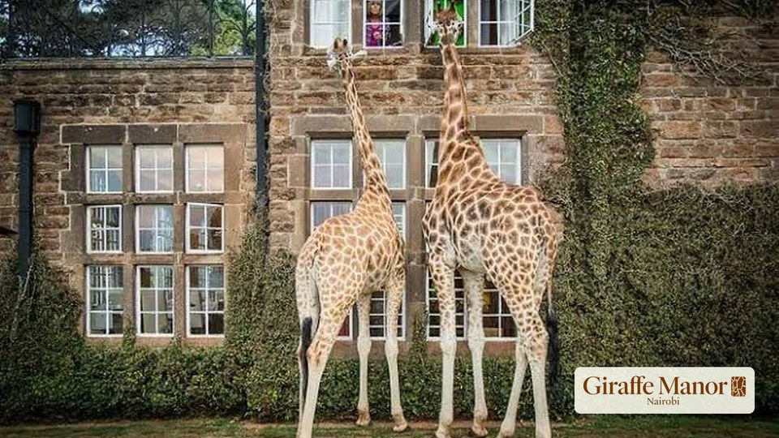
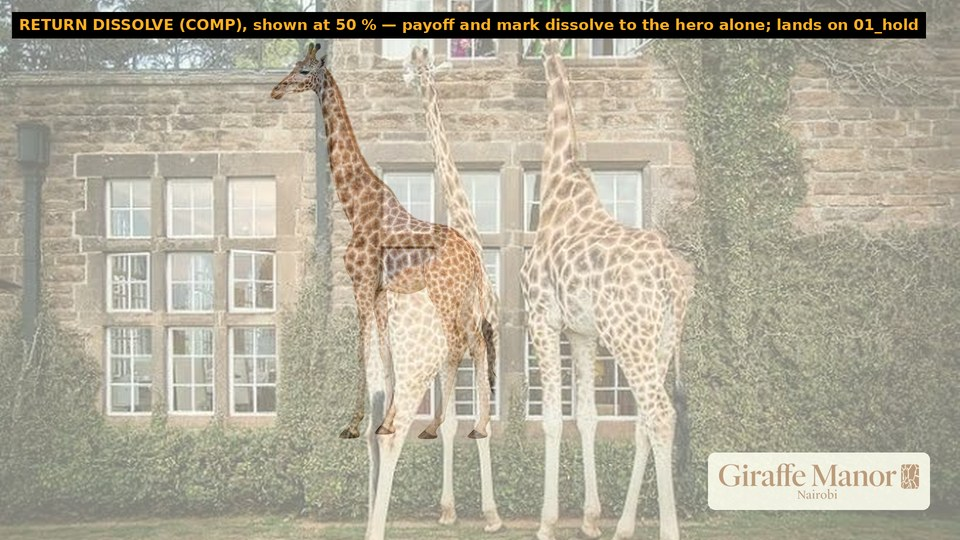

Film 01 of 8 · Theria hospitality slate · v2 boarded 2026-09-25 from the client brief (`Sample Hotel Animations_.docx`), Allen's decisions on v1, and the new assets in the Drive folder (vector wordmark, two Kling hero takes, birdsong ambience).

| | |
|---|---|
| Client brief | Start with image of the giraffe → the Giraffe Manor logo appears under its feet → another giraffe walks into frame → the logo disappears but the manor in the background appears → both giraffes turn and walk towards the manor and put their heads in the window |
| TRT | **16.0 s / 384 frames @ 24 fps** (f0–f383). v1's 14.0 s of picture is unchanged; 2.0 s added at the tail for the loop return |
| Master | One master: 16:9, 1920×1080, 24 fps |
| Loop | **The last frame equals the first.** f383 is pixel-identical to f0 (hero alone on cream, clean still, no logo). The film can be played on repeat with no cut |
| Frames | `frames/01_hold.png` … `frames/11_loop.png` (12 frames incl. `06b_zoomout`), contact sheet `frames/contact_sheet.jpg`. Built by `build_frames.py` from the pulled assets and `assets/wordmarks/giraffe_manor_wordmark.png`; nothing AI-enlarged; no placeholders remain |
| Status key | READY = built from an existing asset · COMP = After Effects / NLE work on existing assets · TO GENERATE = needs a Higgsfield pass (model named) |

### Decisions taken

From Allen (applied as given):

1. One master, 16:9 HD, 24 fps. The 30 fps Kling walk is conformed to 24 with optical flow.
2. Run time: v1 timings kept for beats 1–7 (14.0 s). Extended only for the loop: +1.2 s payoff hold with the mark, +0.9 s return dissolve, +0.5 s loop tail = **16.0 s**.
3. Loop rule: last frame = first frame. Implemented as a return dissolve (Beat 9) landing on the Shot 1 clean still, then a 12-frame hold that is pixel-identical to f0. `build_frames.py` asserts `11_loop == 01_hold`.
4. Vector wordmark is the approved mark (`assets/wordmarks/giraffe_manor_wordmark.png`, 3952×703 RGBA, "Giraffe Manor / Nairobi" with the patch block). It is now on every logo frame; the 288 px webp code path is gone.

Made on this board (state, not ask):

5. **Two giraffes, one colour.** The Kling walker is a darker, more saturated animal than the hero (mean RGB 153/96/60 vs 192/156/125). Plan: regenerate the walk with the hero still as the image reference (NBP for a matching side view, then Kling image-to-video). For the board the walker is colour-matched to the hero with a per-channel levels adjust in Pillow (mean and spread of the opaque pixels, gain capped at 1.35) and tagged **WALKER COLOUR-MATCHED FOR BOARD** on frames 03, 04, 06, 07. The match is board-only; it is not a grade for the film.
6. **Window payoff = exterior upstairs windows** (client reference `images-2.jpg`). The interior breakfast-window alternate is off the board.
7. **Guests stay in the manor plate.** `manor01_background.png` is used as is; no clean plate.
8. **End card folded into the return.** No separate black end. The small mark (400 px, bottom-right, on a translucent cream card so the brown mark reads over brick and ivy) fades up over the payoff hold and dissolves out with the payoff in the return.
9. **Shot 1 micro-life = Kling take2.** `kling_hero_blink_take2.mp4` (1920×1080, 24 fps, 4.04 s) is byte-identical to `frame1_to_frame2.mp4` (same md5): hero alone on cream with subtle life. Use frames 0–48 for Shot 1. `kling_hero_blink_take3.mp4` (4.0 s) is the hero with a Kling-drawn wordmark rising in from below, "Giraffe Manor" first then "Nairobi" and the patch: its pixels are not used (AI-drawn mark), but its timing is the reference for the Beat 2 logo build.
10. **Shot 1 push-in dropped.** v1 had a 1.5 % push over Shot 1; with the loop, any scale change across Shot 1 would have to be undone in the return. Shot 1 is locked off; life comes from take2.
11. **Loop frame is the clean still.** Take2's micro-life starts after f0, so f0 (and f383) is the hero before any blink or ear twitch. The Beat 2 logo, when it fades up, does not touch this frame.
12. **Ambience = birdsong.** `audio/birdsong01.wav` (179.3 s) and `birdsong02.wav` (49.8 s), both 44.1 kHz stereo PCM, are the Shot 1 ambience bed. 01 is the main bed (long enough to pick a clean 16 s section); 02 is the alternate. The bed loops with the picture: crossfade tail to head (0.5 s) across the loop point.
13. **3D wordmark noted, not used.** `upscaled/wordmark3d.obj` / `.usdz` (extrusion of the mark, with `.mtl`) is available for a dimensional logo reveal. The brief says the logo appears under the giraffe's feet; a flat mark does that, so the board keeps it flat. `upscaled/wordmark.psd` is the same mark flat on cream (reference only; the raster PNG with alpha is what the comp uses).

### Beats

| # | Brief line | IN – OUT (frames) | Frame | On screen | Motion / camera | Transition | Assets used | Status |
|---|---|---|---|---|---|---|---|---|
| 1 | Start with image of the giraffe | 00.0 – 02.0 (f0–48) | `01_hold` | Hero giraffe alone on the cream field, centre-left, full body, facing camera-left. **f0 is the loop frame** | Locked off, no push-in. Micro-life from take2: ear, tail, one slow blink, none of it before f12 | — (f0 = f383) | `upscaled/kling_hero_blink_take2.mp4` frames 0–48, conformed to the board staging (hero 800 px tall, hooves y=880, centre x=760; take2 frames the hero a little more central, so reposition the clip in AE). Board frame built from `upscaled/ea5d5cfc-….png` (1024×1536 RGBA). Cream (255,255,240) | READY (Kling take2) — conform position in AE |
| 2 | The Giraffe Manor logo appears under its feet | 02.0 – 03.6 (f48–86) | `02_logo` | Vector wordmark, 640 px wide, on the ground line under the hooves | Rise-and-fade per take3's timing: "Giraffe Manor" first (opacity 0 → 100, y +24 → 0 px over 0.6 s), "Nairobi" and the patch block follow 0.3 s later. Hold 0.7 s | fade | `assets/wordmarks/giraffe_manor_wordmark.png` (3952×703 RGBA, from `upscaled/wordmark.ai`). Timing ref: `kling_hero_blink_take3.mp4` | COMP (AE layer over the vector) |
| 3a | Another giraffe walks into frame | 03.6 – 05.0 (f86–120) | `03_enter` | Second giraffe enters from frame right at full walk, same colouring as the hero | Walk cycle, ~1.4 s per stride pair. Logo stays put; newcomer walks behind it | — | `upscaled/giraffe_walking.mov` (ProRes 4444 with alpha, 4K/30) conformed to 24 and scaled 50 %; frame at t=0.0. Board: colour-matched | READY (existing Kling clip, colour-matched for board) → **regenerate from hero ref** (NBP side view → Kling i2v) |
| 3b | (same) | 05.0 – 06.4 (f120–154) | `04_stop` | Newcomer stops with its shoulder just clear of the hero's rump. Logo eases to 35 % | Walk decelerates to a stop over the last 4 strides | — | same clip, frame at t=2.8; stop position bbox-left x=1060 | READY / COMP — the clip does not itself stop: freeze or ease the last cycle in the NLE |
| 4 | The logo disappears but the manor in the background appears | 06.4 – 07.4 (f154–178) | `05_reveal` | Logo out; cream dissolves to the manor **at scale**: the plate arrives at 2.65× its cover size, so the terrace, steps and ground floor fill the frame behind the giraffes and they read as standing at the foot of the house | Logo opacity → 0 over 0.6 s. Background arrives at ~10 px blur. Giraffes hold at their Shot 3 size and position | cross-dissolve | `upscaled/manor01_background.png` (2752×1536, giraffes painted out, guests kept) at 2.65× cover, pivot chosen so the hooves stay on y=880 | COMP (AE). Approved staging; the 2.65× enlargement is only on screen during the dissolve and the first frames of the pull-back |
| 5 | (same) | 07.4 – 08.6 (f178–206) | `06_manor` → `06b_zoomout` | Manor resolves sharp, then the camera **zooms out**. Giraffes are locked to the plate and shrink with it | Rack focus soft → sharp over 0.4 s, then a continuous pull-back from 2.65× toward 1.0× (ease-in-out). Both giraffes scale from 800 px to ~300 px tall as the whole house comes into view | continuous | same plate; giraffes placed in plate pixels (hero hooves at plate 1744,1400; walker at 2050,1400) so the pull-back is one transform | COMP (AE): one camera move on a pre-comp |
| 6 | Both giraffes turn and walk towards the manor | 08.6 – 11.2 (f206–269) | `07_turn_TOGEN` | Pull-back lands on the full plate: both giraffes on the lawn where the plate's own giraffes stood. From here they turn away and walk up to the house | The risk shot: a 180° turn. If the pull-back is still finishing, overlap it 0.4 s into this shot | — | `07_turn_TOGEN.png` is the actual composite (plate 1.0× + both giraffes at plate scale), not a reference | **TO GENERATE (Kling)** — start frame = `07_turn_TOGEN.png` (rebuild it once the walker is regenerated), prompt in pipeline doc §6 Shot 6. Over-generate; fallback is the whip-pan cheat |
| 7 | …and put their heads in the window | 11.2 – 13.4 (f269–322) | `08_window_TOGEN` | Necks rise, both heads enter the upstairs windows. Land on the reference composition | Slow and calm | — | Shown: client reference `images-2.jpg` (exterior, 678 px). The end plate is generated to match it | **TO GENERATE**: end plate first (Seedream, same house, upstairs windows, both giraffes in the hero's colouring), then Kling start→end from Shot 6's last frame |
| 8 | (payoff hold + mark) | 13.4 – 14.6 (f322–350) | `09_payoff_mark` | Hold on the payoff. Wordmark small, bottom-right (400 px on a cream card), fades up | Mark opacity 0 → 100 over 0.4 s, hold | — | Shot 7 last frame + vector wordmark | COMP (AE) |
| 9 | (loop return) | 14.6 – 15.5 (f350–372) | `10_return_COMP` (shown at 50 %) | Payoff and mark dissolve back to the cream field with the hero alone, in her Shot 1 position | Payoff lifts toward cream first (exposure +0.6 over the first 8 frames) so the dissolve is not a hard brick-to-cream jump, then a cross-dissolve to the Shot 1 clean still. Mark rides the payoff layer and goes with it | cross-dissolve, 0.9 s | Shot 7 last frame; `01_hold` (= take2 f0) | COMP (AE) |
| 10 | (loop tail) | 15.5 – 16.0 (f372–384) | `11_loop` | Hero alone on cream. **f383 is pixel-identical to f0** | Nothing moves | cut to f0 on loop | same still as Beat 1 | READY (`build_frames.py` asserts the identity) |

**Audio.** Birdsong ambience (`audio/birdsong01.wav`, 179.3 s, main; `birdsong02.wav`, 49.8 s, alternate; both 44.1 kHz stereo) from 00.0 under Shot 1 and throughout; one low woodwind swell 06.4 → 08.6 under the reveal (not sourced); ambience alone from 13.4. The bed loops with the picture: 16.0 s section, 0.5 s crossfade tail → head at the loop point. Kling audio tracks are muted.

### Risks (two, with the decision taken)

1. **The return dissolve is a big tonal jump** (dark brick and ivy → flat cream). Decision: the payoff lifts toward cream for 8 frames before the 0.9 s cross-dissolve, and the mark goes out with the payoff layer rather than on its own. If it still reads as a hard cut in the animatic, lengthen the dissolve to 1.2 s and take the 0.3 s from the Beat 8 hold; the TRT stays 16.0 s.
2. **The loop frame depends on Shot 1's source.** If Shot 1 is take2, f0 must be take2's first frame after it is repositioned to the board staging, and the return must land on that exact frame, not on the upscaled still. Decision: the AE comp uses take2 f0 (frozen) as both the Beat 10 hold and the return's landing frame, so the identity holds by construction. The board's `01_hold`/`11_loop` stand for that frame.

### Assets still needed

- Walker regenerated to match the hero (NBP side-view reference from `ea5d5cfc-….png` → Kling i2v walk, right-to-left, alpha via the same matte pass as `giraffe_walking.mov`). Replaces the board's colour-matched stand-in on frames 03–07.
- Shot 6 Kling clip (turn and walk away), from `07_turn_TOGEN.png` as start frame (rebuild after the walker regen).
- Shot 7 end plate (both heads in the upstairs windows, matching `images-2.jpg`; Seedream), then the Kling clip.
- Woodwind swell for the reveal (not sourced; birdsong is in hand).

### What this board does not cover

- No motion was rendered; frames are stills. The animatic (24 fps, 16.0 s, looping) is the next step.
- Shot 1 micro-life and the Beat 2 logo rise are described from the Kling takes, not drawn.
- The return dissolve is shown as a single 50 % blend; its exposure lift is described only.
- The colour of the regenerated walker is not shown; the board's walker is a levels match, not a grade.

## 02 · The Fifth Avenue Hotel

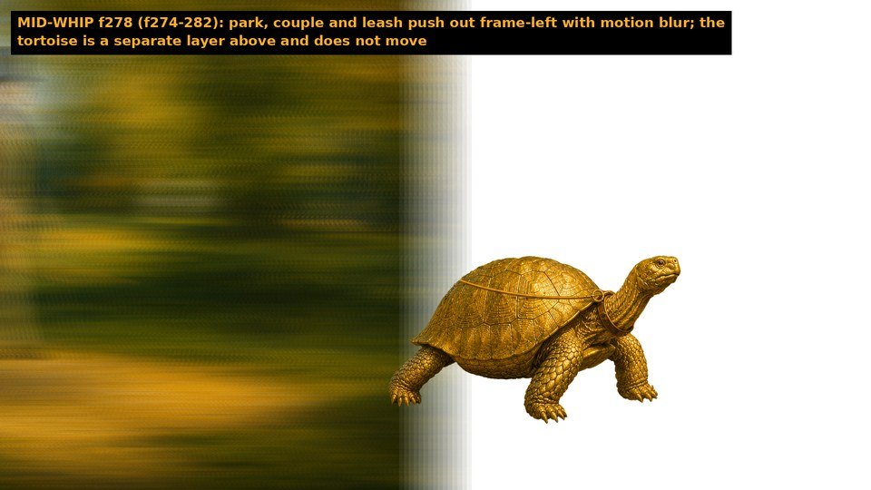
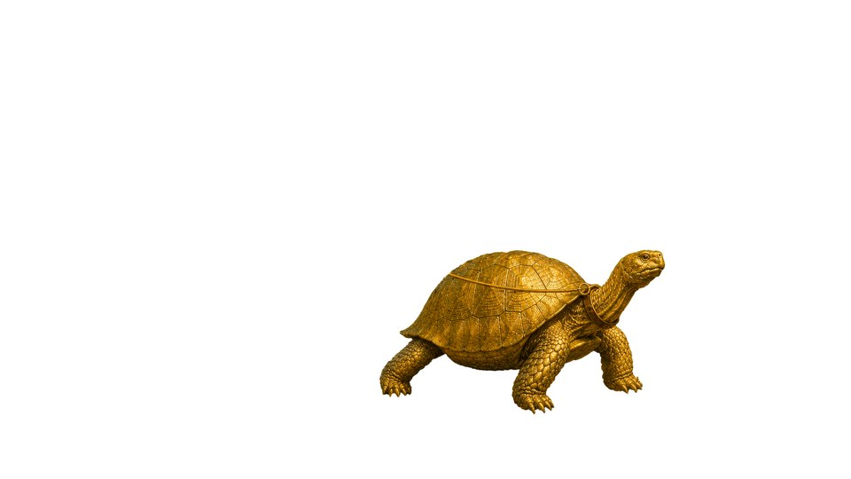
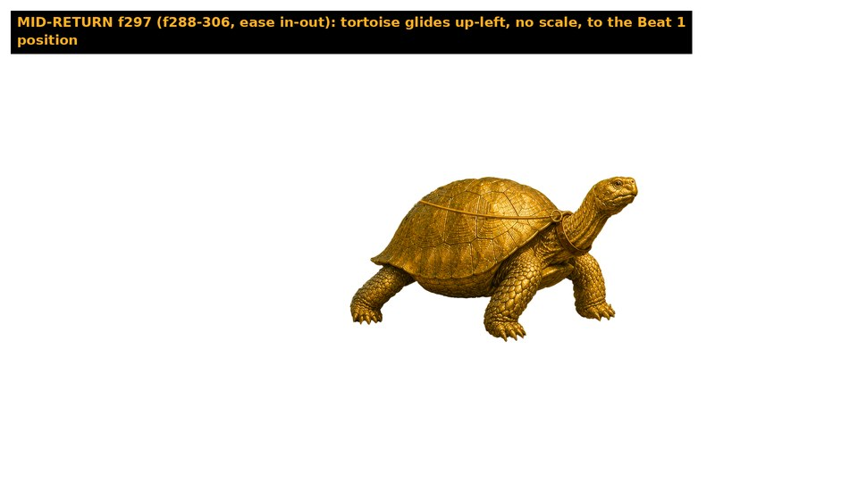
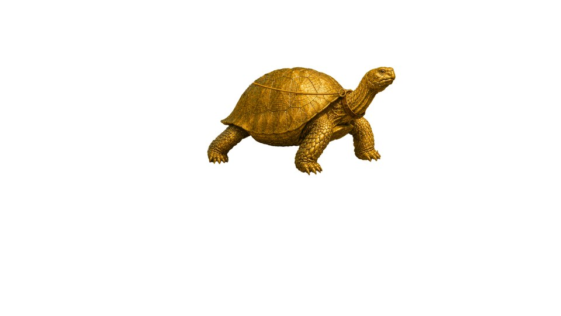

| | |
|---|---|
| Film | 02 · The Fifth Avenue Hotel (client folder `5th ave hotel NYC/`) |
| TRT | **13.0 s = f312** at 24 fps: the v1 12.0 s (f288) untouched, plus a 1.0 s return beat (f288–312) so the film loops. Last frame (f311) is identical to f0 |
| fps / master | 24 fps · one master, 16:9, 1920×1080 (Allen, 2026-09-25) |
| Loop rule | Last frame = first frame. The couple exit frame-left, the park whips to white, the tortoise glides back to its Beat 1 position, hold = frame 01. For a seamless player loop drop the final frame (f311) on assembly; left in, it is one duplicate frame inside a 2.4 s hold |
| Frames | `frames/NN_name.png` 1920×1080, `NN_name_small.jpg` 960×540, `contact_sheet.jpg`, plus `lockup_vector_goldtype.png` (flat gold type from the vector). Built by `build_frames.py PULL_ROOT OUT_DIR` (run 2026-09-25, 10 frames, clean; the script asserts frame 10 == frame 01) |
| Brief (source of truth for beats) | 1 start on the gold tortoise · 2 add the Fifth Ave logo in gold, no background, under its feet · 3 the logo disappears · 4 add the people walking the tortoise · 5 the people move very slowly |

### Decisions taken

1. **Hero = the plate's own tortoise** (`upscaled/turtle.png`, the `turtle` layer of `turtlewalkers.psd`, v1 frame 01b) at plate scale: 646×373 px at HD. Beats 1–6 all show the same render at the same scale, so the Beat 4 dissolve is a true match. `turtle02.png` is no longer used.
2. **The 1.33× pull-out is dropped.** No scale change anywhere in the film.
3. **Lockup low-centre, tortoise offset up-left in Beats 1–3.** At its plate position the tortoise's claws sit at y 935, leaving 145 px under its feet — the lockup cannot go there at any legible size. So in Beats 1–3 the tortoise sits at x 708–1354, claws y 600 (147 px left and 335 px above its plate position) and the lockup sits low-centre under its plastron: 460 px wide, centred x 960, y 645–967, inside the timing doc's centre-80 % logo-safe area. Through the Beat 4 dissolve the tortoise translates (+147, +335) — no scale — into the plate position (x 855–1501, claws y 935), ease in-out over f130–168, landing 5 f before the park is fully up; the leash fades up last (f165–173) once the collar is in place. The whip and return beat at the end undo that move, so the loop closes on frame 01.
4. **Gold lockup on screen = `Asset 1@2x.png`** (Allen's textured-gold render of the vector type, 2762×1933 RGBA, no disc). Its gold matches the tortoise. The flat vector type is extracted from `assets/wordmarks/fifth_avenue_wordmark.png` by the script (`lockup_vector_goldtype.png`, 2685×1876, flat gold #E0BD84 = the same gold the `.obj` material uses) and copied to `assets/wordmarks/fifth_avenue_wordmark_goldtype.png`. It is not on screen in this cut: the end/loop needs no flat mark (see 6). No placeholder marks remain.
5. **Beat 3** keeps the timing doc's out (0.7 s, +3 % scale), white stays white — the tortoise is about to slide, and a warming gradient under the type would fight the dissolve that follows.
6. **End (Beats 6–8), per Allen:** the couple exit frame-left, the park whips to white, the tortoise is alone. The exit *is* the whip: park + couple + leash are one pre-comp that push-whips out frame-left over 8 f (f274–282) with motion blur; the tortoise is a separate layer above it and does not move. Then 6 f of white with the tortoise still at its plate position, an 18 f ease in-out glide up-left to the Beat 1 position (f288–306), and a 6 f hold that is frame 01 (f306–312). The storyboards page's "gold lockup returns bottom-centre" is not used: on loop the lockup comes back 2.4 s later anyway, and a second mark inside 3 s would double-brand; the page's "park holds empty a half-beat" goes with it (see flagged risk 1). The v1 navy-roundel end card is gone.
7. **Beat 5 tortoise travel** stays at a quarter body-width (+162 px HD) — the doc's full body-width takes the head off frame right.
8. **Sound bed** is now the client's own files (`5th ave hotel NYC/audio/`), placed below. The timing doc's cello/footfall/leash-creak is superseded.

**Flagged risks (2)**

1. *"Couple exits frame left at the crawl" cannot be walked.* With a locked camera the couple stand up-stream (left) of the tortoise and everyone faces right; the man's right edge is at x ≈1085, so at the crawl (≈39 px/s) an on-foot exit takes ≈28 s, and a camera track right would take the tortoise out with them. **Decision:** the couple leave frame-left inside the push-whip (0.33 s), still mid-stride at the crawl when it takes them. If Allen wants a slower leave, the same pre-comp can push out over 24 f instead of 8 with no other change (`WHIP` in the script).
2. *The tortoise moves twice* (Beat 4 slide, Beat 7 return), against the timing doc's "not a pixel". It is translate-only, same render, same scale, so the match holds; the move exists only because the lockup has to fit under the tortoise's feet. **Decision:** keep it. The zero-move alternative is the tortoise pinned at its plate position for all 13 s with the lockup to its left (x ≈250–730, y ≈610–930, beside rather than under) — a two-constant change in the script (`HERO_LEFT/HERO_FEET_Y` = the plate position, `LOCKUP_CX/LOCKUP_TOP`), and Beats 7–8 then collapse to a single hold.

### Beats

| # | Brief line | IN–OUT (s) · frames @24 | Frame | On screen | Motion / camera | Transition | Assets used | Status · model |
|---|---|---|---|---|---|---|---|---|
| 1 | Start with image of the gold tortoise | 00.00–02.42 · f0–58 (58 f) | `01_hold.png` | Gold tortoise in profile facing camera-right, collar on, alone on white, offset up-left: x 708–1354, claws y 600. Nothing else | Dead still. Specular highlight travels across the shell L→R f10–f50; one slow head-lift at f44 | — (cold open on white; on loop it is the frame the return beat lands on) | `upscaled/turtle.png` (1463×844 RGBA = `turtle` layer of `turtlewalkers.psd`) at 646 px | READY from assets (still). Specular sweep = AE light sweep masked by the alpha. Head-lift = TO GENERATE, Kling O1 from this frame, single verb, on white so it keys back |
| 2 | Add the Fifth Ave logo in gold, no background, under its feet | 02.42–04.21 · f58–101 (43 f) | `02_lockup.png` | Textured-gold "THE FIFTH AVENUE HOTEL" lockup, no disc, low-centre under the plastron: 460 px wide, x 730–1190, y 645–967. Tortoise as Beat 1 | Letterforms wipe on L→R over 1.0 s (f58–82) behind a soft gold gradient (foil shimmer), then hold. Tortoise unchanged | — | `upscaled/turtle.png`, `upscaled/Asset 1@2x.png` (2762×1933 RGBA, Allen's textured gold render of the vector type) | COMP (AE layer over the still). No generative model near the mark |
| 3 | The logo disappears | 04.21–05.42 · f101–130 (29 f) | `03_lockup_out.png` | Same, lockup at 35 % opacity and +3 % scale (mid fade, f115) | Lockup opacity 100→0 over 0.7 s (f101–118) with 3 % scale-up as it goes. Tortoise unchanged, white stays white | — | as Beat 2 | COMP (AE) |
| 4 | Add the people walking the tortoise | 05.42–07.21 · f130–173 (43 f) | `04_reveal.png` | Mid-dissolve f152: park, couple and leash-less man at 51 % under the tortoise, which is 62 % of the way down-right into its plate position | Cross-dissolve white → park (background + woman + man) over 1.8 s. Tortoise layer translates (+147, +335) px, ease in-out, f130–168 — no scale. Leash fades up f165–173 after the collar has landed. Nothing else moves | cross-dissolve | `upscaled/turtle.png` (same sprite, same scale), `upscaled/turtlewalkers.psd` (`background` layer) + `woman.png`, `man.png`, `leash.png` at PSD origins | COMP (AE). Nothing to generate |
| 5a | Have the people moving very slowly | 07.21–11.42 · f173–274 (101 f) — start | `05_walk_start.png` | The full plate: Gilded-Age couple (parasol, top hat) walking the gold tortoise on a leash, painterly park; tortoise at x 855–1501, claws y 935 | This is the Kling **start frame**. Everything at ≈1/6 normal speed; leaves and light in the background at normal speed. Camera locked | — | `upscaled/turtlewalkers.psd` (`background`) + `woman.png` @(742,196), `man.png` @(1754,226), `leash.png` @(1798,1095), `turtle.png` @(1934,1272) | READY from assets (flattened by `build_frames.py`, identical to the PSD comp) |
| 5b | same | 07.21–11.42 · f173–274 — end | `06_walk_end_TOGEN.png` | Conform target for the end of the walk: man +15 px (foot), woman +12 px, tortoise +162 px (¼ body-width), leash stretched to follow the collar. Parasol rotation (~8°) not shown — the parasol is inside the `woman` layer | Kling O1 image-to-video, start = 05, end = 06. Generate 5 s at normal walk speed, take the best window, retime to 1/6 in the NLE with optical flow. Background leaves/light at normal speed = a second Kling pass on the `background` layer only (or AE particles), comped under the figures | — | as 5a, layers offset in x | **TO GENERATE — Kling O1** (figures) + Kling/AE (background). The end frame itself is a comp |
| 6 | (end, per Allen: couple exit frame-left, park whips to white) | 11.42–12.00 · f274–288 (14 f) | `07_whip.png` (mid-whip f278), `08_white_hold.png` (f282–288) | 07: park, couple and leash streaked out to the left with the white already across the right half; tortoise sharp and unmoved at x 855–1501. 08: white, tortoise alone at its plate position | Push-whip: the park pre-comp (background + woman + man + leash, at the Beat 5 end position) translates −1920 px in x over 8 f (f274–282), 2 f ease-in, directional motion blur; the tortoise layer above is static. Then 6 f hold on white | push-whip to white (the couple's frame-left exit) | 06 comp minus the tortoise layer; `upscaled/turtle.png` | COMP (AE). No generation. Whip audio cut on f282 |
| 7 | (return, for the loop) | 12.00–12.75 · f288–306 (18 f) | `09_return.png` (mid-return f297) | Tortoise alone on white, half-way between its plate position and the Beat 1 position | Tortoise translates (−147, −335) px, ease in-out, no scale, over 0.75 s. Nothing else on screen | — | `upscaled/turtle.png` | COMP (AE). No generation |
| 8 | (loop hold = frame 01) | 12.75–13.00 · f306–312 (6 f) | `10_loop.png` | Identical to `01_hold.png` (asserted pixel-equal by the script) | Dead still; the hold continues as Beat 1 on loop | hard loop to f0 | as Beat 1 | READY |

Frame counts: v1's f0–288 are unchanged (2.42 / 1.79 / 1.21 / 1.79 / 4.21 / 0.58 s); the return beat adds f288–312 = 1.0 s. Beat 1 is 2.4 s = 57.6 f, rounded to f58 as in the timing doc.

### Sound bed (client files, `5th ave hotel NYC/audio/`, all 44.1 kHz stereo WAV)

| Film beat | File | Duration | Placement |
|---|---|---|---|
| Beats 1–3 hold (f0–130) | `Clock 1.wav` | 7.20 s | From f0 under the hold, steady tick (≈−31 dBFS RMS throughout); fade out through the dissolve f130–173 — the file runs out at 7.2 s = f173 exactly. Alternates: `Clock 2.wav` 4.24 s, `Clock 3.wav` 3.84 s; `CLOCK_MantelClockWestminsterTick_SDLX.wav` 43.67 s (Westminster mantel clock, a longer bed if the hold ever extends) |
| Beat 2 lockup arrive (f58) | `HarpGliss_BW.25573.wav` | 3.79 s | Hit on f58 with the wipe-on; rings through Beat 3 to f149. Alternates: `Harp Gliss.wav` 7.17 s (longer tail), `14476 gliss up harp magic spell.wav` 5.13 s; `Mountain Audio - Harp Intro.wav` 10.00 s is a phrase, not a hit — only if the open needs music under the clock |
| Beats 4–6 walk (f130–282) | `Horse Drawn Carriage Pass By With People.wav` | 43.00 s | Use the file window 18.9–25.3 s (file time = film time + 13.5 s): fade in over the dissolve f130–173, so the pass-by's loudest stretch (file 22–26 s, ≈−23 dBFS) sits under f204–282 and peaks as the whip hits; hard cut on f282 with the whip. The file's first 18 s are the approach (−51 → −29 dBFS) |
| Beats 7–8 (f282–312) | — | | Silence after the whip; the clock re-enters at f0 on loop, so the audio loop seam is the clock's first tick |

Sound runs at normal speed under the 1/6-speed figures (storyboards page). Levels and the mix are not boarded.

### Assets still needed

| Asset | For | Route |
|---|---|---|
| Walk clip, figures: start = `05_walk_start.png`, end = `06_walk_end_TOGEN.png` | Beat 5 | Kling O1, start+end frame, 5 s at normal speed, retime to 1/6 in the NLE (optical flow). Budget 3–5 generations |
| Background-only motion (leaves drift, dappled light) | Beat 5 | Kling O1 on the PSD `background` layer alone, or AE particles/light. Normal speed under the slowed figures |
| Head-lift on the tortoise (f44) | Beat 1 | Kling O1 from `01_hold.png`, single verb; on white so it keys back to alpha. The same clip's first frame must match `turtle.png` — if it drifts, use the head-lift only on a soft matte over the neck |
| Specular sweep across the shell | Beat 1 | AE light sweep masked by the tortoise alpha. No generation |
| Foil-shimmer wipe-on, fade-out, dissolve, tortoise slide, leash fade, push-whip, return glide | Beats 2–4, 6–7 | AE only. Positions and frame ranges are the constants at the top of `build_frames.py` |
| Sound edit | all | The three placements above, plus levels; the loop seam is the clock |
| *Available, not used:* `upscaled/Asset 1.obj` + `.mtl` (3D extrusion of the type, 20,544 vertices, 25 groups, flat gold Kd 0.875/0.738/0.516) and `Asset 1.usdz` (448 MB, not pulled) | a dimensional lockup reveal if Beat 2 ever goes 3D | C4D/Blender or AE Advanced 3D; this board keeps the mark flat-lit as `Asset 1@2x.png` |
| *Available, not used:* `upscaled/fifthave_wordmark.ai` (vector source), `assets/wordmarks/fifth_avenue_wordmark_goldtype.png` (flat gold type, this build) | any flat use: 1:1 / 9:16 masters, a static end card if the film is ever played un-looped | Vector, no generation |

### What this board does not cover

- No motion has been generated or previewed; every frame is a still comp and the motion column is intent (v1 timings, Allen's end).
- Parasol rotation, leash slack/tension and the man's stride are not shown in `06` — the parasol and hands are inside the `woman`/`man` layers and the leash is stretched linearly. Kling owns those.
- `04` shows a plain blend and the tortoise at its eased position; the storyboards page's "brushwork resolving" treatment on the dissolve is not boarded.
- `07` simulates the push-whip with a horizontal blur in Pillow; the AE version should use real directional motion blur and a 2 f ease-in.
- Colour grade, sound levels/mix, and the storyboards page's "gold lockup returns bottom-centre" end (dropped, decision 6).
- The 1:1 and 9:16 masters the storyboards page lists. The Beat 1–3 composition (tortoise up-left, lockup low-centre) will need re-blocking for 9:16, and the plate's cover crop changes.
- `05`/`06` are the PSD flattened in Pillow (normal blend, 100 %, as the PSD is set), resampled as a whole plate; the hero in `01`–`04`/`07`–`10` is the `turtle` layer resampled alone at the same scale. In AE keep the tortoise inside the same pre-comp scale so the two are pixel-identical. If `turtlewalkers.psd` changes, re-run the script.

## 03 · Passalacqua

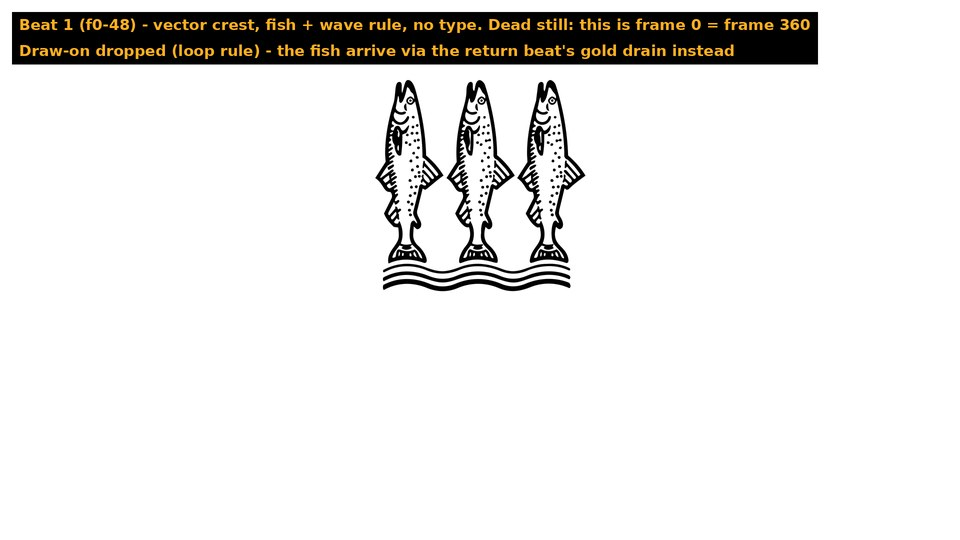

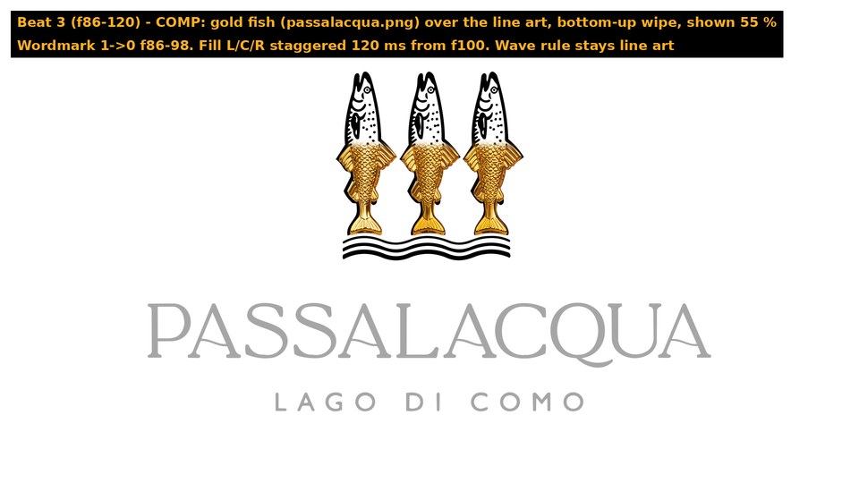

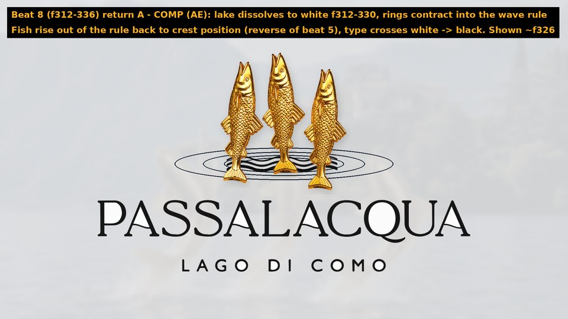
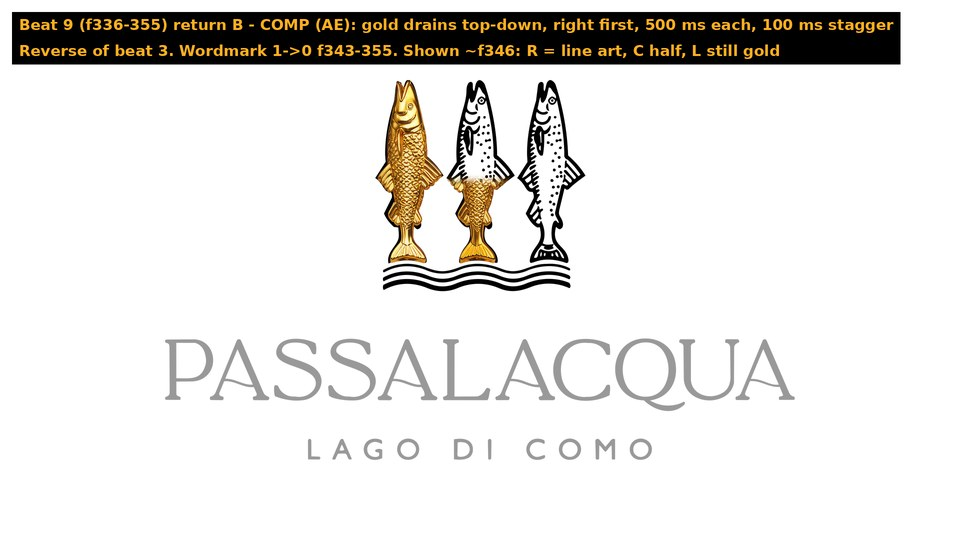
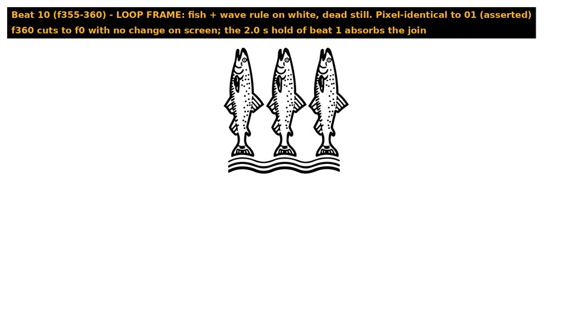

| | |
|---|---|
| Film | 03 · Passalacqua — "three fish leave the crest" |
| Client / studio | Theria / Allen Grabo, RTFX Design |
| TRT | **15.0 s (f360)** = the timing doc's 13.0 s (f312) unchanged + a 2.0 s return beat (f312–360) so the film loops. v1 timings for beats 1–7 are kept to the frame. |
| Frame rate | 24 fps (frame numbers `f###`) |
| Master | One master, 16:9, 1920×1080 (logo-safe area = centre 80 %; the crest sits inside it at 1259×760) |
| Loop | Frame 360 = frame 0: the line-art fish + wave rule on white, dead still. `11_loop_frame.png` is pixel-identical to `01_crest_still.png` before the corner tags (the build script asserts it). |
| Frames | `frames/01_crest_still.png` … `frames/11_loop_frame.png`, each with a `*_small.jpg` (960×540), and `frames/contact_sheet.jpg` |
| Built by | `build_frames.py PULL_ROOT OUT_DIR` — Pillow only; crest from `assets/wordmarks/passalacqua_wordmark.png`, everything else from `Passalaqua/`; nothing under the pull directory was modified |
| Board date | 2026-09-25 (v1 same day; v2 supersedes it) |

### Decisions taken

1. **Loop rule.** Last frame = first frame = the flat crest on white (fish + wave rule, no type). The film gets a 2.0 s return beat after the timing doc's end card: the leap settles, the ripples contract into the wave rule, the three gold fish rise back to their crest positions and drain to line art, the wordmark fades out, and frame 360 is frame 0. Nothing before f312 moved.
2. **Beat 1 draw-on dropped.** The timing doc draws the fish on L→C→R over f0–f30. That cannot coexist with "last frame = first frame = the crest": a draw-on needs f0 to be blank. Beat 1 is now a 2.0 s dead-still hold of the line-art crest, and the "arrival" of the fish is the return beat's gold-drain-to-line-art (which is the draw-on's job done in reverse). See risk 1.
3. **Vector crest is the beat-1/2/3/9/10 artwork.** `assets/wordmarks/passalacqua_wordmark.png` (4000×2200 RGBA, black line art). Split by alpha row bands — fish rows 76–1010 (cols 1474–2543; the three fish separate at empty columns x = 1821 and 2184), wave rule rows 1011–1151, PASSALACQUA rows 1390–1761, LAGO DI COMO rows 1900–2009. Placed at 0.393× so the lock-up is 760 px tall on the 1080 frame; fish = 367 px = 34 % of frame height (v1 proposed ~35 %). Plain Lanczos, never AI-enlarged. All the old `PLACEHOLDER` tags are gone.
4. **Beat 1 is line art, not gold.** The vector crest is black line art, so the brief's "3 outlines of golden fishes" is read as: outlines first (beats 1–2), gold arrives with the fill (beat 3). The printed mark is shown exactly as supplied; no gold tint is applied to the line art.
5. **Gold fish = Allen's render** `passalacqua.png` (7872×4428), cropped on its own alpha — no white-threshold key any more. The PSD (`passalacqua.psd`; `passalacqua copy.psd` is byte-for-byte the same layer set) separates cleanly: `fish` (3278,760,4720,2056), `waves` (3280,2195,4592,2388), `text` (1412,2380,6489,3525). Per-fish crop boxes 3279–3733 / 3773–4229 / 4266–4720 × rows 761–2055. The render is the same crest at 1.37× and its fish register onto the line-art fish by height and centre (checked by overlay: the gold sits under the black outline). Only the fish are used; the render's gold wave rule and its differently-cut wordmark are not.
6. **Wordmark is fixed artwork.** Opacity only — no tracking ease, no rise. `passalacqua_words.png` / `@2x` are not needed: the crest PNG carries the type on its own row bands, at the correct lock-up position.
7. **Wave rule stays line art through beats 3–4** and thickens into the water in beat 5 (the page's idea); in the return beat the water's rings contract back into it. The rule is the hinge of the loop, so it never becomes gold.
8. **Leap is staggered** (timing doc): centre breaches 08.6, left 09.4, right 10.1 — three water-breaks in the audio. The only plate has all three in sync, so the leap is three fish layers (or three Kling passes) over the clean plate. Beat 6 stays boarded as two frames (tight / pulled back).
9. **Villa identity is whatever is in the folder.** The v1 villa question is closed; `images-3.jpg` is no longer boarded as a reference frame (accounted for in the assets table).
10. **End card keeps the timing doc's wordmark over the lake**, but the wave rule and the type sit at their exact crest positions (not the v1 custom placement) so the return beat can hold them still while the lake goes to white around them and the fish come back up above the rule. The type crosses white → black with the field.
11. **Return beat timings** (extension only where the loop needs it): 8 · settle f312–336 (1.0 s), 9 · flatten f336–355 (0.8 s), 10 · loop hold f355–360 (0.2 s). The 2.0 s hold of beat 1 then absorbs the join.

### Beats

| # | Brief line served | IN – OUT (s) · frames @24 | Frame | On screen | Motion / camera | Transition | Assets used | Status |
|---|---|---|---|---|---|---|---|---|
| 1 | "Start with their logo of 3 outlines of golden fishes" | 00.0 – 02.0 · f0–f48 | `01_crest_still.png` | The three line-art fish over the wave rule, white field, no type. Dead still. | None — this is the loop frame (f0 = f360). The draw-on is dropped (decision 2). | — | vector crest, fish rows 76–1010 + wave rows 1011–1151 at 0.393× | **FINAL ARTWORK** — AE layer, still. |
| 2 | "Add the logo underneath" | 02.0 – 03.6 · f48–f86 | `02_wordmark.png` | PASSALACQUA / LAGO DI COMO fades up beneath the wave rule; full printed crest. | Wordmark opacity 0→1 over 0.8 s (f48–67), hold 0.8 s. Fixed artwork: no tracking, no rise. | — | vector crest, type rows 1390–2009 | **FINAL ARTWORK** — AE layer, opacity only. |
| 3 | "The logo disappears as the fish become real golden fish — colored in" | 03.6 – 05.0 · f86–f120 | `03_fill_COMP.png` | Wordmark at 35 % and going; gold floods each fish bottom-to-top, hiding the line art as it rises; scales catch light, eyes gain a specular. Frame shows the flood at ~55 %. | Wordmark 1→0 over 0.5 s (f86–98). From f100 the gold fish wipe on from the tail up, 900 ms per fish, L→C→R staggered 120 ms. Wave rule stays line art. | — | vector crest (fish, wave, type at 35 %) + `passalacqua.png` fish block registered on the line-art fish, bottom-up mask | **COMP (AE)** — a masked wipe of the gold render over the vector fish; nothing to generate. |
| 4 | "The fish then become alive" | 05.0 – 06.6 · f120–f158 | `04_alive_TOGEN.png` | Three dimensional gold fish on white above the wave rule, turned slightly off-axis, cast shadows falling on the page and the rule, mid first tail beat. | Rotate flat-on → three-quarter, gain a cast shadow, first tail beat; the three offset ~150 ms, never in lockstep. Gentle ~15 % push-in as they come off the page. Rule holds. | — | `passalacqua.png` fish crops (own alpha), rotated −9° / +4° / −5°, synthetic shadows; vector wave rule | **TO GENERATE (Kling)** — start frame = beat 3 end (the gold render, flat), end frame = three-quarter fish with tail beat. The isolated fish now exist (decision 5), so no Flux pass is needed. |
| 5 | "Add the background of the villa" | 06.6 – 08.2 · f158–f197 | `05_lake_TOGEN.png` | White dissolving to the lake; the wave rule thickening into the water surface, which rises into the bottom third; the three fish tipping nose-down and dropping in, splash rings on landing. | Cross-dissolve white → lake plate. Water rises to ~y 740. Fish pitch and drop, staggered; rings on entry. | cross-dissolve in | `b74514e7-….png` (55 % under white, blurred — its baked-in leaping fish are visible, tagged) + `passalacqua.png` fish crops | **TO GENERATE (Seedream)** clean lake + villa plate, no fish, 16:9, 3840×2160, from the villa in the folder. **TO GENERATE (Kling)** drop-in with splashes. |
| 6a | "the fish jumping out of the water" | 08.2 – 10.2 · f197–f245 | `06_leap_TOGEN.png` | The leap, tight framing (plate at 112 %): centre fish breaching. | Three staggered arcs — centre 08.6, left 09.4, right 10.1; each airborne ~0.9 s, full body arc, water sheet off the tail. | — | `b74514e7-….png` (fit-cover, zoom 1.12) | **TO GENERATE (Kling)** — `b74514e7` is the leap keyframe but shows all three in sync; the film staggers them (three fish layers / three passes on the clean plate). |
| 6b | same beat, second half | 10.2 – 12.2 · f245–f293 | `07_pullback_TOGEN.png` | Same shot, camera 12 % wider, villa opened up, right fish still airborne. | Camera pulls back 12 % across the whole 4.0 s shot. | — | `b74514e7-….png` (fit-cover, full) | **TO GENERATE (Kling)** — same clip as 6a; two frames only to show the pull-back. |
| 7 | end card (timing doc) | 12.2 – 13.0 · f293–f312 | `08_endcard_COMP.png` | Right fish re-enters; its rings spread across the darkened lake; the wave rule and the wordmark fade up reversed-out, at their crest positions, the rule in the centre of the rings. | Rings spread; rule + type opacity 0→1 over 0.5 s. Lake grade darkens. | (no fade — continues into 8) | `b74514e7-….png` (desaturated, darkened, blurred) + vector wave rule and type recoloured white | **COMP (AE)** — needs the clean lake plate; on the board the plate's baked fish are faintly visible under the grade. |
| 8 | return A — settle (loop rule) | 13.0 – 14.0 · f312–f336 | `09_return_settle_COMP.png` | Lake dissolving to white; the rings contracting into the wave rule; the three gold fish rising out of the rule back to their crest positions, turning back to flat-on, shadows fading; the wordmark crossing from white to black with the field. Frame shows ~f326. | Lake → white f312–330. Rings contract and flatten into the rule (the "signature move", run backwards). Fish rise ~120 px into position, rotate to flat-on, R→C→L stagger 100 ms, land by f336. | cross-dissolve to white | vector wave rule + type (black, 90 %), `passalacqua.png` fish crops (rotated −6° / +3° / −4°), ghost of the lake at 18 % | **COMP (AE)** — fish rise as three layers (the beat-5 drop-in reversed, or a short Kling pass on white). Fallback: straight dissolve to the beat-3 state. |
| 9 | return B — flatten (loop rule) | 14.0 – 14.8 · f336–f355 | `10_return_flatten_COMP.png` | Gold draining top-to-bottom out of each fish, revealing the line art underneath; wordmark fading out. Frame shows ~f346: right fish already line art, centre half drained, left still gold. | Gold mask wipes off from the head down, R→C→L, 500 ms per fish, 100 ms stagger (the reverse of beat 3). Wordmark 1→0 f343–355. Wave rule still. | — | vector crest (fish, wave, type at 40 %) + `passalacqua.png` fish registered, top-down mask | **COMP (AE)** — same masked wipe as beat 3, reversed. |
| 10 | loop frame | 14.8 – 15.0 · f355–f360 | `11_loop_frame.png` | Line-art fish + wave rule on white, no type. Dead still. Pixel-identical to frame 01. | None. f360 cuts to f0 with nothing changing on screen. | hard cut to f0 | vector crest, fish + wave rows | **FINAL ARTWORK** — asserted identical to `01_crest_still` by the build script. |

Sound (timing doc, unchanged): lake ambience + distant church bell from 00.0; three water-breaks at 08.6 / 09.4 / 10.1; strings resolve on the end card (f293). For the loop, the ambience and strings must tail out by f355 and the bed at f0 must be the same as at f360 — i.e. start the bell and the ambience from silence-plus-room-tone that the return beat also lands on.

### Assets still needed

| Asset | For beats | Model / source | Notes |
|---|---|---|---|
| Clean lake + villa plate, no fish, 16:9, 3840×2160 | 5, 6, 7, 8 | Seedream | still the one missing plate: `b74514e7` has the leaping fish baked in. Villa = the one in the folder. |
| Kling clips: alive (beat 4), drop-in (5), staggered leap with 12 % pull-back (6), rise-back (8, optional) | 4–6, 8 | Kling, start/end keyframes from the frames above | prompts in `theria_higgsfield_asset_pipeline_v1.md` §6 "Passalacqua"; the leap needs three fish layers over the clean plate for the stagger |
| Three-quarter / tail-beat poses of the gold fish (if Kling needs an end keyframe) | 4, 8 | render from Allen's gold fish (or Flux from `passalacqua.png` as reference) | the flat-on gold fish are done (`passalacqua.png` / PSD `fish` layer) |
| `b74514e7` at 4K | 6 | pipeline doc: Seedream re-render 2.5× | only if the plate survives into the final; replaced if the clean plate + fish layers are generated at 4K |
| Audio bed + three water-breaks + bell/strings, loop-safe | all | — | not boarded; see the sound note |

Accounted for and not used: `46e10c0f-….png` (earlier lock-up render, superseded by `passalacqua.png`), `passalacqua.jpg` (410 px mark, superseded by the vector crest), `images-3.jpg` (villa photo, 275 px), `passalacqua_words.png` / `@2x` (type only; the crest PNG carries the same type at lock-up position), `passalacqua_wordmark.ai` (the vector source of the crest PNG), `passalacqua copy.psd` (identical layer set to `passalacqua.psd`).

### Flagged risks (two, each with the decision)

1. **The beat-1 draw-on is gone.** The timing doc's L→C→R draw-on (f0–f30) is incompatible with a loop that lands on the finished crest. Decision: hold the crest still for beat 1 and let the return beat's gold-drain do the "arrival". If the draw-on must come back, the loop point moves to blank white instead (last frame = first frame = white, +0.5 s to un-draw the lines at the end) — one constant change in the build, no other beat moves.
2. **The wordmark appears twice per loop** (beat 2 fade-up, beat 7 fade-up over the lake, beat 9 fade-out). Decision: keep it — the end-card read is what a single, non-looping play needs, and the fade-out in beat 9 is what makes the loop honest. The alternative (no wordmark at the end; only in beat 2) saves 0.5 s and one dissolve, and is a one-line change in the build if the double read feels busy.

### What this board does not cover

- The 1:1 and 9:16 crops — one 16:9 master by decision; the crest sits inside the centre-80 % safe area, the leap plate does not.
- Frame-level animation of the fill / drain wipes and the ring→rule contraction — the frames show start/mid states; the wipes are AE masks, the rings are comp.
- Splash / water-sheet simulation, the 240 fps retime at the apex, grade, and audio (including making the bed loop-safe).
- Kling's actual clip lengths / keyframe support; the two-frame split of beat 6 is a board convenience, not a cut.
- The gold fish crops are the flattened `passalacqua.png`; the PSD layer is the same pixels. Only edge quality on rotation (Pillow bicubic) is board-only.

## 04 · Airelles Le Grand Contrôle, Versailles

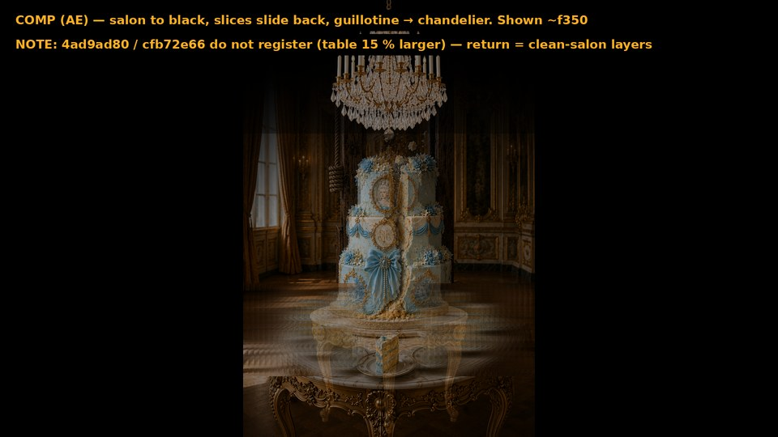
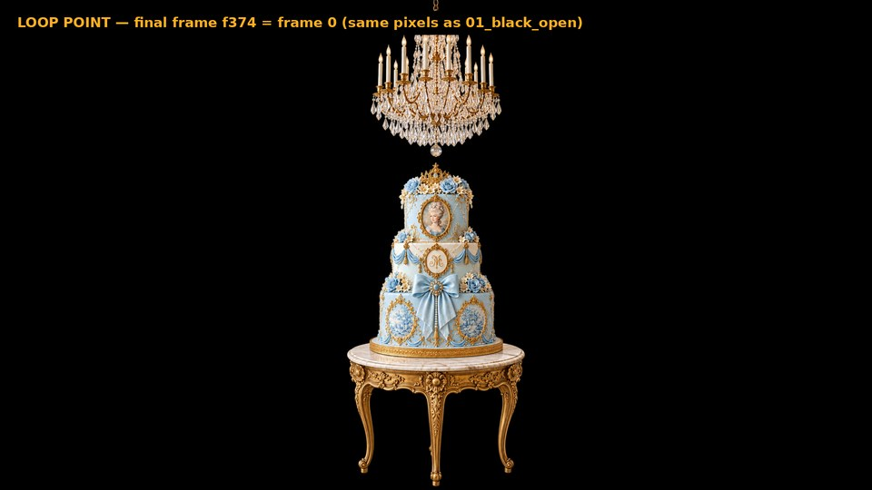

| | |
|---|---|
| Film | 04 — Airelles Le Grand Contrôle, Château de Versailles ("Let them eat cake") |
| Client / studio | Theria / Allen Grabo, RTFX Design |
| TRT | **15.6 s (f374)** — timing-doc beats 1–7 unchanged (0–13.6 s); the 1.4 s Hall of Mirrors end card is replaced by a 2.0 s return-to-frame-0 beat (13.6–15.6 s) |
| Frame rate | 24 fps |
| Master | one master, 16:9, 1920×1080 |
| Loop | **final frame f374 = frame 0.** `build_frames.py` asserts `01_black_open` and `09_loop` are pixel-identical below the tag band |
| Frames | `frames/*.png` (1920×1080), `frames/*_small.jpg` (960×540), `frames/contact_sheet.jpg` — built by `build_frames.py PULL_ROOT OUT_DIR` |
| Board date | 2026-09-25 (v2; v1 same day) |

### Decisions taken

Allen's decisions, applied as given:

1. **One master 16:9 1920×1080, 24 fps.** v1 shot timings kept; the film is extended only by what the loop needs (see 5).
2. **Black field for the open and the close.** The page's white field is dropped. Shot 1 is the `cfb72e66` cut-out on black; the film returns to that exact frame.
3. **The film loops — last frame = first frame.** The Hall of Mirrors end card (v1 `08_endcard`, timing-doc Shot 8) is gone; `1651551468329.webp` is no longer used. After the plated slices, the salon fades to black inward from the edges, the slices slide back into the whole cake and the guillotine dissolves back into the chandelier, landing on frame 0.
4. **Wordmark stays raster.** The 2× Lanczos, luma-keyed enlargement of `images copy.jpg` is the approved production asset — tagged "raster, approved" on the frames. No vector is coming and none is requested.
5. **Production plan = one clean 16:9 salon plate + layered objects** (cake, chandelier, guillotine, table, slices held in one position across Shots 2–8), per the v1 review note. This is stated in the beat table's Status column. The board frames themselves stay on the v1 plates (`fd1e32ee`, `965d5f9a`, `cfb72e66`, `4ad9ad80`) — they are the look reference for the rebuild, not the comp sources.

Judgement calls made on this board (not put back to the client):

6. **Blade drop = 8 frames + flash (timing doc)**, not the page's 4 frames + dust: 2 f pre-shake at f235, blade f238–246, 3-frame white flash on f246, 4 px camera shake settling by f254. The blade is an AE layer moved down over the clean salon — no video model for this shot (pipeline §7 expects the Kling prompt to be refused).
7. **Chandelier → guillotine morph is an AE comp** (Shot 4), never a video model. Crystals darken and elongate into uprights f149–180, boss stretches into the blade f170–200, rope and pulley draw on f195–211. Light drops 1.5 stops across the shot.
8. **The return beat is 2.0 s (13.6–15.6 s, f326–374), TRT 15.6 s.** The 1.4 s the end card had is too short for three overlapping actions after a 3.0 s plating beat: salon-to-black 1.0 s, slices back 1.0 s, guillotine→chandelier 0.8 s, then a 4-frame hold on frame 0 so the join is dead still. Nothing before 13.6 s moves.
9. **The return is the payoff run backwards, not a new idea.** Slices retrace their Shot 7 paths at 2× speed and the plates fade out as each portion arrives; the cut heals as the last slice lands; the guillotine fades and the chandelier fades up in its place (a dissolve, not a reverse morph — the room is already black, so the uprights just go). Quartet fades under the return; silence at the join.
10. **Shot 1 micro-motion (candle flicker, caustics, 1 % push-in) is AE layer work on the still, not Kling.** That keeps f0 pixel-exact to the still, so f374 can equal it. Kling O1 stays an option for Shot 2 (reveal) and Shot 7 (slice travel) only, where neither end has to match a loop frame.

Notes on the files (unchanged from v1 — the timing doc §4 list, pipeline doc §3 and the original brief describe four of the six Versali files wrong; the board uses what is in them):

| File | Actually contains |
|---|---|
| `965d5f9a-…png` 1023×1537 RGB | cake on gilt table under the **guillotine, blade raised**, salon |
| `fd1e32ee-…png` 1024×1536 RGB | cake on gilt table under the **chandelier**, salon |
| `cfb72e66-…png` 1024×1536 RGBA | cake + **chandelier**, isolated, real alpha (bbox 783×1527 at x 227); `(1).png` is a byte-identical duplicate |
| `4ad9ad80-…png` 1023×1537 RGB | **blade down** through the cake, slices already plated round the table |
| `images copy.jpg` 447×447 | the AIRELLES / LE GRAND CONTRÔLE / CHÂTEAU DE VERSAILLES wordmark (dark on cream) |
| `images.jpg` 554×554 | guillotine on white — not the wordmark |
| `1651551468329.webp` 1170×780 | Hall of Mirrors — no longer used |

All hero plates are portrait 2:3, letterboxed at full height on a sampled-and-darkened wall colour, never stretched or cropped. Exposure changes are approximated with a brightness multiply; the real grade is AE. Nobody in frame, ever; the blade only meets cake.

---

### Beats

Frame numbers are `f###` at 24 fps. "Brief line" is the client brief line the beat serves.

| # | Brief line | IN – OUT (s) / frames | Frame | On screen | Motion / camera | Transition | Assets used | Status |
|---|---|---|---|---|---|---|---|---|
| 1 | "Start with the cake on the table with the chandelier" | 00.0 – 02.2 / f0–53 (2.2 s) | `01_black_open.png` | Tiered blue cake on the gilt table, crystal chandelier directly above, everything else black. **This is frame 0 and the loop frame** | Locked off, 1 % push-in. Candle flames flicker; slow crystal caustics across the icing; chandelier may sway 1.5° on a slow sine | — | `cfb72e66-…png` (RGBA cut-out on black) | **READY.** Micro-motion = AE layers on the still (decision 10), so f0 stays exact. In the production build the same cut-out is the cake+chandelier layer for Shots 2–8 |
| 2a | "The background appears with the lavish finishing in the background" | 02.2 – ~03.6 / f53–86 (mid-reveal) | `02a_salon_reveal.png` | The salon fading up from black, outward from the cake; walls and parquet still dark at the edges | Radial reveal ~1.4 s from centre; three passes floor / walls / light ~400 ms apart; warm afternoon shaft lands across the floor last | reveal (from black) | `fd1e32ee-…png` under a radial luma mask | **COMP (AE)** — luma-matte reveal of the **clean salon plate** behind the held cake layer. Alt: Kling O1 Shot 2 prompt with `01` and `02b` as start/end frames |
| 2b | same | 02.2 – 04.4 / f53–106 (end state) | `02b_salon.png` | The salon whole: boiserie, gilding, drapes, window light, cake centre, chandelier above | Hold. Camera locked | — | `fd1e32ee-…png` | **READY as look reference.** Production = clean 16:9 salon plate (TO GENERATE, Seedream 4.5) + cake/chandelier layer; `fd1e32ee` is the reference image for that generation, not a comp source |
| 3 | "The logo for the hotel appears under the table" | 04.4 – 06.2 / f106–149 (1.8 s) | `03_wordmark.png` | AIRELLES lockup on the parquet between the table's front feet | Wordmark fade 0.7 s, hold 1.1 s. Screen-flat fade (timing doc); gold-cream so it reads on the parquet | — | `fd1e32ee-…png` + `images copy.jpg` (2× Lanczos, luma-keyed) | **COMP (AE)** — wordmark layer over the clean salon. Wordmark **raster, approved**. On the clean-salon build the table is a layer, so the floor clearance under it is set at build time; board it at 240 px wide as here |
| 4 | "The chandelier turns into a guillotine" | 06.2 – 08.8 / f149–211 (2.6 s) | `04_morph_COMP.png` | Mid-morph: the chandelier half-become guillotine; wordmark still on the floor; room ~¾ stop down | Morph, not cut (decision 7): crystals → uprights f149–180; boss → blade f170–200; rope and pulley draw on f195–211. Light drops 1.5 stops across the shot; the cake is oblivious | — | 50 % blend of `fd1e32ee-…png` and `965d5f9a-…png`, `images copy.jpg` | **COMP (AE), never a video model.** The blend ghosts because the two plates do not register — irrelevant in production, where the chandelier and guillotine are two layers over one clean salon and the morph is between those two layers |
| 5 | "The logo disappears" | 08.8 – 09.8 / f211–235 (1.0 s) | `05_still.png` | Guillotine raised over the cake, dark room, no logo. Total stillness f223–235 | Wordmark opacity → 0 over 0.5 s, then 12 frames of nothing. Quartet stops dead at 09.8 | — | `965d5f9a-…png` | **READY as look reference** (shown −1.0 stop; doc grade is −1.5). Production = clean salon + guillotine layer (isolated guillotine TO GENERATE, see Assets) + logo fade in AE |
| 6 | "The guillotine comes down fast and cuts the cake" | 09.8 – 10.6 / f235–254 (0.8 s) | `06_drop_COMP.png` | Impact frame: blade through all three tiers, 3-frame white flash, frame kicked 4 px | **8-frame drop + flash (decision 6):** pre-shake f235, blade f238–246, flash f246, 4 px shake settling by f254. No dust burst, no gore physics | hard | `4ad9ad80-…png` at −1.5 stop, +4/−3 px offset, 35 % white | **COMP (AE)** — blade is a layer moved 8 frames over the clean salon. Impact state needs a blade-through-cake element without plates (see Assets); `4ad9ad80` stands in on the board |
| 7 | "The cake it cut up into many pieces" | 10.6 – 13.6 / f254–326 (3.0 s) | `07_served.png` | Cake parted under the blade, slices on porcelain ringing the table; light back up 1 stop | 0.6 s of the cake falling into slices, then portions slide out to their plate positions and settle. Quartet back at 11.2 as if nothing happened | — | `4ad9ad80-…png` at −0.5 stop | **READY as end-state reference.** Slice travel = Kling O1 (pipeline §6 Shot 7 prompt, start `06` end `07`) or AE cut-outs sliding over the clean salon. Whichever is used, the end positions are keyed so Shot 8 can run them back |
| 8 | — (loop rule, replaces the timing-doc end card) | 13.6 – 15.6 / f326–374 (2.0 s) | `08_return_COMP.png` | Mid-return (~f350): the salon black at the edges and closing in, only the table still lit; slices trailing back toward the cake; the chandelier ghosting in over the guillotine; the cut cake starting to heal | **The return (decisions 8–9):** salon fades to black inward from the edges f326–350 (reverse of Shot 2); slices retrace their Shot 7 paths at 2× speed f338–362, plates fading as each portion lands, cut heals on the last; guillotine → chandelier dissolve f350–370, cake light back to Shot 1 level; hold f370–374. Quartet fades out under it; silence at the join | fade to black around the table; **loop** | `4ad9ad80-…png` (−0.5 stop, radial mask to black, slice bands smeared inward) + `cfb72e66-…png` ghosted at 50 % / 18 % | **COMP (AE)** — layer work on the clean salon: salon layer fades, slice cut-outs run backwards, guillotine layer out / chandelier layer in. The board frame is an honest composite of two plates that do not register (table ~15 % larger in `4ad9ad80`) — see Flagged risks |
| 9 | (loop point) | 15.4 – 15.6 / f370–374 (4 f hold, inside Shot 8) | `09_loop.png` | Identical to frame 0 | Dead still. **Final frame f374 = frame 0** | loop → Shot 1 | `cfb72e66-…png` | **READY** — same pixels as `01_black_open` (asserted by the build) |

---

### Flagged risks (with decisions)

1. **`4ad9ad80` and `cfb72e66` do not register**, so the return cannot be a dissolve between the two plates — the table is ~15 % larger and lower in the plated plate and the cake sits at a different scale (`08_return_COMP` shows the honest blend; compare the two table edges). **Decision:** the return, like Shots 2–7, is built on the clean-salon layer stack, where the cake, table and chandelier cut-outs never move; the slices are cut-outs keyed from the Shot 7 end positions and run back. The plated plate is a look reference only. No outpaint of `4ad9ad80` is ordered.
2. **The loop join depends on f0 and f374 being the same pixels, but Shot 1 has micro-motion** (flicker, caustics, 1 % push-in). If Shot 1 came out of Kling its first frame would drift from the still and the join would pop. **Decision:** Shot 1 micro-motion is AE layers on the `cfb72e66` still, the push-in is a scale keyframe that resets at the join (1 % over 2.2 s reads as a breath, not a jump), and the flicker/caustic layers are seeded to start at zero. The build already asserts the two board frames match; the AE comp should be checked the same way (difference matte on f0 vs f374).

---

### Assets still needed

- **Clean empty salon plate**, 16:9, ≥ 3840 wide, no cake, no chandelier, no guillotine (Seedream 4.5, `fd1e32ee` as the reference) — the background for every shot from 2a to 8. This replaces the three portrait outpaints v1 listed; none is now needed.
- **Isolated guillotine with alpha** at plate scale, matching the model in `965d5f9a` — Flux 2.0 Pro per pipeline §3, or keyed out of `965d5f9a` (rope and open timber will be fiddly). Blade must be a separate layer, or separable, for the 8-frame drop.
- **Isolated cake alone and chandelier alone** — `cfb72e66` has both in one alpha; they do not overlap, so a horizontal split above the cake's finial separates them for free. Not yet done.
- **Blade-through-cake element with no plated slices** (Shot 6 impact, Shot 7 start, Shot 8 end of the heal) — does not exist; generate from `4ad9ad80` with plates removed (Seedream / NBP) or build in AE from the cake cut-out.
- **Slice cut-outs** (12 portions on porcelain) keyed from `4ad9ad80`, or generated as one element set — needed for Shot 7 travel if done in AE, and for Shot 8's return either way (a Kling Shot 7 does not give reversible layers).
- **Audio**: period string quartet bed, rope-and-timber creak, blade whoosh, impact thud; quartet out under the return.
- Nothing further for the wordmark (raster approved) and nothing for the Hall of Mirrors (end card dropped).

### What this board does not cover

- In-between motion: candle flicker, caustics, the morph itself, the blade travel, slice travel out and back — every frame here is a keyframe or a tagged stand-in.
- The morph design (which crystal becomes which upright, where the chain becomes rope) — AE animatic, not board.
- Colour grade, the 1.5-stop / 1-stop light changes (approximated), and any cool-down of the light through Shots 4–5.
- Audio timing beyond what the timing doc states and the fade under the return.
- 1:1 and 9:16 crops — one 16:9 master only, per Allen.
- The generation of the clean salon plate and the isolated elements listed above — no generation was run.
- Anything under the pull directory was read only; nothing there was modified, including the duplicate `cfb72e66 (1).png`.

## 05 · North Island

| | |
|---|---|
| Film | 05 North Island (Theria slate, 8 films) |
| TRT | **13.0 s** = 312 frames @ **24 fps** (per `theria_hotel_animations_timing_v1.md` §5; v1 timings kept) |
| Master | **One master, 16:9, 1920×1080** |
| Shots | 6 in the timing doc, boarded as 8 frames (shots 4 and 6 get two frames each) |
| Loop | final frame f312 = frame 0. `build_frames.py` asserts 01 and 08 are pixel-identical below the tag band |
| Frames | `frames/NN_name.png` (1920×1080) + `NN_name_small.jpg` (960×540) + `contact_sheet.jpg`. Rebuild: `python3 north_island/storyboard/build_frames.py PULL_ROOT north_island/storyboard/frames` |
| Beat source | client brief lines (6) → timing doc §5 (source of truth for IN/OUT) → storyboard page "05 NORTH ISLAND" (page differences from v1 are resolved below) |

### Decisions taken

From Allen (applied):
- One master 16:9 1920×1080, 24 fps. v1 timings kept unchanged.
- Loop rule: last frame = first frame. Pixel-identical check kept in the build.
- No vector for this hotel; rasters are fine. The wordmark burned into `b261916d` and `northisland.png` is accepted as-is. It is baked in and will be **masked/held in comp** — a still patch of the plate's wordmark is held over the Kling shots and travels with the plate dissolves.

Judgement calls (made here, stated so they can be overruled):
1. **Turtle count = 5** (the lock-up plates). The beach plate `0873e031` with three turtles is used **as-is** for the landfall beat (04, 05); the two missing turtles (the top-right pair) are comped onto the sand from cut-outs of the water plate. Shot 5's "the three turtles" in the timing doc becomes five.
2. **Water wipe direction**: bottom-up flood on beat 2 (timing doc, 1.2 s), top-down drain on beat 6 (timing doc, 1.0 s). The page's radial-from-corners wipe with refraction is dropped; the wordmark stays locked, no displacement pass.
3. **`northisland.png` replaces `7e26a98a` on every water beat** (02, 03, 04, 06, 07). Diff after resizing to 1536×1024: mean abs difference 3.5/255, 1.8 % of pixels differ by more than 16, gold-mask IoU 0.89, identical gold bounding boxes — same composition, residual is edge/resampling detail. Being 2×, it scales to 1080p at 0.527 instead of 1.055, so it is sharper. `7e26a98a` is now reference only.
4. **Lock-up plates are fit by height, not cover-cropped.** v1's cover crop cut ~60 source px off the top-right turtle and the big turtle's rear flippers at the frame edge. v2 scales `b261916d` and `northisland.png` to 1620×1080, centred: nothing is clipped. On white the 150 px pillars are white and invisible. On water the pillars must be extended in comp (generative expand of the raster, 150 px each side — caustics only, no gold in the fill). On the board the pillars are a mirror-tiled gold-free strip of the plate's own edge, tagged. The beach plate is a scene, not a lock-up, so it keeps the v1 cover crop biased down (loses 115 source rows of sky, nothing else).
5. **Wordmark behaviour across the film**: held over shot 3 (masked still patch over Kling), dissolves out with the water→sand cross-dissolve at f168–197 (the beach plate has no wordmark), comes back with the sand→water dissolve at f226–274, and holds through the whiteout to the loop. The v1 "fade at f150 / fade back up" is dropped — one less thing to animate, and it needs no clean plate.
6. **Beat 5 exit**: turtles turn back on the same plate (timing doc). The page's "mirror the plate" is dropped — it flips the island and the lodge.
7. **Beat 3 motion**: timing-doc version (staggered flippers, ~15 % drift right, formation holds). The page's break-formation/wakes idea is not boarded.

Where the page and timing doc differed in v1 (beat boundaries, beat 2/6 mechanics, turtle count, beat 3/4/5 mechanics, sound), the timing doc wins throughout.

**Build assumptions**
- Blend frames (02, 04, 06, 07) are plain 50 % `Image.blend` of two plates: they show *which two states* the beat moves between, not the wipe itself.
- `b261916d` and `northisland.png` are two separate generations, not one composition re-lit: turtles and wordmark sit 5–11 px (1536-space) apart, gold-mask IoU 0.39. Shot 2 and shot 6 therefore cannot be a straight luma wipe between the two files — comp the turtles + wordmark as one cut-out layer set (from `northisland.png`, the sharper source) over a white plate and a water plate, then wipe the grounds.
- `download.jpg` (house mark, 225×121) is **not used in any frame**. Nothing was AI-enlarged. No client logo was touched.
- Nothing under the pull directory was modified.

### Beats

| # | Brief line | IN–OUT (s) / frames @24 | Frame | On screen | Motion / camera | Transition | Assets used | Status |
|---|---|---|---|---|---|---|---|---|
| 1 | "Start with the gold turtle logo" | 0.0–2.2 / f0–53 (2.2 s) | `01_hold` | Five gold turtles + "north island / SEYCHELLES" on white, dead still. Lock-up 1620 px wide, centred, white pillars | Locked off. One specular sweep across the big turtle's shell f24–48 (AE, on the plate) | — | `b261916d-7215-4f97-8607-d091aabe911a.png` (fit-height) | **READY** as a board frame and as the final plate (wordmark baked in, accepted) |
| 2 | "Have the background change to water" | 2.2–4.0 / f53–96 (1.8 s) | `02_flood_COMP` | White ground becomes turquoise shallows; turtles and wordmark do not move | Turquoise floods from the bottom edge upward over 1.2 s (f53–82), caustics resolve as it rises; hold on the water plate to f96. Plates are not pixel-locked (5–11 px drift), so the turtles + wordmark are one cut-out layer set held over both grounds | luma wipe **bottom→top** (AE) | `b261916d-…png` → `northisland.png` (shown as 50 % blend) | **COMP (AE)** |
| 3 | "Have the gold turtles start to swim" | 4.0–7.0 / f96–168 (3.0 s) | `03_swim_TOGEN` | Turtles in the shallows begin to swim; wordmark holds | Front flippers start f96, staggered 6 frames per turtle; slow drift toward frame right ~15 % of frame width over the shot; caustics move across the shells. Wordmark = masked still patch held over the Kling output | — | `northisland.png` as Kling start frame (with the 150 px comp extension each side) | **TO GENERATE — Kling** (image-to-video). Wordmark region masked back to the plate in comp |
| 4a | "Have them land on a beach" | 7.0–8.2 / f168–197 (1.2 s) | `04_landfall_COMP` | Water shallows out; sand, beach and island fade up behind; wordmark goes with the water | Colour ramps turquoise → pale sand over 1.2 s; beach plate fades up under the Kling shot-3 tail | cross-dissolve (AE) | `northisland.png` → `0873e031-511a-499b-a9d5-8a2b7a701d87.png` (50 % blend) | **COMP (AE)**. Beach plate used as-is (3 turtles); **+2 turtles comped from `northisland.png` cut-outs** so five land |
| 4b | (same) | 8.2–9.4 / f197–226 (1.2 s) | `05_sand` | Five turtles on white sand, bay and lodge behind | Flipper cycle changes from swim to a heavy crawl at f190; slow each ~30 % as it takes the sand | — | `0873e031-…png` (Kling start frame, cover crop biased down) + 2 turtle cut-outs | **TO GENERATE — Kling** from the 5-turtle comp of the beach plate |
| 5 | "Then back to sea" | 9.4–11.4 / f226–274 (2.0 s) | `06_return_COMP` | Turtles turn back to the water; sand ramps back to turquoise; wordmark returns with the water | Five turtles turn, staggered 0.5 s apart, and head out; colour ramp sand → turquoise under them; same plate, no mirror | cross-dissolve (AE) | `0873e031-…png` → `northisland.png` (50 % blend) | **TO GENERATE — Kling** (turn) **+ COMP (AE)** ramp. Turtles must end in their lock-up positions |
| 6a | "back to blue, back to white" | 11.4–12.4 / f274–298 (1.0 s) | `07_whiteout_COMP` | Water desaturates to white from the top down; turtles settle into shot-1 positions; wordmark holds | Top-down luma wipe over 1.0 s; turtle/wordmark cut-out layer set held over both grounds | luma wipe **top→bottom** (AE) | `northisland.png` → `b261916d-…png` (50 % blend) | **COMP (AE)** |
| 6b | (loop) | 12.4–13.0 / f298–312 (0.6 s) | `08_loop` | Identical to frame 0 | Hold. **Final frame = frame 0** | loop point | `b261916d-…png` | **READY** (same pixels as `01_hold`) |

### Flagged risks

1. **Landfall turtle reconciliation (04/05).** The three beach turtles are at a different scale and lighting (low sun, long shadows) from the water plate's top-down gold. Two cut-outs pasted from `northisland.png` will need a relight/shadow pass to sit on the sand, and the two extra turtles have no beach-plate positions to inherit. Decision: comp them upper-right of the three, matching the lock-up's layout, and let the Kling shot-4b generation start from that 5-turtle comp rather than the raw plate. If Kling cannot hold five, fall back to three on the sand with the top-right pair still swimming in the shallows behind — the count stays five in frame.
2. **Water pillars (03, and the water state of 02/04/06/07).** Fit-height leaves 150 px each side of the water plate to extend. Decision: generative expand of the raster in Photoshop (caustics only; mask the gold out of the sample), done once on `northisland.png` before it goes to Kling, so shot 3 is generated at the full 16:9 frame and the extension never has to track. The board's tiled stand-in is not final.

### Assets still needed

- `northisland.png` extended to 16:9 (3413×1920 at 2×, or 1920×1080 at master) — generative expand of the water, gold masked out of the sample. Feeds shot 3 Kling and the 02/06/07 comps.
- Turtle + wordmark cut-outs from `northisland.png` (one layer per turtle, one for the wordmark) — for the shot 2/6 grounds wipe, the staggered swim start, the settle-back in shot 6 and the +2 turtles on the sand.
- Beach plate 5-turtle comp (`0873e031` + 2 cut-outs, relit) — Kling start frame for shot 4b.
- Kling clips: shot 3 swim/drift (start `northisland.png` 16:9), shot 4b crawl (start 5-turtle beach comp), shot 5 turn. No North Island prompts exist in the pipeline doc yet.
- Audio bed (surf/reef) rising through the water beats, dropping to near-silence at 12.4; loop-safe.

### What this board does not cover

- No wipe/caustic previs: 02, 04, 06, 07 are flat 50 % blends of two plates.
- No per-turtle motion, stagger or the 15 % drift; no shot-1 highlight sweep.
- The +2 turtles on the sand are noted on 04/05, not comped on the board frames.
- The water pillars on the board are a tiled stand-in, not the comp extension.
- No Kling prompts, seeds or fallbacks. No audio. No 1:1 / 9:16 re-frames (single 16:9 master).
- Frames are built from the 1536×1024 white/beach plates scaled ×1.055 / ×1.25 and the 3072×2048 water plate scaled ×0.527 — review frames, not final plates.

## 06 · Miavana

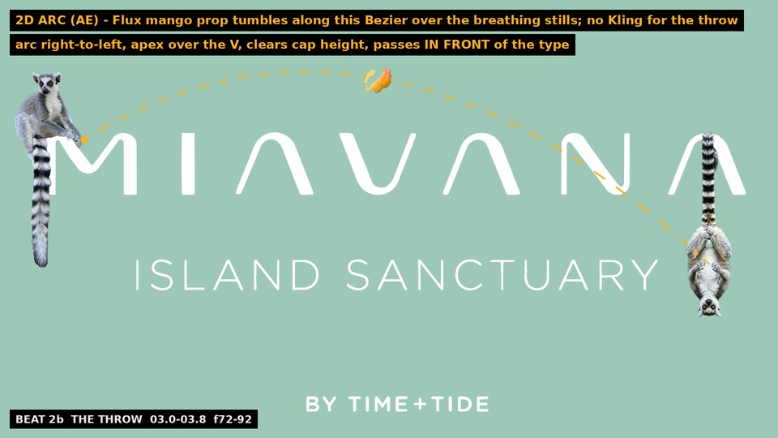

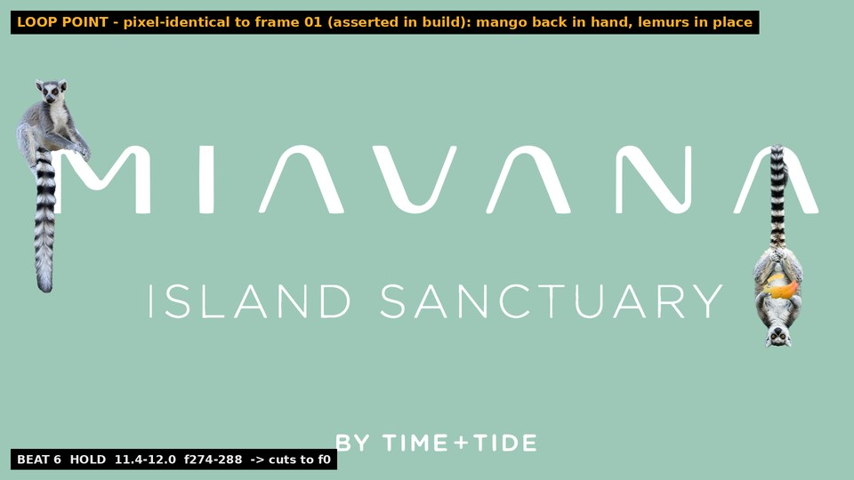

| | |
|---|---|
| Film | 06 Miavana, Nosy Ankao, Madagascar (client: Theria; hotel group Time+Tide) |
| TRT | 12.0 s = 288 frames @ 24 fps (timing doc `theria_hotel_animations_timing_v1.md` §6; v1 timings kept) |
| Master | One master, 16:9, 1920×1080, 24 fps; sage brand ground RGB 157/200/183 (PSD background layer) |
| Loop | Last frame = first frame. Frame 08 is built from the same composite as frame 01 and asserted pixel-identical in `build_frames.py` |
| Frames | `miavana/storyboard/frames/` — one PNG per beat + `*_small.jpg` (960×540) + `contact_sheet.jpg` (4×2); rebuilt by `build_frames.py PULL_ROOT OUT_DIR` |
| Brief | "Start with the logo with the lemurs (better positions). Have the last one holding a mango throwing it to the other lemur. The hotel appears in the background and the lemurs are in the palm trees. Hotel disappears back to the logo and lemurs in places." |

### Decisions taken

- **Seated lemur stays on the M** (PSD position). The timing doc's first-A placement is dropped: it put the tail into ISLAND SANCTUARY and would have meant re-seating the lemur against the mark. The v1 ALT frame is removed.
- **MIAVANA line = the vector wordmark**, rasterised to `assets/wordmarks/miavana_wordmark.png` (3919×604 RGBA, white). It is alpha-cropped and fitted **by width** to the PSD `miavana` layer bbox (2260×201 on the 2508 canvas → 1730×154 at HD, origin (111,327)). Letter x-positions match the PSD raster to <0.1 % of the width, so the seat on the M and the hang on the final A do not move; the vector's 0.6 % taller aspect is centred on the bbox height. ISLAND SANCTUARY and BY TIME+TIDE remain the PSD layer exports (no vector for those two lines).
- **Resort plate = `resort_16x9.png`** (4988×2806, Allen's 16:9 outpaint). Scaled to cover 1920×1080 with no crop. Used for beats 3, 4 and 5. Licensing: the plate may be used freely; no rights note carried.
- **Throw = 2D.** The Flux mango prop is animated along the drawn Bezier in After Effects over the breathing lemur stills. Kling is used **only** for two lemur poses: the hanging lemur's wind-up (one free arm) and the seated lemur's one-handed catch. No Kling throw clip at HD is needed.
- **Mango at the loop point: in hand.** Beat 6 = beat 1, mango in the hanging lemur's clasped hands, so f288 cuts to f0 with no visible change. The storyboard page's "mango is gone" gag is not used.
- Throw direction right-to-left ("the last one" = the hanging lemur on the final A), release from its clasped hands (1750,651), catch at the seated lemur's hand (207,344), apex over the V at (932,197), 130 px above cap height. Unchanged from v1.
- Timings follow the **timing doc**; the storyboard page's motion notes (12-frame anticipation hold, arc in front of the type, plate greens matched toward sage) are kept.

Screen positions (HD px) carried through every beat: seated lemur bbox (34,176)–(207,660); hanging lemur bbox (1690,322)–(1810,783). The PSD lemurs are ~480 px / ~460 px tall at HD (soft, from the 1254 px source); the palms beat uses the large cut-outs `lemur.png` and `Firefly_remove background 477817 (1).png` scaled down to the same bboxes as stand-ins for NBP output.

### Beats

| # | Brief line | IN–OUT (s) · frames | Frame | On screen | Motion / camera | Transition | Assets used | Status |
|---|---|---|---|---|---|---|---|---|
| 1 | "Start with the logo with the lemurs (better positions)" | 00.0–02.4 · f0–58 | `01_lockup.png` | Sage lock-up: vector MIAVANA / ISLAND SANCTUARY / BY TIME+TIDE, seated lemur on the M, hanging lemur by its tail from the final A, mango already in its clasped hands | Still. Breathing on both, one tail sway on the hanging lemur, one head-turn. Mango visible from f0 so it registers before it moves | — | `assets/wordmarks/miavana_wordmark.png` (fitted to PSD bbox 145,427→2405,628), `miavana_0003_islandsanctuary.png`, `miavana_0004_bytimeandtide.png`, `miavana_0000_left_lemur.png`, `miavana_0001_right_lemur.png`, sage from `miavana_0005_Layer-0.png`; mango crop from `a ring-tailed lemur produces a mango, throws it up and to the right.mp4` @2.0 s | COMP (lock-up READY) · mango TO GENERATE — **Flux** prop |
| 2a | "the last one holding a mango" | 02.4–03.0 · f58–72 | `02_windup_TOGEN.png` | Hanging lemur weighs the mango, cocks one arm | Wind-up f58–70, 12-frame anticipation hold — the comedy is in the pause. Seated lemur only turns its head | — | as beat 1; mango offset up-right of the hands | TO GENERATE — **Kling** wind-up pose (hanging lemur with one free arm; the PSD still has both hands clasped) |
| 2b | "throwing it to the other lemur" | 03.0–03.8 · f72–92 | `03_throw_2D.png` | Mango mid-arc over the V, in front of the type; dashed arc from release (1750,651) to catch (207,344) | Release f72, 20-frame arc, apex (932,197) clearing cap height, mango tumbling ~35°; seated lemur's head tracks it | — | as beat 1 | **2D (AE)** — Flux mango on the Bezier over breathing stills; no Kling |
| 2c | (catch) | 03.8–04.2 · f92–101 | `04_catch_TOGEN.png` | Mango in the seated lemur's outstretched hand | One-handed catch, body otherwise still; soft "thup" at 04.0 | — | as beat 1 | TO GENERATE — **Kling** catch pose (seated lemur, one hand out) |
| 3 | "The hotel appears in the background" | 04.2–06.2 · f101–149 | `05_reveal_COMP.png` | Sage dissolving to the 16:9 aerial plate; wordmark holds ~1.0 s at reduced strength then fades; lemurs hold position | Cross-dissolve; the letters under the lemurs resolve into palm trunks as they go. Colour-match the plate greens toward the sage ground so the change reads as focus, not a cut | cross-dissolve | `resort_16x9.png` (cover, no crop; blurred 3 px at the mid-point), lock-up at 55 %, lemur layers, mango | COMP |
| 4 | "the lemurs are in the palm trees" | 06.2–09.6 · f149–230 | `06_palms_TOGEN.png` | Full 16:9 plate; both lemurs in real palm crowns at the same screen positions they had on the letterforms; second toss mid-arc, going **back** left-to-right | Slow aerial drift right-to-left, 6 % of frame over 3.4 s. Second toss at 07.8: seated lemur throws it back, shorter and lower (apex 90 px below the first); hanging lemur catches at 08.0 ("thup") and keeps it | — | `resort_16x9.png`, `lemur.png` (seated, scaled to the 484 px bbox), `Firefly_remove background 477817 (1).png` (hanging, scaled to the 462 px bbox), mango crop | TO GENERATE — **NBP** plate (lemurs sat in real palm crowns at these bboxes, type-free); toss **2D** as beat 2b |
| 5 | "Hotel disappears back to the logo" | 09.6–11.4 · f230–274 | `07_return_COMP.png` | Plate dissolving out, sage returning, letters re-forming under the lemurs | Reverse of beat 3; lemurs land in their beat 1 positions | cross-dissolve | `resort_16x9.png` at 30 % (blurred 6 px), lock-up at 75 %, lemur layers | COMP |
| 6 | "lemurs in places" (hold / loop) | 11.4–12.0 · f274–288 | `08_hold_LOOP.png` | Lock-up at full strength, lemurs in beat 1 positions, mango back in the hanging lemur's hands | Still; f288 cuts to f0 | — (loop) | as beat 1 — same composite, pixel-identical to `01_lockup.png` under the annotations | READY (loop verified in build); mango TO GENERATE — **Flux** |

Audio (timing doc): Malagasy forest at dawn, valiha or light marimba; two soft catches at 04.0 and 08.0. Storyboard page: "keep it dry, never cartoonish".

### Flagged risks

1. **Mango continuity across the loop.** The mango leaves the hanging lemur's hands at f72, is caught at f101, is tossed again at 07.8 in the palms, and must be back in the hanging lemur's hands at f274. Nothing in the brief returns it. Decision: the second toss in beat 4 is the seated lemur throwing it **back** (left-to-right, same arc reversed); the hanging lemur catches it at 08.0 and holds it through beats 5–6. This keeps the loop clean without an extra shot; the beat-4 arc annotation reads either direction, and the NBP brief for the palms plate does not change.
2. **Vector aspect vs. PSD bbox.** The vector wordmark is 0.6 % taller than the PSD raster at the same width. Fitted by width and centred on the bbox height, the cap line moves <1 px at HD and the letter x-positions are unchanged, so the lemur seats hold. Decision: accept; do not stretch the vector to the PSD height.

### Assets still needed

- **Mango prop (Flux)**: clean alpha, ~120 px at HD, lit to match the lemur stills; one hero frame plus a 35° tumbled frame for the arc (the board uses a colour-keyed crop from the 720×1280 Kling clip as a placeholder).
- **HD lemur poses (Kling)**: hanging lemur wind-up with one free arm (beat 2a) and seated lemur one-handed catch (beat 2c), at the PSD lemurs' scale on sage, plus breathing/tail-sway loops for the holds.
- **Palms plate (NBP)**: `resort_16x9.png` with both lemurs composited into real palm crowns at bboxes (34,176)–(207,660) and (1690,322)–(1810,783), type-free, for beat 4.
- Audio: forest bed, valiha/marimba figure, two catch foleys.

### What this board does not cover

- No motion is proven at HD: the Kling references are 720×1280. The dashed arcs are annotations, not the final AE curves.
- The "letters resolve into palm trunks" idea (beat 3) is described only; no morph frame was built. With the vector mark in hand it is now buildable, but it waits for the NBP palms plate.
- The palms frame places the big cut-outs at the letterform positions on the plate; they are not yet in the palm crowns — that is the NBP job.
- Colour-matching the plate greens to sage, the 6 % aerial drift, and the easter-egg mango on the third loop are not previewed.
- No audio, no end-card variant with a smaller mark, and no vertical (9:16) safe-area pass — one 16:9 master only.
- `build_frames.py` writes one ffmpeg frame grab and the mango cut-out into `frames/_work/`; nothing under the pull directory is touched.

## 07 · Necker Island

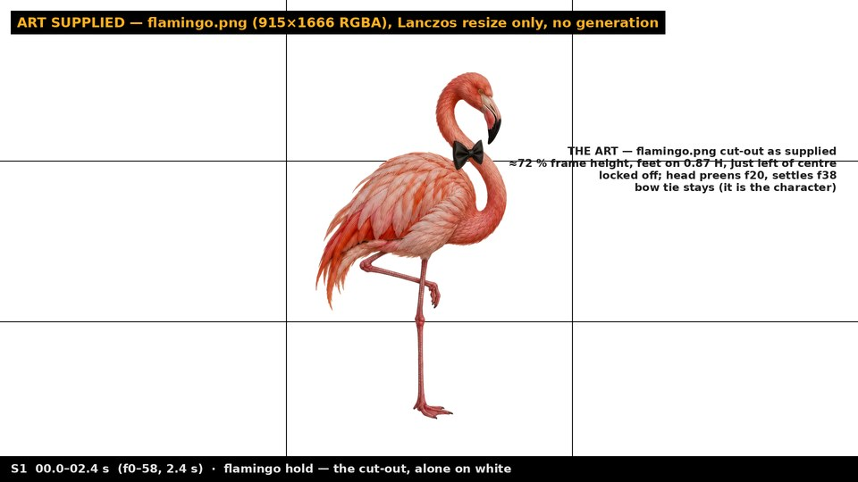

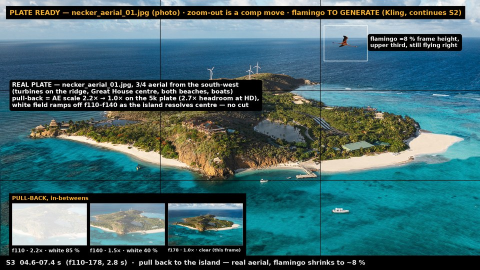
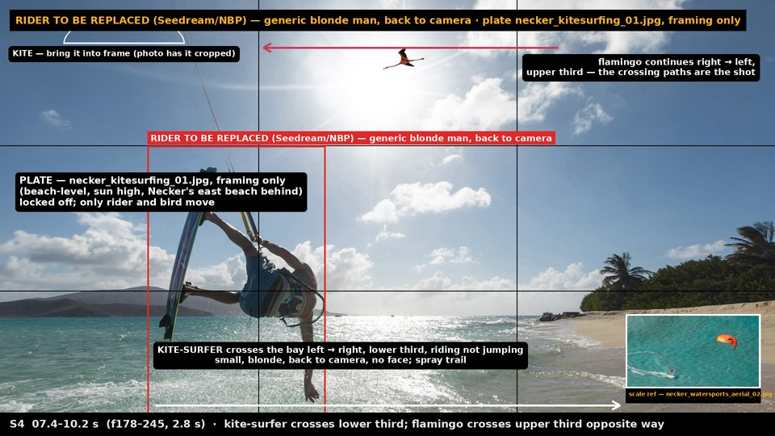

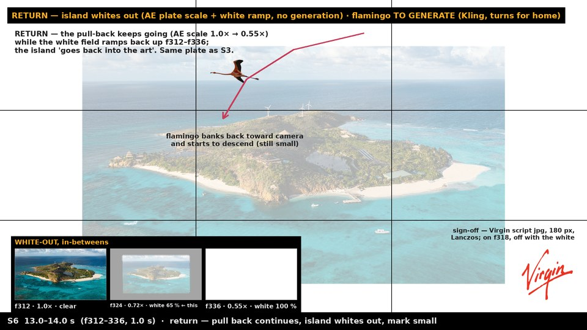
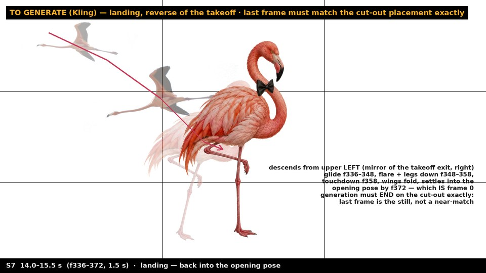
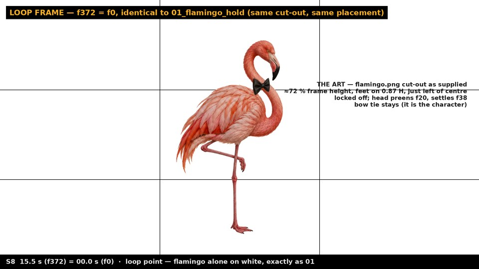

**Film 07 of 8** · client Theria · Allen Grabo / RTFX Design
**TRT 15.5 s (f372) @ 24 fps · 16:9 · 1920×1080 master** — 14.0 s of v1 timings + 1.5 s loop return · 8 frames, loop-locked (f372 = f0)
Frames: `necker_island/storyboard/frames/` (PNG 1920×1080, `*_small.jpg` 960×540, `contact_sheet.jpg`).
Build: `python3 necker_island/storyboard/build_frames.py PULL_ROOT OUT_DIR` (Pillow + numpy; ~10 s; prints every source photo's dimensions).

**Script (the only one):** the client brief — *"Art is a flamingo → the flamingo takes flight → it zooms out as an island comes into view with a kite-surfer (a generic blonde man, not a real person) → and lemurs are playing tennis with each other."*

v1 was a schematic because no art existed. v2 is built from Allen's photo set (`PULL_ROOT/Necker Island/`, local names; `drive/manifest.json` maps them to the Drive titles) and the flamingo cut-out. Every frame is now either the real cut-out or a real Necker plate; only the things that genuinely do not exist yet carry a TO GENERATE / TO BE REPLACED tag with the model named. Frames show the *end state* of each beat unless noted; motion in-betweens are shown as a thumbnail strip on 03 and 06.

### Decisions taken

1. **One master 16:9 1920×1080 at 24 fps.** v1 beat timings (14.0 s) kept as-is for S1–S6; a 1.5 s landing beat (S7) is added, then the loop frame. TRT 15.5 s.
2. **Loop rule applied:** last frame = first frame, the cut-out flamingo alone on white. The return is boarded in two beats — S6 the island whites out (pull-back continues, white ramps up, sign-off mark small), S7 the flamingo lands back into its opening pose. Frame 08 is composited from the same code path as 01 (same placement numbers), so the loop point is exact by construction.
3. **`Animation Virgin.docx` ignored** — not read, not boarded. The client brief is the script.
4. **Beat 1 is the supplied art.** `flamingo.png` (915×1666 RGBA, bow tie and all) is a proper cut-out (corner alpha 0; the linen texture is only in the RGB under transparent pixels). Lanczos resize only, ≈72 % frame height, feet on 0.87 H, just left of centre. Nothing to generate.
5. **The in-flight flamingo on the board is a real Necker bird**, keyed off the clear sky of `necker_flamingos_08.jpg` (top-left bird of the flock). It stands in for the animated cut-out in S2–S4/S6–S7 and doubles as the wing-pose reference for Kling. The final bird is the cut-out animated, not the photo.
6. **Pull-back plate = `necker_aerial_01.jpg`** (5162×3439, 3/4 aerial from the south-west: turbines on the ridge, Great House centre, both beaches, boats). It is the best of the three aerials for the brief — `necker_watersports_aerial_02.jpg` is a low-oblique of one beach and `necker_bali_hi_aerial_05.jpg` is a near top-down of one point. **The zoom-out is a comp move, not a generation:** AE scale 2.2× → 1.0× on the 5k plate (2.7× headroom at HD), white field ramping off f110–f140. Same plate reversed for the white-out in S6 (1.0× → 0.55×).
7. **S3 → S4 is a cut down to sea level.** On the 3/4 aerial a kite-surfer would be ~1 % of frame (the watersports aerial proves it — its real kiter is a speck). The beach-level `necker_kitesurfing_01.jpg` gives the rider a shot. The flamingo crossing above carries continuity across the cut.
8. **Casting rule enforced.** The real rider in `necker_kitesurfing_01.jpg` is boxed and tagged **RIDER TO BE REPLACED (Seedream/NBP) — generic blonde man, back to camera**; the photo is framing only. Boarded as a straight crossing, riding not jumping. The kite is cropped out of the photo, so the generated rider brings it into frame top-left. The distant kiter in `necker_watersports_aerial_02.jpg` is the scale/back-to-camera reference (inset on frame 04).
9. **Tennis plate = `necker_tennis_03.jpg`** (ground-level court: astroturf, shade sail, umbrellas, palms). The real player is boxed **PLAYER TO BE REMOVED — clean-plate the court (NBP inpaint)**. `necker_tennis_01.jpg` (top-down of both courts) is the location reference for the push-in, not a plate.
10. **Lemur species: generate two ring-tails.** The photo set has three species — ring-tail (`necker_lemur_01.jpg`), black-and-white ruffed (`necker_lemur_08.jpg`), red ruffed (`necker_lemurs_3.jpg`). Ring-tail reads instantly as "lemur" and matches Film 06 (Miavana). Stand-ins on the court are crops of `lemur_01` (A) and `lemur_08` (B), pinned as photos and labelled; B's label says to generate it as a ring-tail. v1's Miavana cut-outs are no longer used here.
11. **Sign-off mark:** the Virgin script jpg (`07D6D2DD-….jpg`, 1320×1240, red on white) at 180 px, alpha lifted from luminance, Lanczos only, lower-right on the white-out beat, on f318 and off with the white. No lock-up question, no end card.
12. **No vector for this hotel.** Everything here is raster; the cut-out and the plates are used at or below native resolution.
13. **v1's S5b AE fallback frame is dropped** from the board (it was a schematic). The fallback itself still stands as a production option and is noted in "What this board does not cover".

**Flagged risks (two, each with the decision):**
- **Loop seam at f372/f0.** A Kling landing will not end on the cut-out pixel for pixel. Decision: the last ~8 frames of S7 are a comp dissolve from the Kling output into the actual cut-out still, so frame 08 *is* frame 01 by construction; frame 07's tag says the generation must end on the cut-out placement, and the seam is hidden in the wing-fold.
- **Rider replacement on a sun-flare plate.** `necker_kitesurfing_01.jpg` has the sun dead centre and the real rider is large and mid-jump, so a clean replacement is a full re-generation of the lower-left quadrant, not a swap. Decision: keep the plate for framing (it is the only kite photo), but generate the rider small and riding (not jumping) in the lower third with the kite brought into frame; if the flare fights the composite, fall back to the same framing generated whole (Seedream, plate as reference) rather than inpainting.

### Beats

| # | Brief line served | IN–OUT (s) / frames @24 | Frame | On screen | Motion / camera | Transition | Assets (local filenames) | Status + model |
|---|---|---|---|---|---|---|---|---|
| 1 | "Art is a flamingo" | 00.0–02.4 · f0–58 (2.4 s) | `01_flamingo_hold.png` | The cut-out flamingo (bow tie) alone on white, full profile facing right, ≈72 % frame height, feet on 0.87 H, just left of centre. Same open-on-white grammar as Films 01, 02, 05. | Locked off. Head preens f20, settles f38. | — | `flamingo.png` (915×1666 RGBA) | **ART SUPPLIED** — Lanczos resize only, no generation. Motion: Kling (subtle preen) or a 2-key AE puppet on the head. |
| 2 | "The flamingo takes flight" | 02.4–04.6 · f58–110 (2.2 s) | `02_takeoff_TOGEN.png` | Crouch, lift, three wingbeats along an arc to the upper right, exiting top-right. Ghosts on the frame: the cut-out (f58, f68), then a real Necker flamingo in flight (f84, f110). Still on white — no background yet. Inset: flight reference. | Crouch f58–66, first downstroke f68, three full wingbeats to f110. Camera tilts up with it, lagging a few frames. | — | `flamingo.png`; flight pose from `necker_flamingos_08.jpg` (7392×4928, keyed crop); standing-flock ref `necker_flamingos_02.jpg` | **TO GENERATE — Kling** image-to-video from the cut-out, wing pose per `necker_flamingos_08`. |
| 3 | "It zooms out as an island comes into view" | 04.6–07.4 · f110–178 (2.8 s) | `03_pullback_aerial.png` | The real 3/4 aerial of Necker fills frame; flamingo ≈8 % frame height, upper third right, still flying right. In-between strip: f110 2.2× / white 85 % → f140 1.5× / 40 % → f178 1.0× / clear. | One continuous pull-back, no cut: AE scale 2.2× → 1.0× on the 5k plate while the white field ramps off f110–140; island resolves centre. | — | `necker_aerial_01.jpg` (5162×3439); refs `necker_elders_temple_flamingos.jpg` (flamingos over the roofs), `necker_bali_hi_aerial_05.jpg`, `necker_watersports_aerial_02.jpg` (not chosen) | **PLATE READY** (photo, comp move). Flamingo **TO GENERATE — Kling**, continuous from S2. |
| 4 | "…with a kite-surfer (a generic blonde man)" | 07.4–10.2 · f178–245 (2.8 s) | `04_kitesurfer_RIDER_TBR.png` | Beach-level shot of the bay, sun high, Necker's east beach behind. Kite-surfer crosses **left → right in the lower third**, small, blonde, back to camera, spray trail, kite in frame top-left. Flamingo crosses **right → left in the upper third**. The crossing paths are the shot. Real rider boxed red. Inset: distant kiter for scale. | Locked off; only rider and bird move. Riding, not jumping. | cut from S3 (on a wingbeat) | `necker_kitesurfing_01.jpg` (7984×5322) framing only; scale ref `necker_watersports_aerial_02.jpg` (8160×5436); foil refs `necker_foil_surfing_06.jpg`, `necker_foil_surfing_closeup_02.jpg` (not used, real people) | **RIDER TO BE REPLACED (Seedream/NBP) — generic blonde man, back to camera.** Motion: Kling. Flamingo: Kling, continued. |
| 5 | "Lemurs are playing tennis with each other" | 10.2–13.0 · f245–312 (2.8 s) | `05_lemur_tennis_TOGEN.png` | The real court. Two ring-tailed lemurs, one each side of the net, rackets in hand, mid-rally. Real player boxed red for removal. Stand-ins: pinned crops of `lemur_01` (A, near left) and `lemur_08` (B, far right). Ball arc with hit marks. Inset: top-down of the courts (location). | Push in 1.0× → 1.15× on the 6.7k plate. Hits at **10.8 / 11.6 / 12.4 s**, ≈14 f ball travel per exchange. Play it straight — proper form, no cartoon takes. Rally audio arrives one beat before the cut. | cut from S4 | `necker_tennis_03.jpg` (6720×4480) plate; `necker_lemur_01.jpg` (7669×5113), `necker_lemur_08.jpg` (6720×4480) crops; location ref `necker_tennis_01.jpg` (8160×5436); species ref `necker_lemurs_3.jpg` (red ruffed, not used) | **TO GENERATE (Seedream → NBP) — lemurs with rackets, mid-rally**, on the cleaned plate (NBP inpaint removes the player). Motion: Kling. Highest-risk generation in the reel; AE fallback below. |
| 6 | (return, part 1) | 13.0–14.0 · f312–336 (1.0 s) | `06_return_whiteout.png` | Same aerial, pull-back continuing (0.72× at this frame), white at 65 %. Flamingo small, banking back toward camera and starting to descend. Virgin script mark small lower-right. In-between strip: f312 1.0× clear → f324 0.72× / 65 % → f336 0.55× / 100 % white. | AE: plate scale 1.0× → 0.55×, white ramp f312–336. The island "goes back into the art". Mark on f318, off with the white. | — (continuous white-out) | `necker_aerial_01.jpg` (same plate as S3); `07D6D2DD-B1C4-4F3A-A698-BEFC90F1162C.jpg` Virgin mark (1320×1240) | **COMP ONLY** (no generation). Flamingo **TO GENERATE — Kling** (turns for home). |
| 7 | (return, part 2) | 14.0–15.5 · f336–372 (1.5 s) | `07_return_landing_TOGEN.png` | White field. Flamingo glides in from upper left (mirror of the S2 exit), flares, legs drop, touches down and settles into the opening pose. Ghosts: flier f336, f348; cut-out f358; final at f372. | Glide f336–348, flare + legs down f348–358, touchdown f358, wings fold, still by f372. Camera locked (matches S1). | — | `flamingo.png`; flier from `necker_flamingos_08.jpg` | **TO GENERATE — Kling**, reverse of the takeoff; last ~8 f are a comp dissolve into the cut-out still. |
| 8 | (loop point) | 15.5 = 00.0 · f372 = f0 | `08_loop_equals_01.png` | Identical composition to frame 01 — same cut-out, same placement numbers. | Hold = frame 0. | loop → S1 | `flamingo.png` | **LOOP FRAME** — built from the same code path as 01. |

**Audio (unchanged from v1 timing doc):** wingbeats close then distant, wind and water, three tennis pocks; no music. Add a soft wing-fold / settle on the landing so the loop point has a sound-cue as well as a picture-cue.

### Assets still needed

- **Flamingo motion (Kling):** takeoff (S2), continuous flight over the aerial and the bay (S3–S4), the bank-and-descend (S6), the landing (S7) — all from `flamingo.png`, wing pose per `necker_flamingos_08.jpg`. The S7 clip must end on the cut-out placement (comp dissolve covers the last frames).
- **Kite-surfer (Seedream/NBP):** generic blonde man, small, back to camera, riding in the lower third of the `necker_kitesurfing_01.jpg` framing, kite in frame top-left. Replaces the real rider. Then Kling for the crossing.
- **Clean court plate (NBP inpaint):** `necker_tennis_03.jpg` with the player and her shadow removed.
- **Two ring-tailed lemurs with rackets, mid-rally (Seedream → NBP):** on the clean court plate; then Kling for the rally. Fallback: two static plates (A ready / B follow-through), ball keyed in AE on a 14-frame arc, cut on each hit.
- **AE comp moves:** S3 pull-back 2.2× → 1.0× with white ramp-off; S5 push-in 1.0× → 1.15×; S6 pull-back 1.0× → 0.55× with white ramp-on; the 180 px Virgin mark fade.
- **Audio:** wingbeats, wind/water bed, three tennis pocks, wing-fold settle at the loop.

### Not used

Measured or seen, deliberately not composited:

- `necker_flamingos_02.jpg` (8064×5376, standing flock at dusk — takeoff-crouch reference only), `necker_flamingos_10.jpg` (8870×5909, top-down of the pond — no use in this cut), `necker_elders_temple_flamingos.jpg` (6720×4480, flamingos flying past the Elders Temple — proves the "bird over the island" idea, but the roofline is a different angle from the aerial), `necker_bali_hi_complex_flamingo_pond_02.jpg` (8870×5913, rainbow over the pond from a pool — a beauty shot, not a beat).
- `necker_watersports_aerial_02.jpg` (8160×5436, inset only), `necker_bali_hi_aerial_05.jpg` (6270×4177, near top-down of Bali Hi — wrong angle for the pull-back).
- `necker_foil_surfing_06.jpg` (5323×3546), `necker_foil_surfing_closeup_02.jpg` (3857×2893) — real people on foils, faces visible; not kite-surfing.
- `necker_lemurs_3.jpg` (5184×3456, red ruffed lemur — third species; not generating this one).
- `necker_tennis_01.jpg` (8160×5436) — inset only.
- `necker_bali_beach_hot_tub.jpg` and `_dup.jpg`, `necker_bali_hi_complex_01.jpg`, `necker_bali_hi_pool_sunset_01.jpg`, `necker_great_house_room4_terrace.jpg`, `necker_kayaking_02.jpg`, `necker_kayaking_03.jpg`, `necker_palm_beach_dining_05.jpg`, `necker_scarlet_ibis.jpg` — hotel/lifestyle photos with no beat in the brief.
- `necker_brochure.pdf`, `necker_press_kit_2026.pdf`, `necker_rate_card_2026.pdf`, `Necker Schedule.pdf`, `Iconic Leadership Summit 26.pdf` — not opened.
- `Animation Virgin.docx` — ignored per Allen. The other docx files (speeches, itinerary, questions, notes, "to lisa") — unrelated to the animation, not read.
- v1's Miavana lemur cut-outs (`Miavana/upscaled/lemur2.png`, `lemur3.png`) — replaced by the Necker lemur photos.

### What this board does not cover

- **Look of the generated elements.** The flying flamingo on frames 02–07 is a keyed photo of a real bird, not the cut-out in flight; the kite-surfer and the lemur players do not exist yet. The plates are real, the tags say what replaces what.
- **In-betweens inside the generations** — the three wingbeats of S2, the three hits of S5, the flare of S7. Only end states, hit times and the two comp-move strips (03, 06).
- **The S5 AE fallback** is described, not drawn (v1 frame 05b retired). It only comes into play if Kling cannot hold rackets.
- **Colour / grade.** Plates are used as shot; the S3 aerial is late-afternoon and the S4 beach is high sun. A unifying grade is a comp decision.
- **No AE comp, no Kling runs, no generated art** — nothing here touches the pull directory or any model. The build only reads the photos and writes to OUT_DIR.

## 08 · 22 Club

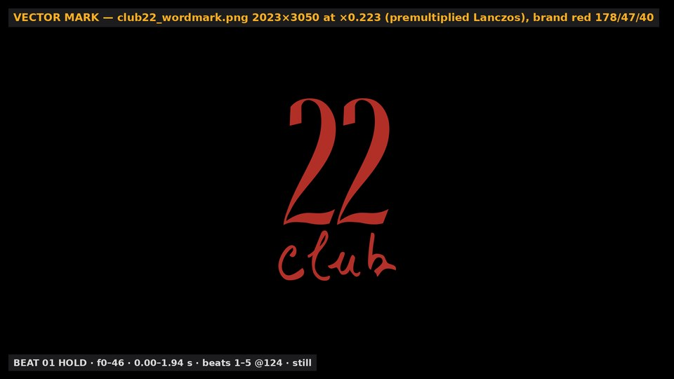

| | |
|---|---|
| Film | 22 Club (Theria slate, film 8 of 8) — "the numerals become the decks" |
| TRT | **12.10 s = 290 frames @ 24 fps**, cut to a 124 BPM grid (11.613 f/beat, 25 beats, 6.25 bars of 4). Picture cuts to black on beat 25 = f279; black held 11 f to f290 |
| Format | 16:9, 1920×1080 master, 24 fps. Frames in `frames/` (PNG) + `*_small.jpg` (960×540) + `contact_sheet.jpg` |
| Ground | **Black** (0,0,0) throughout — Allen's call. No ivory anywhere in this film |
| Mark | Client vector `22 club/22club_wordmark.ai`, rasterised to `assets/wordmarks/club22_wordmark.png` (2023×3050 RGBA). Used at ×0.223 so the ink stands 520 px tall, 335 px wide, top-left of ink at (793, 280). Brand red **178/47/40** (read from the file). No placeholders remain |
| Built by | `build_frames.py PULL_ROOT OUT_DIR` — Pillow only; the mark comes from the repo raster, the pull is only checked for the `.ai` source and never modified |
| Source of truth | Client brief (5 lines) → `theria_hotel_animations_timing_v1.md` §8 → v1 board → Allen's decisions (below) → this board |
| Changes v1 → v2 | Vector mark replaces the 364 px placeholder; ivory dropped, one ground; `01b` alternate frame removed; beat-6 composite is byte-for-byte the beat-1 composite; open-questions section closed out as decisions |

### Decisions taken

From Allen (applied, not re-opened):
1. **One master, 16:9, 1920×1080, 24 fps.** The v1 beat grid at 124 BPM stays exactly as it was (12.10 s / 290 f).
2. **Black ground.** Beat 1 is the red mark on black; the spotlight beat no longer has to "take the ground to black" — the ground already is, so the beam only brightens what it covers and the decks sit at 55 % outside the cone. Beat 5 no longer mixes the ground anywhere; the light lifts to nothing and black remains.
3. **Loop rule: last picture frame = first frame.** The beat-6 composite is the beat-1 composite reused (the build asserts the two are pixel-identical). f278 → f0 is a clean join.
4. **The vector mark is the mark.** Split read from the raster's alpha: digits rows 262–1884, left 2 cols 345–1014, right 2 cols 1029–1699 (15 px clear column between them), script rows 1952–2595 cols 280–1783. Three AE layers: `2 L`, `2 R`, `club`.

Judgement calls made here:
5. **The two 2s drift outward as they fall** — left −107 px, right +110 px — landing centred on 320 px platters at x = 775 / 1145 (±185 from centre). At 520 px mark height the digits' centres are only 153 px apart; two readable decks need the drift. The drift is eased in with the rotation (it is part of the fall, not a separate slide) and reversed on the way back up in beat 5. Alternative (140 px decks, no drift) rejected: too small to read as turntables at 1080p.
6. **Hinge line = the 2s' lowest ink row** (source row 1884, canvas y = 642). The vector's "2" has a calligraphic swash base, not the flat bar the timing doc assumed; there is no straight edge to rotate on, so each digit rotates about a horizontal axis through its lowest ink point and the platter rim, once built, hides the swash. Left digit rotates first, right +8 f.
7. **Spotlight and flip-back keep the timing doc's 6.2 s / 8.2 s hits**, snapped to beats 14 (f151) and 18 (f197) — the "2" of bars 4 and 5. Moving them to the downbeats would shorten the deck beat to 1.45 s; the syncopated hit is the better trade.
8. **Cut to black on beat 25 = f279**, black held 11 f to f290 so audio can ring out under black. The loop point is therefore the last *picture* frame (f278), not the last frame of the file — see risk 1.
9. **Spin at 33⅓ rpm from f130** (43 f/rev, timing doc), not locked to the 124 BPM bar. The vinyl flash reads as a record; the beat is carried by the light and the cuts.
10. **Perspective: 30° camera elevation**, platter ellipses at 0.5 × width, near rim on the hinge line, extending away from camera. The "club" script never moves; in beat 3 it reads as the mixer fascia between and below the decks.

### Flagged risks (two, each with the decision)

| # | Risk | Decision |
|---|---|---|
| 1 | **Loop vs. cut-to-black.** A player that loops the file will show an 11 f blink of black (f279–289) before the mark reappears at f0. | Keep the black tail — it is Allen's beat-25 cut and the audio needs it. For a seamless-loop deliverable (club screens), trim the export at f279: TRT 11.61 s = exactly 24 beats / 6 bars, and f278 → f0 already joins. Both cuts come from the same master; no re-animation. |
| 2 | **The digit gap is 3 px on the canvas** (15 px in the source): when the left 2 goes down first, its top edge sweeps back through the space directly beside the still-upright right 2. In a true 3D rotation the two layers can z-fight for ~8 f. | Rotate the digits about an axis 2 px *behind* their face (not on it) and put the left digit on a lower z-order for beats 2–5; the 8 f stagger means the right 2 is still upright and in front when the left passes it, which reads correctly from the 30° camera. Verified only as words; first thing to test in the AE block-through. |

### Beats

| # | Brief line served | IN–OUT (timing doc) | IN–OUT snapped to 124 BPM · frames @24 · lands on beat | Frame | On screen | Motion / camera | Transition | Assets used | Status |
|---|---|---|---|---|---|---|---|---|---|
| 1 | "Start with the logo with the 22 club" | 0.00–2.00 s | **0.00–1.94 s · f0–46 · beats 1→5** (in on beat 1, out on bar-2 downbeat) | `01_hold.png` | The full mark, brand red, dead centre on black. Nothing else. | Locked off. Optional 2 % bass-pulse scale on "club" at tempo (timing doc) — not drawn. | — (out is the flip starting, no cut) | `club22_wordmark.png` ×0.223, whole mark | **READY** (AE, nothing to generate) |
| 2 | "The 22 turns on its back" | 2.00–4.40 s | **1.94–4.36 s · f46–105 · beats 5→10** (59 f, 2.46 s) | `02_flip_COMP.png` | Both 2s rotate 90° backwards about the hinge line (their lowest ink row), left first, right 8 f behind; they end as two flat shapes seen from 30° above, drifting outward (−107 / +110 px) onto the platter footprints. "club" does not move. Shown ≈ f80: left down, right at ~45°. | 3D layer rotation in AE, camera 30° elevation. 0.8 s per digit (19 f) with small overshoot and settle. Ease-in from still. Drift eased with the rotation. | — | mark split into `2 L`, `2 R`, `club` (source cols 345–1014 / 1029–1699, rows 262–1884; script rows 1952–2595) | **COMP (AE)** — digit flip. Layers exist; see risk 2 |
| 3 | "…becomes vinyl record player with spinning records" | 4.40–6.20 s | **4.36–6.29 s · f105–151 · beats 10→14** (46 f, 1.92 s) | `03_decks_TOGEN.png` | Spindle, platter rim, tonearm and a black vinyl with plain red label build onto each ellipse over 1.0 s (f105–129). Records start spinning at f130, up to speed in 0.5 s. "club" stays put and becomes the mixer fascia between/under the decks. Shown ≈ f140. | Static camera. Rotation: 33⅓ rpm = 1.8 s/rev = 43 f/rev. Flash on the vinyl once per rev. Tonearm pivots behind the far rim (decks sit 50 px apart). | — | Flux stills: "Turntable platter, isolated" + "Vinyl record, isolated, top-down" (pipeline §5.1) cut out and mapped onto the 30° ellipses in AE | **TO GENERATE (Flux 2.0 Pro)** — turntable, vinyl. Deck build itself is COMP (AE). |
| 4 | "A spot light appears" | 6.20–8.20 s | **6.29–8.21 s · f151–197 · beats 14→18** (46 f, 1.92 s) | `04_spotlight_COMP.png` | Hard-edged cone drops in from top-left at f151, hits the left deck at f158, sweeps right across both by f180. Decks at 55 % outside the cone, full inside. Dust in the beam. Vinyl catches the light each rotation. "club" half-lit in the spill. Shown ≈ f180. | Beam = AE cone geometry + noise-driven dust layer (pipeline §5.1 note). Track: filter opens here. | — | Flux "Spotlight cone + floor" still as lighting reference only; beam built in AE | **COMP (AE)** — spotlight. Reference still TO GENERATE (Flux), optional. |
| 5 | "The numbers turn back around" | 8.20–10.60 s | **8.21–10.65 s · f197–255 · beats 18→23** (58 f, 2.42 s) | `05_flipback_COMP.png` | Records fade, decks strip back to bare ellipses (0.8 s, f197–216), then both digits rotate up 90° **together** (0.8 s, f216–235) with the same overshoot, sliding back to their home x. Spotlight narrows and lifts to nothing by f255. Ground stays black. Shown ≈ f240 (digits at ~45°). | Reverse of beat 2 in AE, un-staggered. Track: drop lands on f197. | — | same as beats 2–3 | **COMP (AE)** — digit flip back + spotlight lift. |
| 6 | "…and then go back to normal" | 10.60–12.00 s (doc: 12.10 s) | **10.65–12.10 s · f255–290 · beats 23→25(+end)**; hard cut to black on beat 25 = f279 (11.61 s), black held 11 f to f290 | `06_return.png` (= `01_hold.png` composite, pixel-identical) | Full mark, dead centre, dead still, red on black. Same pixels as beat 1 = loop point (f278 → f0). | Locked off. | **hard cut to black on the final downbeat (beat 25)** | `club22_wordmark.png`, whole mark | **READY** as beat 1 |

Where this board still differs from the earlier storyboard page ("08 22 CLUB", TRT 12.0 s, 6 beats) — unchanged from v1, boarded to the timing doc in every case: 12.10 s at 124 BPM (not 12.0 s); "club" stays put as the mixer fascia (does not slide away); 33⅓ rpm spin (not BPM-locked); single L→R spotlight sweep dropping in over 7 f (not a one-frame snap); same-speed un-staggered rise and a hard cut on the final downbeat (not "20 % faster" with audio running a bar past picture).

### Assets still needed

| Asset | For | Route | Notes |
|---|---|---|---|
| Turntable platter, isolated, low three-quarter | beat 3 | Flux 2.0 Pro, pipeline §5.1 prompt 1 | Needs to read at 30° elevation; two copies. Brushed rim, black slipmat, chrome spindle, matte tonearm. |
| Vinyl record, top-down, plain red label | beats 3–5 | Flux 2.0 Pro, pipeline §5.1 prompt 2 | Label in brand red 178/47/40. Mapped to the ellipse in AE; rotation done in AE. |
| Spotlight: AE build (cone geometry + Optical Flares + noise-driven dust) | beats 4–5 | AE, by us | The Flux "spotlight cone + floor" still (§5.1 prompt 3) is a lighting reference only, optional. |
| Techno bed, 124 BPM, ≥ 13 s, **licensed** | all | Allen / client | Locks the frame grid. Any other tempo moves every IN–OUT in the table (at 122 BPM the film is 12.30 s / 295 f). Filter opens f151, drop f197. |

Nothing else is outstanding on the mark: the vector is in the pull (`22club_wordmark.ai`) and the raster in `assets/wordmarks/` is the working file. `Asset 1.png` / `Asset 1@2x.png` (541×840) are PNG exports of the same vector, kept for reference only.

### What this board does not cover

- **No motion was tested.** Every frame is a still at one representative frame number; the digit flip is drawn as a vertical squash, not a true 3D projection. The overshoot, the 8 f stagger, the eased drift and the tonearm move only exist as words. Risk 2 (digit z-order during the stagger) is untested.
- **No real deck, vinyl, spotlight or dust artwork.** Beats 2–5 are Pillow schematics tagged COMP / TO GENERATE. Nothing was generated; the pipeline §5.1 prompts were not run or rewritten.
- **Audio.** No track chosen; filter/drop automation is specified only as "filter opens f151, drop f197". The 124 BPM grid is fixed by decision but still needs a track that is actually 124.
- **Any format other than 16:9 @ 24 fps.** Allen fixed one master. A 9:16 or square cut-down would restack the decks and the whole flip geometry changes; not boarded.
- **Type, taglines, URLs, end-card legal.** Logo only, as on every film in the slate.
- **Sound design of the flip** (mechanical clunk, needle drop) — not specified anywhere upstream, not added here.
- **Colour management.** Brand red is taken as the sRGB value in the raster (178/47/40). If the vector carries a spot/CMYK definition, match to that in AE, not to this number.

