# Theria Hotel Animations — Storyboards for review
Boarded 2026-09-25 · RTFX Design · one section per film, frames built from the real assets.

## Read this first — decisions that cut across all eight films

Each film section below has its own frames, beat table, review notes and open questions. These are the calls that affect more than one film. Nothing below has been decided; the boards follow the timing doc where the documents disagree.

| # | Decision | Why it matters | Boards affected |
|---|---|---|---|
| 1 | **Run times: timing doc or storyboard page?** Timing doc: 14.0 / 12.0 / 13.0 / 15.0 / 13.0 / 12.0 / 14.0 / 12.1 s. Page: 12.0 / 11.0 / 12.5 / 14.0 / 13.0 / 12.0 / 13.0 / 12.0 s | Every frame range in every beat table moves | all except North Island and Miavana |
| 2 | **One master (16:9 HD) or three (1:1, 9:16, 16:9)?** The page header says three; the handoff says HD settled | Several payoff frames do not survive a 1:1 crop (Giraffe Manor 06–07, Fifth Avenue walk, Passalacqua leap) | all |
| 3 | **Frame rate 24 or 30.** Boards are at 24 (timing doc). The one Kling clip delivered so far is 30 | Conform of every Kling clip; the 22 Club beat grid | all |
| 4 | **Vector logos.** None exist for any hotel. Every logo on every board is a tagged raster placeholder (web thumbnails at 2×, or AI redraws that were not used) | Blocks every "logo appears / disappears" beat in all eight briefs | all |
| 5 | **Loop rule.** The page says every film ends on its opening frame. The timing doc ends Fifth Avenue, Passalacqua and Versailles on a different end card | Changes the last beat of three films | Fifth Avenue, Passalacqua, Versailles |
| 6 | **Source files are mislabelled in the timing and pipeline docs.** Versailles: chandelier / guillotine / isolated / plated are swapped across all four files. Passalacqua: the "leap" file is the lock-up render, the "villa" file is the leap, `images-3.jpg` is a villa photo not the mark, and the villa may be Balbianello, not Passalacqua. North Island: turtle count is 5 / 3 / 4 across plates, page and doc, and the two lock-up plates do not register. Fifth Avenue: the isolated tortoise and the plate's tortoise are different renders | The boards use what is actually in the files; the docs need correcting before generation | Versailles, Passalacqua, North Island, Fifth Avenue |
| 7 | **Licensed photo, generative extension.** Miavana `resort.png` is a 2× of the © Dylane Cabano aerial and is portrait; 16:9 needs an outpaint or a crop that loses 58 % of its height | Rights question before any model touches it | Miavana |
| 8 | **Which Necker concept is live** — the flamingo brief (boarded) or `Animation Virgin.docx` (not boarded). And which mark signs off | Whole film | Necker Island |
| 9 | **22 Club: ivory or black ground, and lock the track first.** Every frame number is at 124 BPM; any other tempo moves all of them | Beats 2–5 | 22 Club |

### One line per film

- **01 Giraffe Manor** — walk cycle exists on alpha at 4K. Revised staging: manor fades in at scale, camera pulls back. Decide the window payoff (exterior vs interior) and note the walker is a darker giraffe than the hero.
- **02 Fifth Avenue** — layers are separated and placed. The two tortoises don't match; use the plate's own tortoise as the hero (frame 01b). Lockup has no room under the feet at plate scale; boarded with a 1.33× pull-out.
- **03 Passalacqua** — no clean lake plate and no mark above 410 px exist. Confirm the villa is the right one before generating anything.
- **04 Versailles** — the two salon plates do not register, so the morph cannot be a blend of them. Recommend one clean empty salon plus cake / chandelier / guillotine as layers.
- **05 North Island** — wordmark is burned into two plates and is an AI serif, not the house mark. Regenerate clean and comp the type. Settle the turtle count.
- **06 Miavana** — seated lemur on the M (PSD, page) or first A (timing doc); both boarded. The 720×1280 Kling clips prove the throw but are below HD; cheapest route is a Flux mango on a 2D arc over breathing stills.
- **07 Necker Island** — nothing exists but the Virgin script. Schematic board with screen fractions; lemur tennis is the riskiest generation in the slate, AE fallback boarded.
- **08 22 Club** — the two 2s are too close together to become two readable decks without drifting apart as they fall. Ground colour decides the spotlight beat.

### How to use this page

Frames are 960×540 previews; the 1920×1080 PNGs and each film's `build_frames.py` are in the repo under `<film>/storyboard/`. Orange tags on a frame mean placeholder, comp, or to-generate; untagged frames are built from a supplied asset as-is. Nothing here is animated yet. Answers to the nine decisions above unlock the animatics.

## 01 · Giraffe Manor

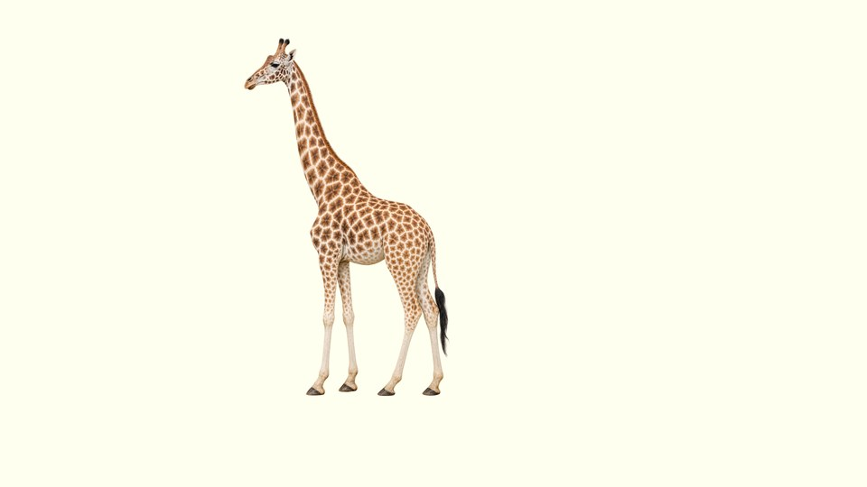
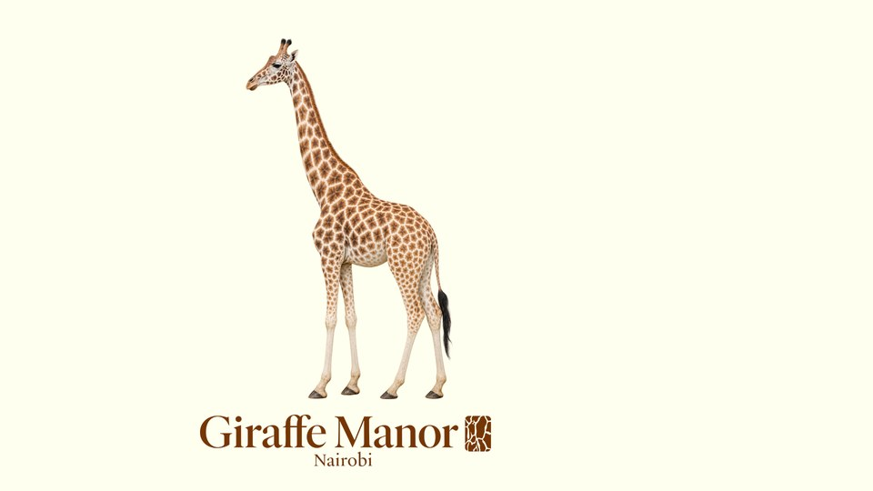
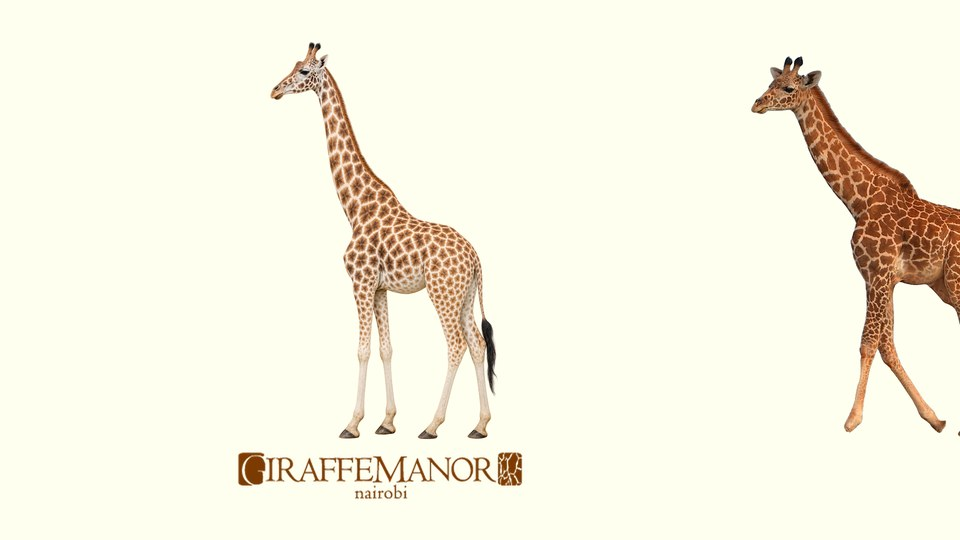
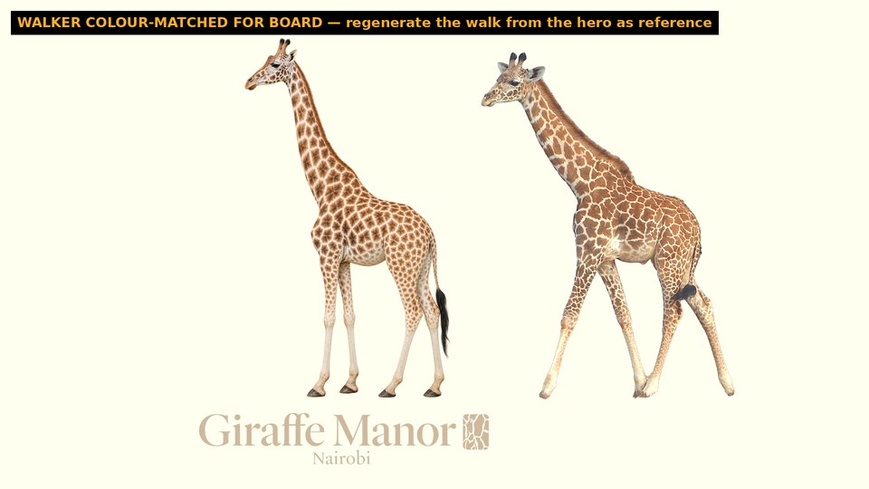
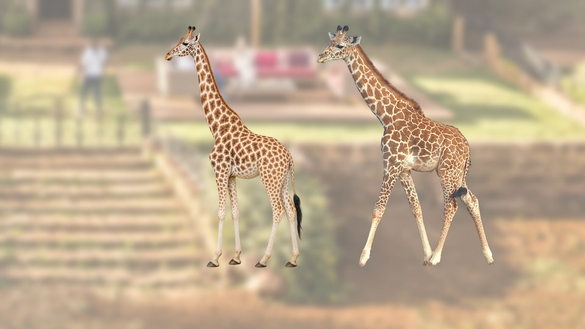
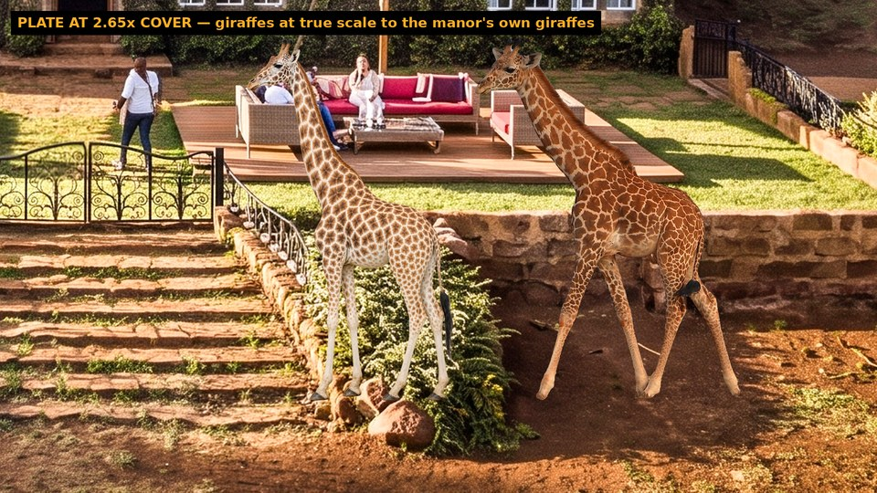
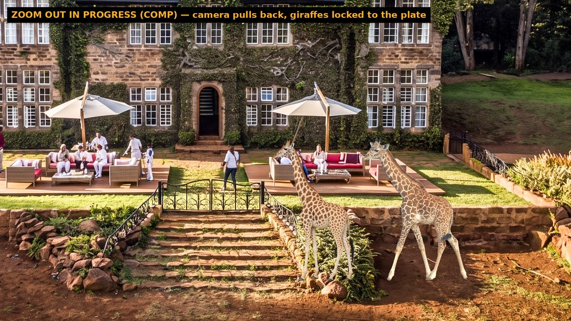
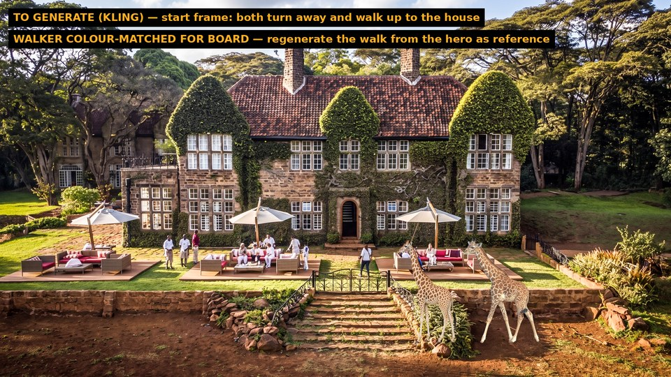
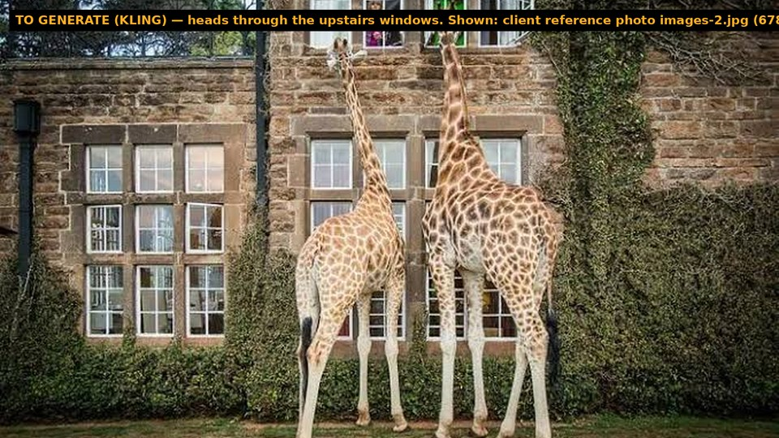
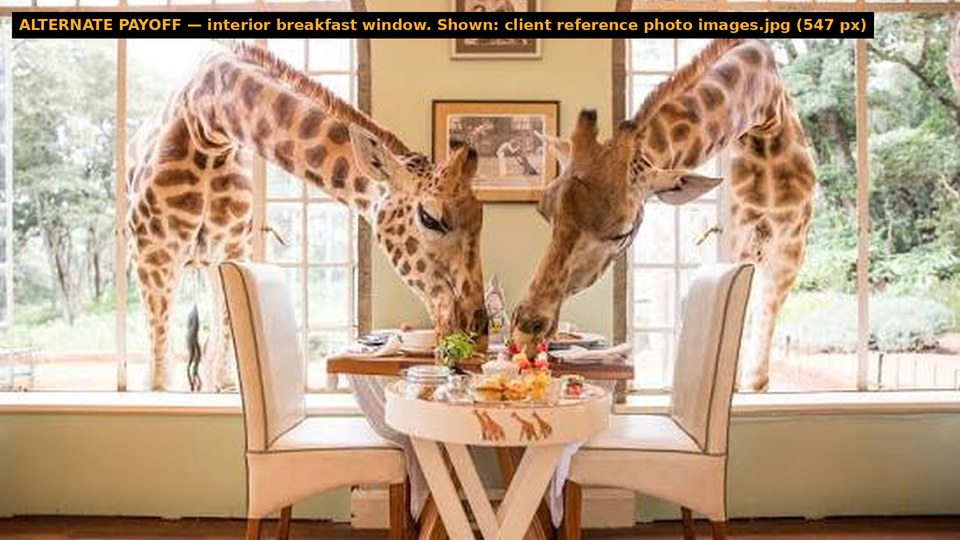
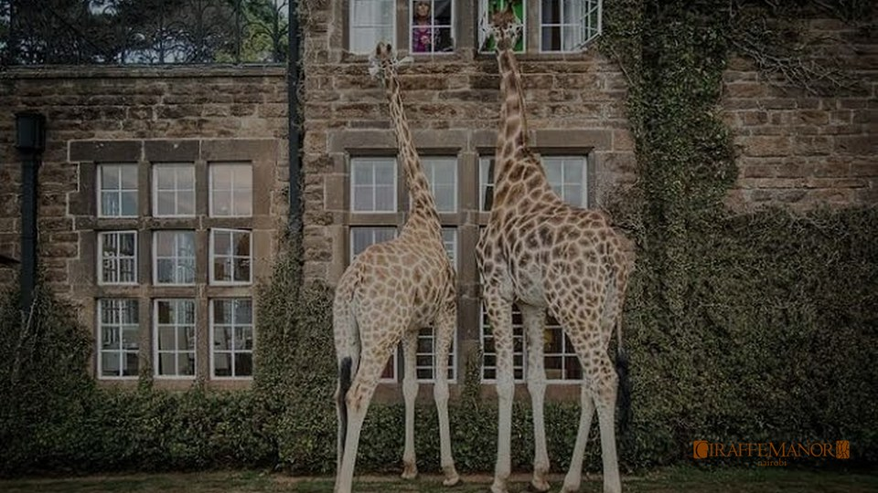

Film 01 of 8 · Theria hospitality slate · boarded 2026-09-25 from the client brief (`Sample Hotel Animations_.docx`) and the real assets in the Drive folder.

| | |
|---|---|
| Client brief | Start with image of the giraffe → the Giraffe Manor logo appears under its feet → another giraffe walks into frame → the logo disappears but the manor in the background appears → both giraffes turn and walk towards the manor and put their heads in the window |
| TRT | **14.0 s / 336 frames @ 24 fps** (timing doc v1). The earlier storyboard page ran it at 12.0 s; see open question 1 |
| Master | 16:9, 1920×1080 (HD confirmed 2026-09-25). The storyboard page also lists 1:1 and 9:16 masters; see open question 2 |
| Frames | `frames/01_hold.png` … `frames/09_endcard.png` (11 frames incl. `06b_zoomout` and the `08b` alternate), contact sheet `frames/contact_sheet.jpg`. Built by `build_frames.py` from the pulled assets; nothing AI-enlarged |
| Status key | READY = built from an existing asset · COMP = After Effects / NLE work on existing assets · TO GENERATE = needs a Higgsfield pass (model named) |

### Beats

| # | Brief line | IN – OUT (frames) | Frame | On screen | Motion / camera | Transition | Assets used | Status |
|---|---|---|---|---|---|---|---|---|
| 1 | Start with image of the giraffe | 00.0 – 02.0 (f0–48) | `01_hold` | Hero giraffe alone on the cream field, centre-left, full body, facing camera-left | Locked off. Micro-life only: ear twitch f12, tail flick f30, one slow blink f40. 1.5 % push-in over the shot | — | `upscaled/ea5d5cfc-….png` (1024×1536 RGBA, opaque 881×1487) scaled to 800 px tall; cream (255,255,240) sampled from the Kling test frames | COMP (still + micro-life) or Kling Shot 1 prompt from pipeline doc §6 |
| 2 | The Giraffe Manor logo appears under its feet | 02.0 – 03.6 (f48–86) | `02_logo` | Wordmark fades up on the ground line directly under the hooves | Scale 96 → 100 % ease-out, opacity 0 → 100 over 0.8 s, hold 0.8 s | fade | `orig/Giraffe-Manor-Logo-46px.webp` (288×46) at 2× as a **placeholder**. The AI-drawn `giraffemanor_wordmark_alpha.png` is not used: wrong typeface and case | COMP (AE layer) — **blocked on vector logo** |
| 3a | Another giraffe walks into frame | 03.6 – 05.0 (f86–120) | `03_enter` | Second giraffe enters from frame right at full walk | Walk cycle, ~1.4 s per stride pair. Logo stays put; newcomer walks behind it | — | `upscaled/giraffe_walking.mov` (ProRes 4444 with alpha, 4K/30) conformed to 24 and scaled 50 %; frame at t=0.0 | READY (existing Kling clip) — conform 30→24 with optical flow |
| 3b | (same) | 05.0 – 06.4 (f120–154) | `04_stop` | Newcomer stops with its shoulder just clear of the hero's rump. Logo eases to 35 % | Walk decelerates to a stop over the last 4 strides | — | same clip, frame at t=2.8; stop position bbox-left x=1060 | READY / COMP — the clip does not itself stop: freeze or ease the last cycle in the NLE |
| 4 | The logo disappears but the manor in the background appears | 06.4 – 07.4 (f154–178) | `05_reveal` | Logo out; cream dissolves to the manor **at scale**: the plate arrives at 2.65× its cover size, so the terrace, steps and ground floor fill the frame behind the giraffes and they read as standing at the foot of the house, not towering over it | Logo opacity → 0 over 0.6 s. Background arrives at ~10 px blur. Giraffes hold at their Shot 3 size and position | cross-dissolve | `upscaled/manor01_background.png` (2752×1536, giraffes painted out) at 2.65× cover, pivot chosen so the hooves stay on y=880 | COMP (AE). The 2.65× enlargement is only on screen during the dissolve and the first frames of the pull-back |
| 5 | (same) | 07.4 – 08.6 (f178–206) | `06_manor` → `06b_zoomout` | Manor resolves sharp, then the camera **zooms out**. Giraffes are locked to the plate and shrink with it | Rack focus soft → sharp over 0.4 s, then a continuous pull-back from 2.65× toward 1.0× (ease-in-out). Both giraffes scale down from 800 px to ~300 px tall as the whole house comes into view | continuous | same plate; giraffes placed in plate pixels (hero hooves at plate 1744,1400; walker at 2050,1400) so the pull-back is one transform | COMP (AE): one camera move on a pre-comp |
| 6 | Both giraffes turn and walk towards the manor | 08.6 – 11.2 (f206–269) | `07_turn_TOGEN` | Pull-back lands on the full plate: both giraffes on the lawn where the plate's own giraffes stood. From here they turn away and walk up to the house | The risk shot: a 180° turn. If the pull-back is still finishing, overlap it 0.4 s into this shot | — | `07_turn_TOGEN.png` is the actual composite (plate 1.0× + both giraffes at plate scale), not a reference | **TO GENERATE (Kling)** — start frame = `07_turn_TOGEN.png`, prompt in pipeline doc §6 Shot 6. Over-generate; fallback is the whip-pan cheat |
| 7 | …and put their heads in the window | 11.2 – 13.4 (f269–322) | `08_window_TOGEN` (exterior) · `08b_window_interior_ALT` | Necks rise, both heads enter the windows. Land on the reference composition | Slow and calm | — | Placeholders show the client reference photos `images-2.jpg` (exterior, 678 px) and `images.jpg` (interior breakfast room, 547 px) | **TO GENERATE (Kling)**, end plate first (Seedream), see open question 3 |
| 8 | (end card, not in brief) | 13.4 – 14.0 (f322–336) | `09_endcard` | Wordmark small, bottom-right, 60 % of Shot 2 size, over the payoff frame darkened; hold to black | fade to black f336 | fade | logo placeholder as above | COMP (AE) |

**Audio** (timing doc): Kenyan highland ambience from 00.0; one low woodwind swell 06.4 → 08.6 under the reveal; ambience alone from 13.4. Not sourced.

### Review notes (what to look at)

1. **Giraffe identity.** The Kling walker (`giraffe_walking.mov`) is a darker, more orange animal than the pale hero still. Frames 04–06 show them side by side. Either regenerate the walk from the hero as reference (NBP for consistency, then Kling) or accept two different giraffes.
2. **Staging scale, frames 05–07 (revised after Allen's note).** The manor now fades in at scale and the camera pulls back, so the giraffes never appear oversized against the house. Cost: the plate is enlarged 2.65× at the reveal, so it is soft for about a second while blurred anyway. If that bothers you, the fix is a second manor plate shot from the foot of the steps (Seedream, same house) for the reveal, cross-dissolving to the wide during the pull-back. Also visible at 2.65×: guests and staff on the terrace behind the giraffes.
3. **Logo.** Every wordmark on the board is the 288 px web mark at 2×. It is legible on the board and unusable in the film. Nothing else in the folder is the real mark.
4. **Guests in the plate.** `manor01_background.png` still has staff and guests at the tables. The earlier storyboard page asked for a clean plate; the brief does not. Decide.

### Open questions for Allen

1. TRT 14.0 s (timing doc) or 12.0 s (storyboard page)? The board is cut at 14.0.
2. One master (16:9 HD) or three (1:1, 9:16, 16:9)? Frames 01–04 survive a 1:1 crop; frame 06 does not.
3. Payoff: exterior upstairs windows (`images-2.jpg`, timing doc) or interior breakfast window (`images.jpg`, storyboard page)? Both are boarded as 08 / 08b.
4. Guests in the manor plate: keep or regenerate clean?
5. Frame rate 24 (board) or 30 (Kling walk native)?

### Assets still needed

- Vector Giraffe Manor wordmark (AI/EPS/SVG) — blocks Beats 2 and 8.
- Shot 6 Kling clip (turn and walk away), from `06_manor` as start frame.
- Shot 7 end plate (heads in windows, matching the chosen reference) then the Kling clip.
- Optional: clean manor plate without guests; a walker regenerated to match the hero's colouring.

### What this board does not cover

- No motion was rendered; frames are stills. The animatic is the next step once the questions above are answered.
- Audio not sourced.
- 1:1 and 9:16 reframes not drawn.
- Shot 1 micro-life and Shot 2 logo animation are described, not shown.

## 02 · The Fifth Avenue Hotel

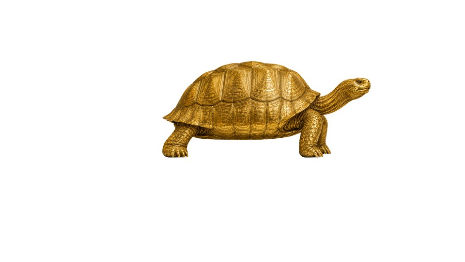
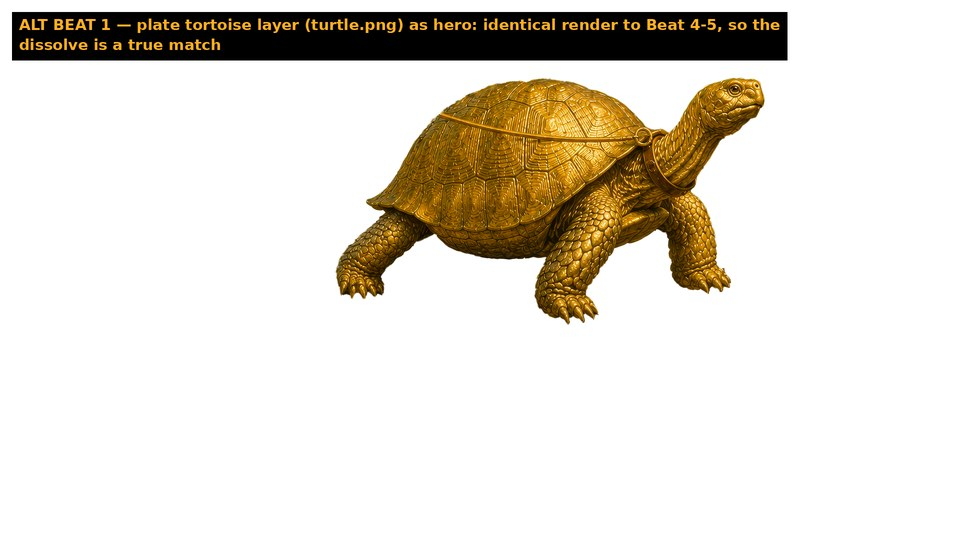
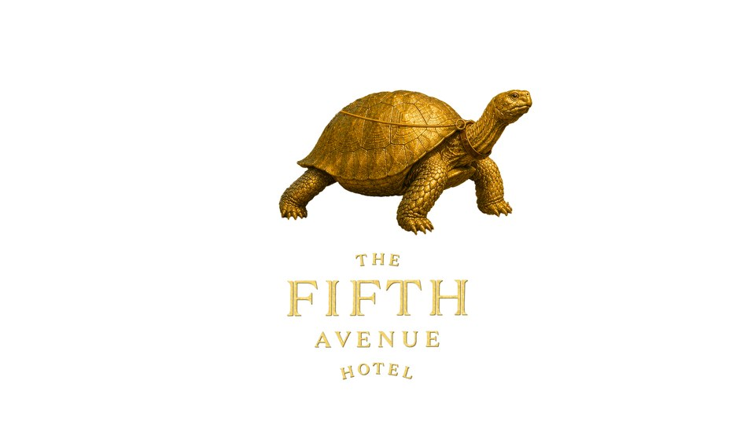
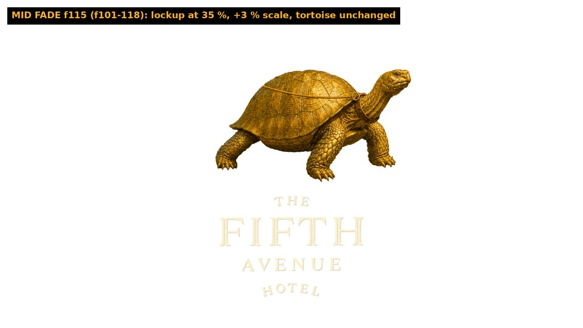
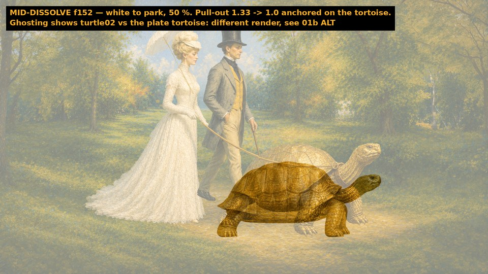
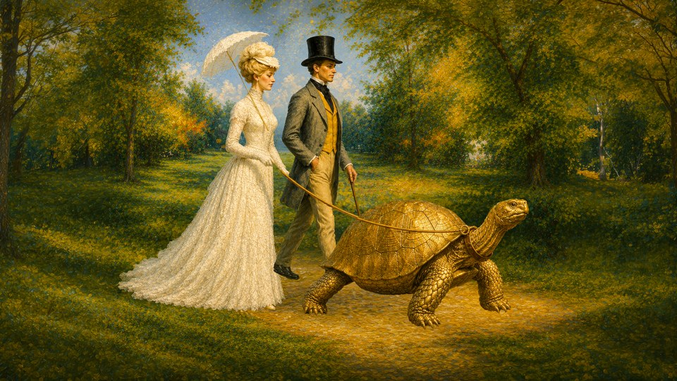
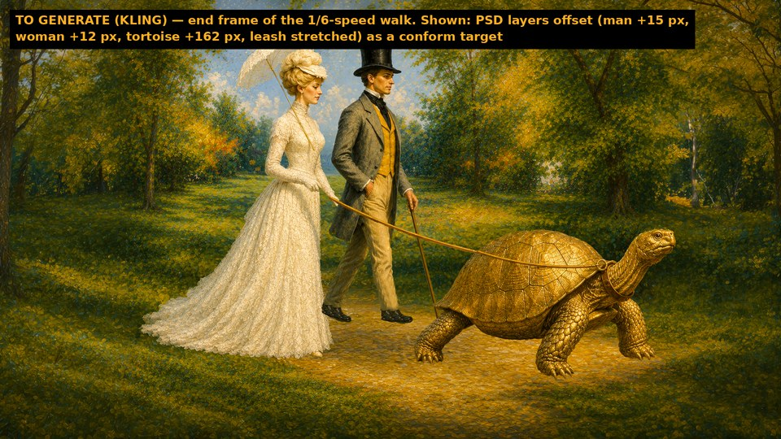
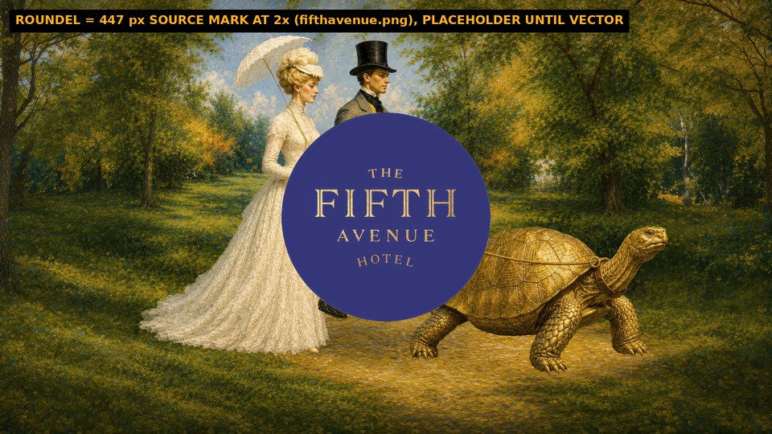

| | |
|---|---|
| Film | 02 · The Fifth Avenue Hotel (client folder `5th ave hotel NYC/`) |
| TRT | **12.0 s = f288** per `theria_hotel_animations_timing_v1.md` §2 (the storyboards page says 11.0 s, six beats — see "Where the page differs") |
| fps | 24 (assumed in the timing doc, not confirmed by Allen) |
| Aspect / master | 16:9, 1920×1080 HD (Allen, 2026-09-25). The storyboards page header also lists 1:1 and 9:16 masters — not boarded here |
| Frames | `frames/NN_name.png` 1920×1080, `NN_name_small.jpg` 960×540, `contact_sheet.jpg`. Built by `build_frames.py PULL_ROOT OUT_DIR` (run 2026-09-25, 8 frames, clean) |
| Brief (source of truth for beats) | 1 start on the gold tortoise · 2 add the Fifth Ave logo in gold, no background, under its feet · 3 the logo disappears · 4 add the people walking the tortoise · 5 the people move very slowly |

**Assumptions made to build the board**
- The walkers plate is `upscaled/turtlewalkers.psd` (4346×2444, 16:9) flattened from its own layers: `background` + `woman`, `man`, `leash`, `turtle` at the PSD bbox origins. The background layer is a clean park (no figures, no holes), so layers can be moved. `turtlewalkers.png` is the old 4:3 plate and is only the fallback if psd-tools is absent.
- Plate → HD is a straight cover scale of 0.4418 (no crop). At HD the plate tortoise is 646 px wide at x 854–1501, y 562–935; the woman's head is at y 87 and the tortoise's claws at y 935, so the plate cannot be scaled up without cropping the figures.
- Beats 1–3 use the client's isolated tortoise (`turtle02.png`, from `orig/47da2bff…png`) at 860 px wide = 1.33× its size in the plate, right of centre, claws at y 650, so the gold lockup fits under it. Beat 4 therefore carries a 1.33 → 1.0 pull-out anchored on the tortoise. If Allen wants the timing doc's "not a pixel" literally, the hero must be 646 px wide with its claws at y 935 — and then there is no room for a lockup under its feet. Open question 1.
- Gold lockup = `upscaled/fifthave_text.png` (603×422 RGBA). It is already the gold type keyed out of the navy roundel — the same thing the brief asked for — but it comes from the 2× (894 px) enlargement of a 447 px web thumbnail. **Placeholder until vector.** The script keys the gold out of `fifthavenue.png` itself only if `fifthave_text.png` is missing. No logo was AI-enlarged.
- End card roundel = `upscaled/fifthavenue.png` (894 px, plain 2× of `orig/images.jpg`) shown at 520 px — a downscale, tagged placeholder.
- No motion exists yet for this film. Every "motion / camera" cell is the timing doc's note, not something that has been generated.

### Beats

| # | Brief line | IN–OUT (s) · frames @24 | Frame | On screen | Motion / camera | Transition | Assets used | Status |
|---|---|---|---|---|---|---|---|---|
| 1 | Start with image of the gold tortoise | 00.0–02.4 · f0–58 (58 f) | `01_hold.png` | Gold tortoise in profile facing camera-right, alone on white, right of centre (cx 1100), 860 px wide, claws at y 650 | Dead still. Specular highlight travels across the shell L→R f10–f50; one slow head-lift at f44 | — (cold open on white) | `upscaled/turtle02.png` (2803×1298 RGBA; = `orig/47da2bff-cdd3-4463-a32e-4320ffb9b8b0.png` isolated at 2×) | READY from assets (still). Specular sweep = AE comp (light sweep over the alpha). Head-lift = TO GENERATE, Kling O1 from this frame, single-verb prompt |
| 1 ALT | same | same | `01b_hold_ALT.png` | Same layout using the plate's own tortoise layer as hero (different pose: head higher, collar on, 1463×844) | as Beat 1 | — | `upscaled/turtle.png` (= `turtle` layer of `turtlewalkers.psd`) | READY from assets. **Recommended** unless the plate is regenerated around `turtle02` — it makes Beat 4 a true match (see review note 1) |
| 2 | Add the Fifth Ave logo in gold, no background, under its feet | 02.4–04.2 · f58–101 (43 f) | `02_lockup.png` | Gold "THE FIFTH AVENUE HOTEL" lockup, disc removed, 480 px wide centred under the plastron (top y 700, bottom y 1036) | Letterforms wipe on L→R over 1.0 s behind a soft gold gradient (foil shimmer), then hold. Tortoise unchanged | — | `upscaled/turtle02.png`, `upscaled/fifthave_text.png` **(PLACEHOLDER — vector lockup pending)** | COMP (AE layer over the still). Vector trace / client vector needed — no generative model near the mark |
| 3 | The logo disappears | 04.2–05.4 · f101–130 (29 f) | `03_lockup_out.png` | Same, lockup at 35 % opacity and +3 % scale (mid fade, ≈f115) | Lockup opacity 100→0 over 0.7 s (f101–118) with 3 % scale-up as it goes. Tortoise unchanged, white stays white | — | `upscaled/turtle02.png`, `upscaled/fifthave_text.png` (placeholder) | COMP (AE) |
| 4 | Add the people walking the tortoise | 05.4–07.2 · f130–173 (43 f) | `04_reveal.png` | Mid-dissolve (≈f152): white field and the couple/park at 50 %; the tortoise is the anchor | Cross-dissolve white → plate over 1.8 s, plus the 1.33→1.0 pull-out that lands the hero on the plate tortoise (646 px, x 854–1501, claws y 935). The frame shows the ghost of `turtle02` over the plate tortoise: they are different renders | cross-dissolve | `upscaled/turtle02.png` scaled to the plate footprint, `upscaled/turtlewalkers.psd` (`background` layer) + `woman.png`, `man.png`, `leash.png`, `turtle.png` at PSD origins | COMP (AE). Blocked by the hero mismatch: either take 01b ALT, or regenerate the plate around `turtle02` — NBP (multi-reference consistency; keep the pose) — and re-separate |
| 5a | Have the people moving very slowly | 07.2–11.4 · f173–274 (101 f) — start | `05_walk_start.png` | The full plate: Gilded-Age couple (parasol, top hat) walking the gold tortoise on a leash, painterly park | This is the Kling **start frame**. Everything at ≈1/6 normal speed; leaves and light in the background at normal speed | — | `upscaled/turtlewalkers.psd` (`background`) + `woman.png` @(742,196), `man.png` @(1754,226), `leash.png` @(1798,1095), `turtle.png` @(1934,1272) | READY from assets (flattened by `build_frames.py`, identical to the PSD comp) |
| 5b | same | 07.2–11.4 · f173–274 — end | `06_walk_end_TOGEN.png` | Conform target for the end of the walk: man +15 px (foot), woman +12 px, tortoise +162 px (¼ body-width), leash stretched to follow the collar. Parasol rotation (~8°) not shown — the parasol is inside the `woman` layer | Kling O1 image-to-video, start = 05, end = 06. Generate 5 s at normal walk speed, take the best window, retime to 1/6 in the NLE with optical flow. Background leaves/light at normal speed = a second Kling pass on the `background` layer only (or AE particles), comped under the figures | — | as 5a, layers offset in x | **TO GENERATE — Kling O1** (figures) + Kling/AE (background). The end frame itself is a comp, not a generation |
| 6 | (sign-off; not in the brief) | 11.4–12.0 · f274–288 (14 f) | `07_endcard.png` | Plate frozen at the 06 position, desaturated 20 %; full navy roundel fades up dead centre, 520 px | Roundel opacity 0→100 over the 0.6 s. No move on the plate | fade (out to black/white is not specified in the timing doc) | 06 comp + `upscaled/fifthavenue.png` **(447 px source at 2×, PLACEHOLDER UNTIL VECTOR)** | COMP (AE). Vector roundel needed |

Frame counts: the doc's IN/OUT frames sum to f288 = 12.0 s. Beat 1 is 2.4 s = 57.6 f (rounded to f58 in the doc).

### Where the storyboards page (TRT 11.0 s, six beats) differs from the timing doc

Boarded to the timing doc. The page is `inventory/storyboards_rendered_text_2026-09-25.txt`, "02 THE FIFTH AVENUE HOTEL · GILDED PATIENCE".

| Beat | Timing doc (boarded) | Storyboards page |
|---|---|---|
| all | 12.0 s: 2.4 / 1.8 / 1.2 / 1.8 / 4.2 / 0.6 | 11.0 s: 2.0 / 2.0 / 1.5 / 2.0 / 2.5 / 1.0 |
| 1 | specular L→R f10–50, head-lift f44 | highlight sweep 1.6 s, "no other movement" (no head-lift) |
| 2 | wipe on over 1.0 s behind a gold gradient | foil-shimmer wipe, 600 ms |
| 3 | type out 0.7 s, +3 % scale; tortoise unchanged, white stays | type out 500 ms; the white ground **warms to a park-light gradient** under it |
| 4 | 1.8 s cross-dissolve, plate pre-aligned to the isolate | 1.2 s dissolve "as a painting arrives — brushwork resolving" |
| 5 | 4.2 s hold, ≈1/6 speed, parasol ~8°, foot ~15 px, tortoise one body-width; leaves at normal speed | 2.5 s, "procession crosses frame left at a crawl, one step per second", ≈15 % speed; leaves/light normal speed |
| 6 | **navy roundel** fades up centre over the frozen plate, desaturated 20 % | couple **exit**, park holds empty a half-beat, **gold lockup** returns bottom-centre, then whip to white over 300 ms (loop) |

Sound also differs (doc: one cello note, footfall + leash creak at 08.2 and 10.6; page: parlour clock, distant carriage, one harp string). Not boarded.

### Open questions for Allen

1. **Hero scale vs "not a pixel".** Beats 1–3 are boarded at 1.33× the plate tortoise with a pull-out through the dissolve, because at plate scale the tortoise's claws sit at y 935 and there is no room for the lockup under its feet. Accept the pull-out, or move the lockup (beside the tortoise / lower third) and keep the tortoise fixed from frame 1?
2. **Which tortoise is the hero?** `turtle02.png` (the client's isolate — head low, no collar) and the plate's `turtle` layer (head raised, collar on) are different renders; a straight dissolve between them will crawl. Take 01b ALT (plate tortoise as hero), or regenerate the plate around `turtle02` with NBP and re-separate?
3. **End card.** Timing doc: navy roundel over the frozen plate. Page: couple exit, gold lockup bottom-centre, whip to white. Which one — and does the roundel version end on black, white, or loop?
4. **Beat 5 tortoise travel.** The doc's "one body-width" (646 px at HD) takes the tortoise's head off frame right (its nose is already at x 1501). Boarded as a quarter body-width. OK?
5. **Vector.** Has the client been asked for the lockup as AI/EPS/SVG? Both marks in this board are placeholders from a 447 px web thumbnail; the storyboards page also asks for the gold-on-transparent lockup as a source file.

### Assets still needed

| Asset | For | Route |
|---|---|---|
| Vector lockup — gold type only (no disc) **and** the navy roundel | Beats 2, 3, 6 | Client vector, else hand-trace in Illustrator. Not a generative model. Comp as an AE layer |
| Walk clip, figures: start = `05_walk_start.png`, end = `06_walk_end_TOGEN.png` | Beat 5 | Kling O1, start+end frame, 5 s at normal speed, retime to 1/6 in the NLE (optical flow). Budget 3–5 generations |
| Background-only motion (leaves drift, dappled light) | Beat 5 | Kling O1 on the PSD `background` layer alone, or AE particles/light. Must run at normal speed under the slowed figures |
| Head-lift on the isolated tortoise (f44) | Beat 1 | Kling O1 from `01_hold.png`, single verb; on white so it keys back to alpha |
| Specular sweep across the shell | Beat 1 | AE (light sweep masked by the tortoise alpha). No generation |
| *Optional, if open question 2 goes that way:* park plate regenerated around `turtle02` in the same pose, then re-separated | Beat 4–6 | NBP (multi-reference: `turtle02.png` + `turtlewalkers.png`), then Photoshop layer separation |

### What this board does not cover

- No motion has been generated or previewed; every frame is a still comp and the motion column is the timing doc's intent.
- Parasol rotation, leash slack/tension physics and the man's stride are not shown in `06` — the parasol and the hands are inside the `woman`/`man` layers, and the leash is stretched linearly, not re-drawn. Kling owns those.
- The mid-dissolve (`04`) shows a plain 50 % blend, not the pull-out in progress and not the page's "brushwork resolving" treatment.
- End card fade-out / loop behaviour, sound, and colour grade.
- The 1:1 and 9:16 masters the storyboards page lists; the timing doc's "logo-safe area = centre 80 %" was not checked against those crops.
- The `05`/`06` plate is the PSD flattened in Pillow (normal blend, 100 % opacity, which is how the PSD is set) — not a Photoshop export; if `turtlewalkers.psd` changes, re-run the script.

## 03 · Passalacqua

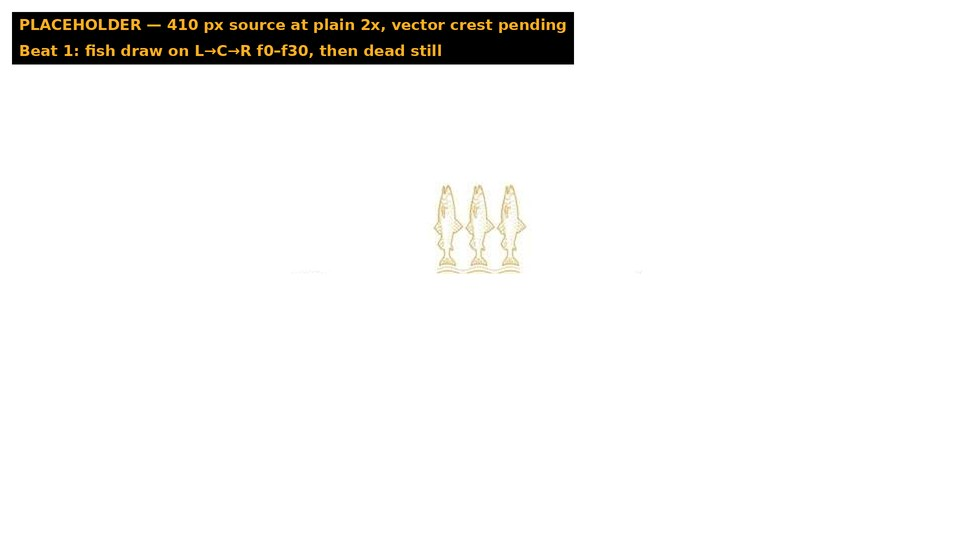
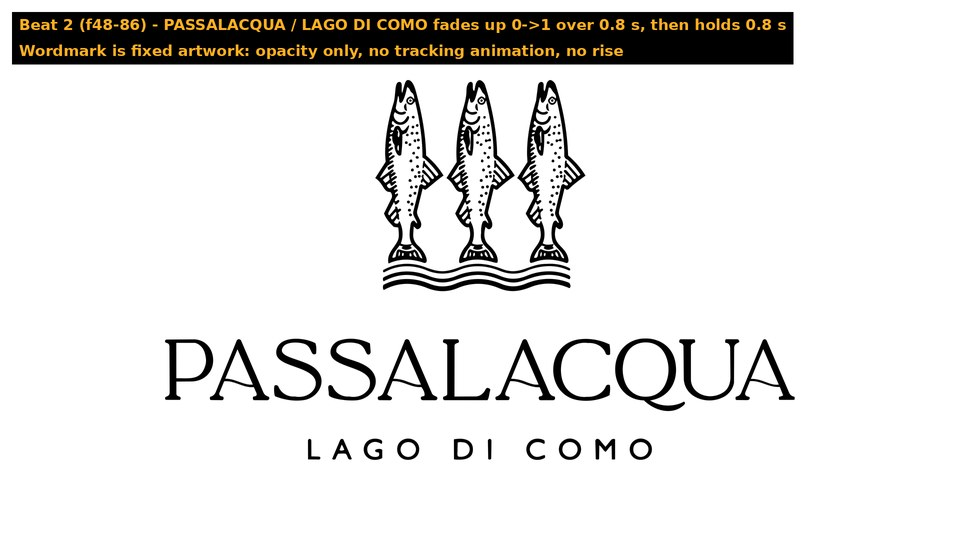
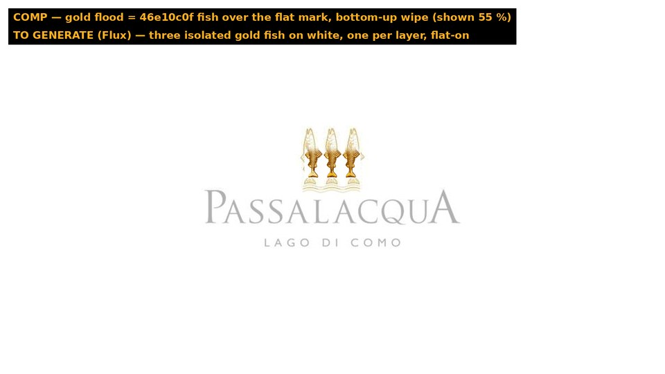
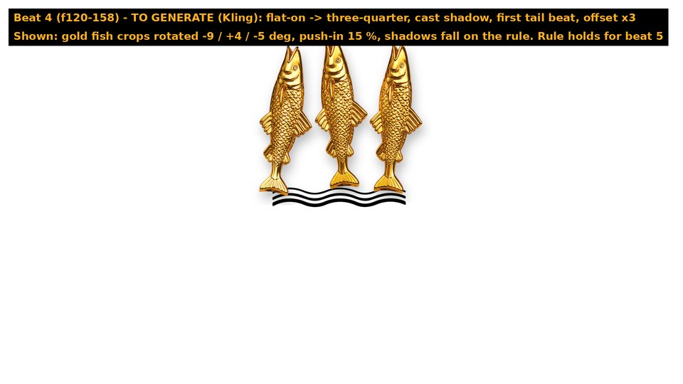
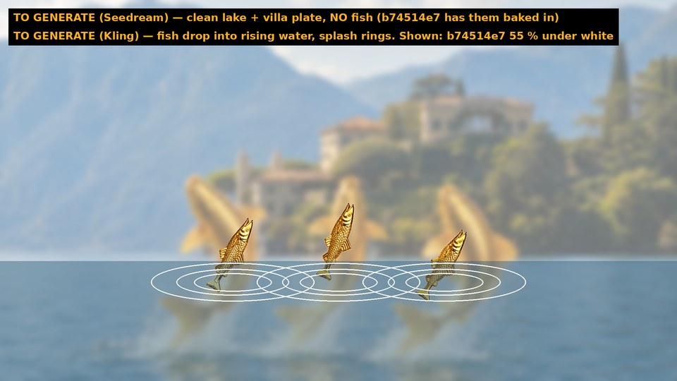
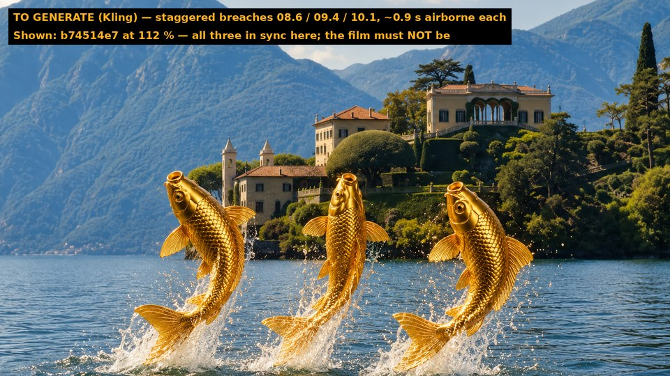
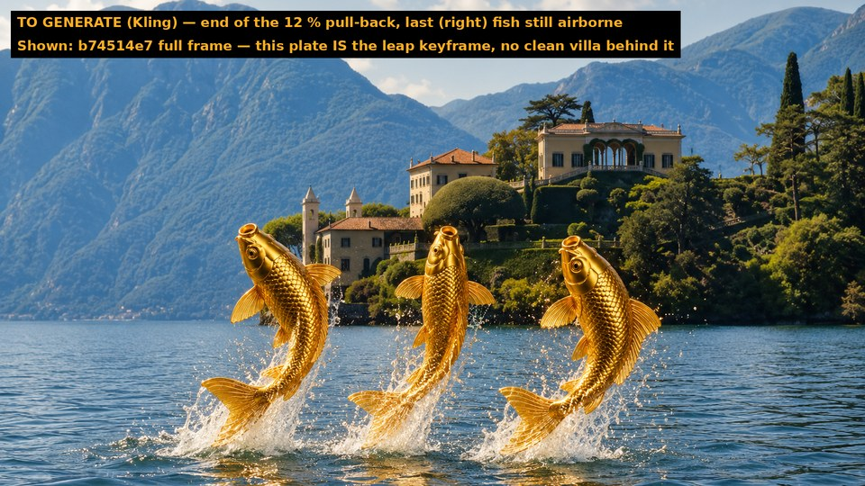
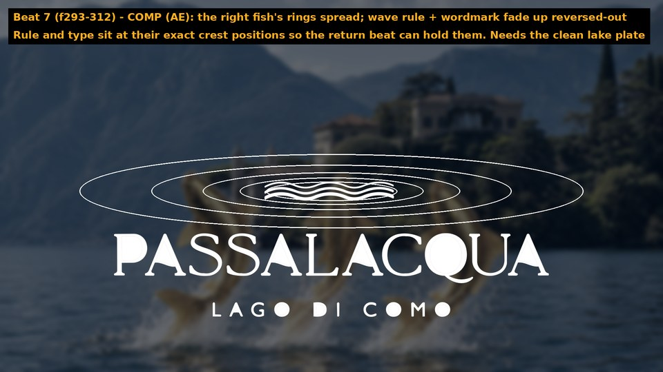
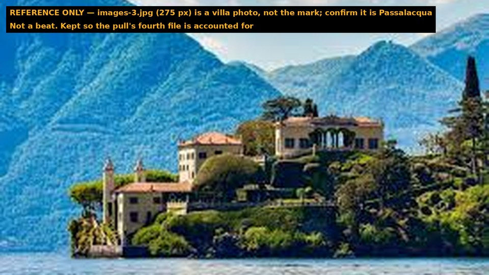

| | |
|---|---|
| Film | 03 · Passalacqua — "three fish leave the crest" |
| Client / studio | Theria / Allen Grabo, RTFX Design |
| TRT | **13.0 s (f312)** per `theria_hotel_animations_timing_v1.md` §3. The earlier storyboard page says 12.5 s / 6 beats — boarded to the timing doc, page differences noted per beat. |
| Frame rate | 24 fps (frame numbers `f###`) |
| Master | 16:9, 1920×1080 board frames (the aspect is still "not decided" in the timing doc; logo-safe area = centre 80 %) |
| Frames | `frames/01_outlines.png` … `frames/08_endcard_COMP.png` (+ `ref_images-3_villa.png`), each with a `*_small.jpg` (960×540), and `frames/contact_sheet.jpg` |
| Built by | `build_frames.py PULL_ROOT OUT_DIR` — Pillow only, all frames from the four files in `Passalaqua/`; nothing under the pull directory was modified |
| Board date | 2026-09-25 |

**Assumptions**

1. The brief's "start with their logo of 3 outlines / add the logo underneath" is read as the timing doc reads it: fish mark first, wordmark second.
2. **The pull's file descriptions in the timing doc are wrong, and the board follows what the files actually contain** (verified by eye and by pixel stats):
   - `passalacqua.jpg` 410×319 — the printed mark (flat gold fish, wave rule, PASSALACQUA / LAGO DI COMO). The only flat source.
   - `images-3.jpg` 275×183 — **not** the mark: a small photo of a villa on Como (it looks like Villa del Balbianello, not Passalacqua).
   - `46e10c0f-….png` 1421×1107 — **not** the leap: the same lockup re-rendered on white with dimensional polished-gold fish (an AI render; its wordmark is redrawn, so only its fish are used here).
   - `b74514e7-….png` 1536×1024 — **not** a villa-only plate: this is the leap — three gold fish breaching in sync, villa behind. There is no fish-free lake plate anywhere in the pull.
3. Logo rule: the 410 px mark is never AI-enlarged. Beats 1–3 and the end card show it at a plain 2× Lanczos resize (820×638, 43 % of frame width, fish ≈154 px tall) tagged `PLACEHOLDER — 410 px source at plain 2x, vector crest pending`. That is the honest size, not the design intent — see open question 5.
4. Every wordmark appearance is an AE layer over the plate (pipeline doc §4), so no beat needs NBP. Gold fish = Flux (objects), lake/villa = Seedream (worlds), motion = Kling, end card = comp.
5. The gold fish in beats 3–5 are rectangular crops of `46e10c0f` with a cheap white-threshold alpha (not a key); edges are crunchy and are only for the board.

### Beats

| # | Brief line served | IN – OUT (s) · frames @24 | Frame | On screen | Motion / camera | Transition | Assets used | Status |
|---|---|---|---|---|---|---|---|---|
| 1 | "Start with their logo of 3 outlines of golden fishes" | 00.0 – 02.0 · f0–f48 | `01_outlines.png` | Three flat gold fish over the wave rule, white field, no type. | Fish draw on in sequence: left f0–14, centre f8–22, right f16–30. Then dead still. *(Page: "hairline engraving", paths write in L→R over 1.1 s — same idea, same order.)* | — (open) | `passalacqua.jpg` (rows 70–163 of the 410 px source, 2×) | **PLACEHOLDER** — needs the vector crest with the three fish and the wave rule on separate paths. Comp in AE. |
| 2 | "Add the logo underneath" | 02.0 – 03.6 · f48–f86 | `02_wordmark.png` | PASSALACQUA / LAGO DI COMO fades up beneath the wave rule; full printed crest. | Wordmark opacity 0→1, letter-spacing eases +8 % → +4 % as it fades. Hold 0.8 s. *(Page disagrees: "fade + 8 px rise; no tracking animation, the crest is fixed artwork" — see OQ 4.)* | — | `passalacqua.jpg` (full mark, 2×) | **PLACEHOLDER** — vector crest. Comp in AE (wordmark is a separate AE layer). |
| 3 | "The logo disappears as the fish become real golden fish — colored in" | 03.6 – 05.0 · f86–f120 | `03_fill.png` | Wordmark at 35 % and going; gold floods each fish bottom-to-top, scales catch light, eyes gain a specular. Frame shows the flood at ~55 %. | Wordmark opacity → 0 over 0.5 s (f86–98). From f100 gold gradient floods each body from the tail up, 900 ms per fish, staggered 120 ms (page timing). Wave rule stays. | — | `passalacqua.jpg` (2×, type at 35 %) + `46e10c0f-….png` (gold fish block, registered onto the flat fish, bottom-up mask) | **COMP** (fill wipe in AE) + **TO GENERATE (Flux)**: three isolated gold fish on white, flat-on, one per layer with alpha. `46e10c0f` is usable as the look reference for the filled state. |
| 4 | "The fish then become alive" | 05.0 – 06.6 · f120–f158 | `04_alive_TOGEN.png` | Three dimensional gold fish alone on white, turned slightly off-axis, cast shadows on the white, mid first tail beat. | Rotate flat-on → three-quarter, gain a cast shadow, first tail beat; the three are offset ~150 ms so they never move in lockstep. Board assumes a gentle ~30 % push-in as they come off the page (not in the timing doc). *(Page adds: gills work, fins flutter, "the wave rule thickens into actual water" — that is boarded in beat 5 instead.)* | — | `46e10c0f-….png` (three fish crops, white-threshold alpha, rotated −9° / +4° / −5°, synthetic shadows) | **TO GENERATE (Kling)** — start frame = beat 3 end, end frame = three-quarter fish with tail beat. Needs the Flux isolated fish first. |
| 5 | "Add the background of the villa" | 06.6 – 08.2 · f158–f197 | `05_lake_TOGEN.png` | White dissolving to the lake; water level rising into the bottom third; the three fish tipping over and dropping into it, splash rings on landing. | Cross-dissolve white → lake plate. Water rises to ~y 740 (bottom third). Fish pitch nose-down and drop, staggered; rings on entry. *(Page: lake "floods in behind them — mountains, cypress, the villa on its terrace".)* | cross-dissolve in | `b74514e7-….png` (55 % under white, blurred — the baked-in leaping fish are visible, tagged) + `46e10c0f-….png` fish crops | **TO GENERATE (Seedream)** clean lake + villa plate, no fish, 16:9, 3840×2160. **TO GENERATE (Kling)** drop-in with splashes. |
| 6a | "the fish jumping out of the water" | 08.2 – 10.2 · f197–f245 | `06_leap_TOGEN.png` | The leap, tight framing (plate at 112 %): centre fish breaching. | Three staggered arcs — centre breaches at 08.6, left at 09.4, right at 10.1; each airborne ~0.9 s with a full body arc and a water sheet off the tail. *(Page: "all three break the surface together", peak at 09.6, 240 fps water retimed 0.5× at apex — see OQ 3.)* | — | `b74514e7-….png` (fit-cover, zoom 1.12) | **TO GENERATE (Kling)** — `b74514e7` is the leap keyframe but shows all three in sync; the film must stagger them (three separate fish layers, or three Kling passes on the clean plate). |
| 6b | same beat, second half | 10.2 – 12.2 · f245–f293 | `07_pullback_TOGEN.png` | Same shot, camera 12 % wider, villa opened up, last (right) fish still airborne. | Camera pulls back 12 % across the whole 4.0 s shot (08.2 → 12.2). | — | `b74514e7-….png` (fit-cover, full) | **TO GENERATE (Kling)** — same clip as 6a; boarded as two frames only to show the pull-back. |
| 7 | end card (not in the brief; timing doc / page) | 12.2 – 13.0 · f293–f312 | `08_endcard_COMP.png` | Last fish re-enters; the splash rings settle into the wave rule of the crest; wordmark fades up reversed-out over the darkened lake. | Rings contract and flatten into the rule (the "signature move"; comp, not a model). Wordmark fade 0→1. *(Page ends differently: wordmark "re-forms in the white" — back to the crest on white, which also satisfies the global loop rule — see OQ 2.)* | fade out | `b74514e7-….png` (desaturated, darkened, blurred) + `passalacqua.jpg` (wave rule + wordmark at 2×, reversed to white) | **COMP (AE)** — pipeline doc: do the ripple→rule in comp, fall back to a straight fade if it fights. Needs the vector crest and the clean lake plate. |
| ref | — | — | `ref_images-3_villa.png` | The pull's fourth file, so nothing is unaccounted for. | — | — | `images-3.jpg` (275 px, fit-cover) | **REFERENCE ONLY** — not a beat. |

Sound (timing doc): lake ambience + distant church bell from 00.0; three water-breaks at 08.6 / 09.4 / 10.1; strings resolve on the end card. *(Page: room tone → single water drop at the moment of colouring → lake; strings enter on the jump.)*

### Open questions for Allen

1. **Is this the right villa?** `b74514e7` (the leap plate) and `images-3.jpg` both look like Villa del Balbianello at Lenno, not Passalacqua at Moltrasio. If the client will notice (they will), the clean lake plate should be generated from a real Passalacqua facade reference — do we have one?
2. **How does it end?** Timing doc: wordmark over the lake, fade. Page: ripples → wave rule → wordmark re-forms *in the white*, i.e. back to the beat-2 crest, which is also what the global "each film ends on its own opening frame" rule wants. Board follows the timing doc; page version is one extra dissolve.
3. **Leap: staggered (timing doc) or together (page)?** The only plate has them in sync. Staggered means three fish layers or three Kling passes over the clean plate; together means one pass but loses the three water-breaks in the audio.
4. **Wordmark tracking ease (+8 % → +4 %, timing doc) or fixed artwork (page)?** The page's argument — "this is the frame that must read as the printed mark" — is the brand-safe one.
5. **Crest size and the coloured-in look.** At the permitted 2× the placeholder fish are 154 px tall on a 1080 frame; once the vector arrives, propose fish ≈ 35 % of frame height for beats 1–4. And: `46e10c0f` is an AI re-render of the client's mark — is that dimensional-gold look approved as "the fish coloured in", or must the filled fish keep the client's exact silhouette?

### Assets still needed

| Asset | For beats | Model / source | Notes |
|---|---|---|---|
| Vector crest (AI/EPS/SVG) with three fish, wave rule, PASSALACQUA, LAGO DI COMO on separate paths | 1, 2, 3, 7 | client — ask first; trace by hand if it does not come | needed for the draw-on and the fill wipe; nothing on hand is above 410 px in the flat style |
| Three isolated gold fish on white with alpha, flat-on (matching the crest silhouette) and three-quarter | 3, 4, 5 | Flux (or a proper key of `46e10c0f`, which is already on clean white) | one file per fish |
| Clean lake + villa plate, no fish, 16:9, target 3840×2160 | 5, 6, 7 | Seedream | the on-hand plate has the fish baked in; ideally the real Passalacqua (OQ 1) |
| Kling clips: fill → alive (beats 3–4), drop-in (5), staggered leap with 12 % pull-back (6) | 3–6 | Kling, start/end keyframes from the frames above | prompts drafted in `theria_higgsfield_asset_pipeline_v1.md` §6 "Passalacqua" |
| `46e10c0f` / `b74514e7` at 4K | 3–7 | pipeline doc routes both to Seedream re-render (2.7× / 2.5×) | only needed if the plates survive into the final; if the clean plate and Flux fish are generated at 4K they replace both |
| Audio bed + three water-breaks + bell/strings | all | — | not boarded |

### What this board does not cover

- Aspect ratio: 16:9 assumed; the 1:1 and 9:16 crops are not checked (the crest at 2× sits inside the centre-80 % safe area, the leap does not).
- The draw-on itself (beat 1) and the fill wipe (beat 3) at frame level — both need the vector paths; the frames show start/mid states only.
- Splash / water-sheet simulation, the 240 fps retime at the apex, grade, and audio.
- Reconciling the page (12.5 s, 6 beats) with the timing doc (13.0 s, 7 beats) beyond the notes above — the board follows the timing doc.
- Whether the film loops (global rule) — depends on OQ 2.
- Kling's actual clip lengths / keyframe support; the two-frame split of beat 6 is a board convenience, not a cut.
- Any keying: the gold fish crops here are white-threshold alpha for layout only.

## 04 · Airelles Le Grand Contrôle, Versailles

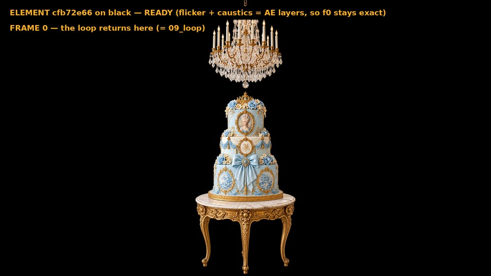
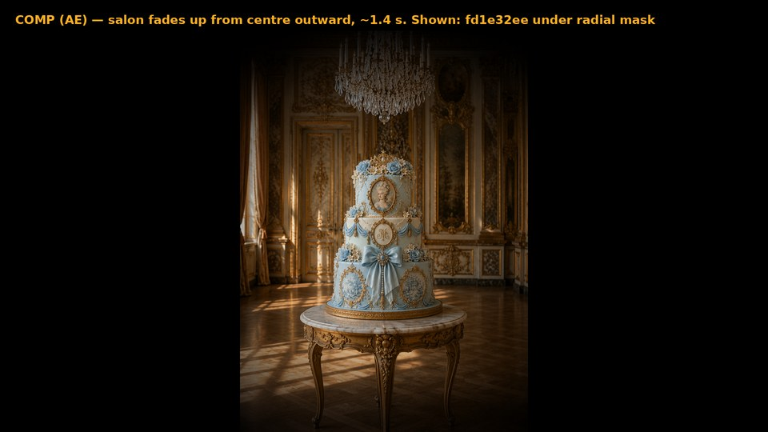
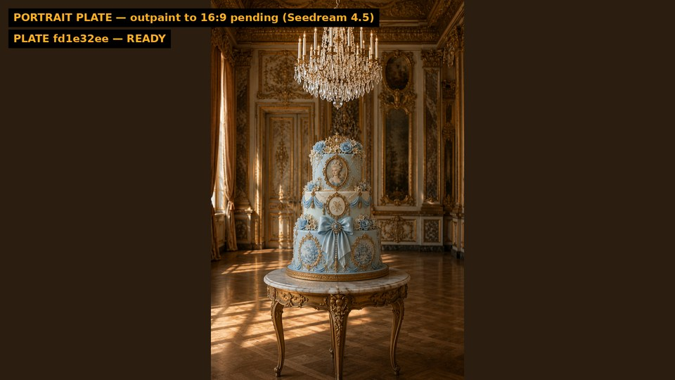
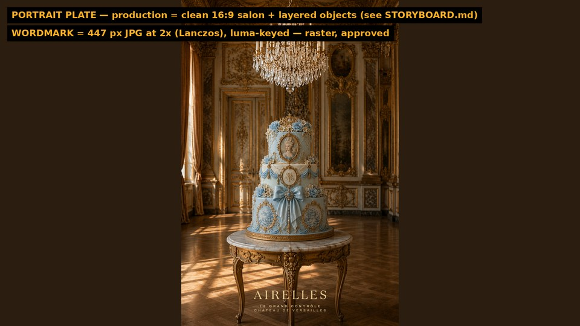
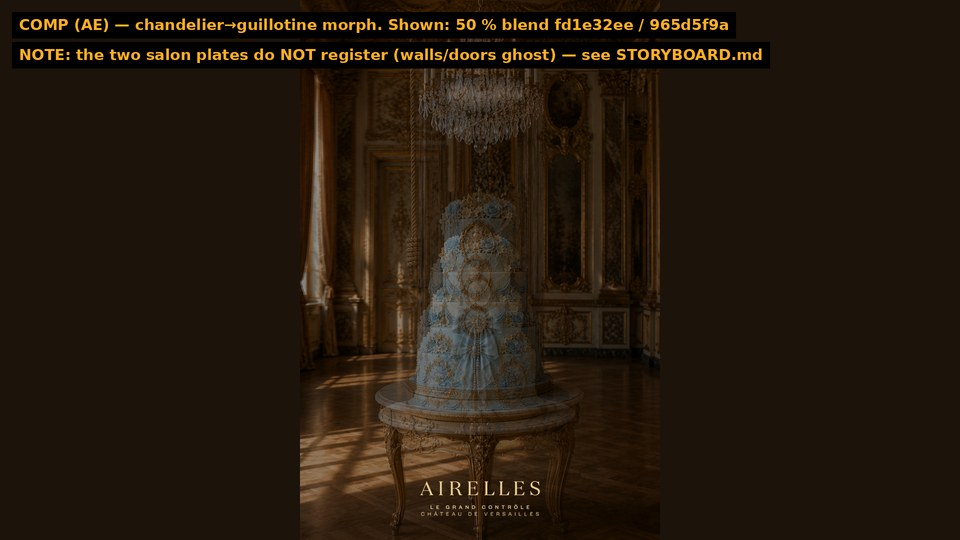
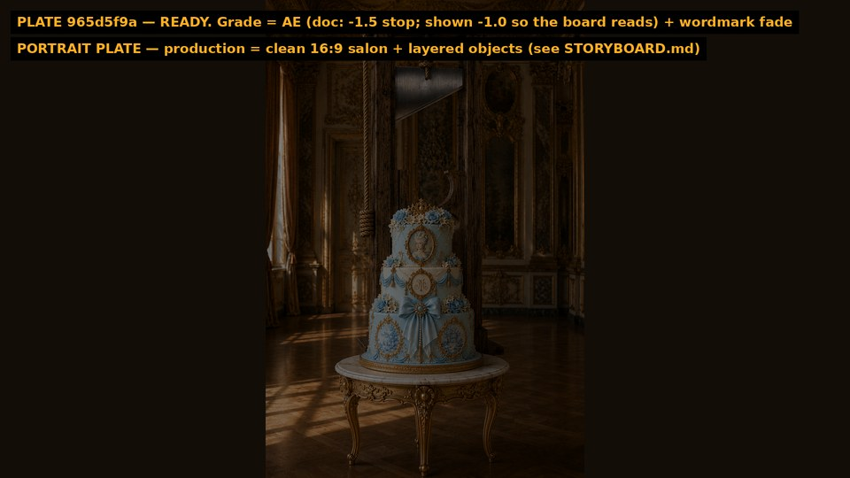
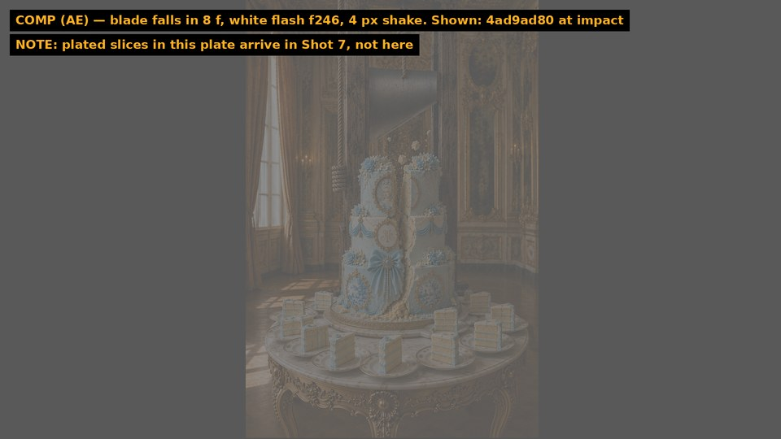
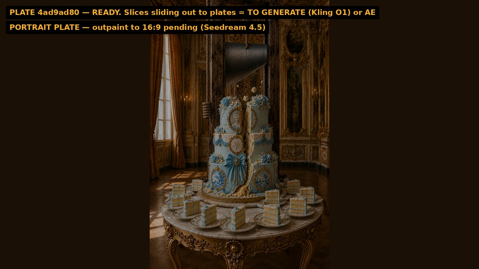
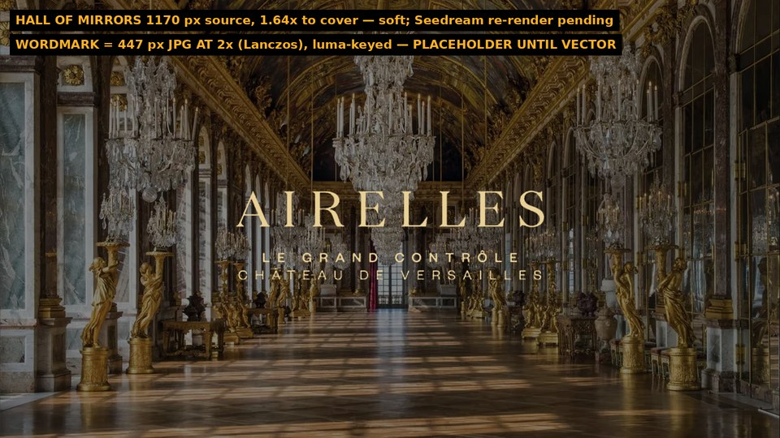

| | |
|---|---|
| Film | 04 — Airelles Le Grand Contrôle, Château de Versailles ("Let them eat cake") |
| Client / studio | Theria / Allen Grabo, RTFX Design |
| TRT | **15.0 s (f360)** per `theria_hotel_animations_timing_v1.md` §4, 8 shots |
| Frame rate | 24 fps |
| Master | 16:9, 1920×1080 (frames built at this size; deliverable master resolution still open per timing-doc global assumptions) |
| Frames | `frames/*.png` (1920×1080), `frames/*_small.jpg` (960×540), `frames/contact_sheet.jpg` — built by `build_frames.py PULL_ROOT OUT_DIR` |
| Board date | 2026-09-25 |

**Assumptions**

1. Boarded to the timing doc (15.0 s, 8 shots, black-field open, end card). Where the earlier storyboard page (TRT 14.0 s, 7 beats, white-field open, no end card) differs, it is called out in the row and in "Where the page differs" below.
2. **The asset descriptions in the timing doc (§4 asset list), the pipeline doc (§3 table) and this task's brief are wrong for four of the six Versali files.** Checked by eye; the board uses what is actually in the files:

| File | Actually contains | Docs say |
|---|---|---|
| `965d5f9a-d71a-4435-b487-cfabab3a0186.png` 1023×1537 RGB | cake on gilt table under the **guillotine, blade raised**, salon | cake + chandelier |
| `fd1e32ee-80ef-4d63-9d10-59e07f81e997.png` 1024×1536 RGB | cake on gilt table under the **chandelier**, salon (no alpha, not on black) | elements on black |
| `cfb72e66-8752-47fc-8f43-2f824eeb0f1d.png` 1024×1536 RGBA | cake + **chandelier**, isolated, real alpha (max 254 everywhere; bbox 783×1527 at x 227) | cake + guillotine |
| `4ad9ad80-ccba-4b14-8cd7-b85c4eb54f27.png` 1023×1537 RGB | **blade down** through the cake, slices already plated round the table | cake sliced, guillotine above |
| `images.jpg` 554×554 | **guillotine on white** (not the wordmark) | wordmark |
| `images copy.jpg` 447×447 | AIRELLES / LE GRAND CONTRÔLE / CHÂTEAU DE VERSAILLES wordmark, dark type on cream, JPG | wordmark |
| `cfb72e66-… (1).png` | byte-identical duplicate of `cfb72e66` (same md5) | — |

3. All three salon plates and the cut-out are portrait 2:3. They are letterboxed at full height, centred, pillars filled with a sampled-and-darkened wall colour — never stretched or cropped — and tagged **PORTRAIT PLATE — outpaint to 16:9 pending (Seedream 4.5)**. Shot 1 is an element on black, so its pillars are black by design.
4. The wordmark is a plain 2× Lanczos resize of the 447 px JPG, luma-keyed (dark type → gold-cream alpha) so it can sit on the parquet. Tagged placeholder; no AI enlargement. Vector art replaces it 1:1.
5. Exposure changes written in the timing doc ("light drops 1.5 stops") are approximated with a brightness multiply for the board; the real grade is AE.
6. Nobody in frame, ever. The blade only meets cake. No frame in this board shows or implies a figure.

---

### Beats

Frame numbers are `f###` at 24 fps from the timing doc. "Brief line" is the client brief line the beat serves.

| # | Brief line | IN – OUT (s) / frames | Frame | On screen | Motion / camera | Transition | Assets used | Status |
|---|---|---|---|---|---|---|---|---|
| 1 | "Start with the cake on the table with the chandelier" | 00.0 – 02.2 / f0–53 (2.2 s) | `01_black_open.png` | Tiered blue cake on the gilt table, crystal chandelier directly above, everything else black | Locked off, 1 % push-in. Candle flames flicker; slow crystal caustics across the icing. Chandelier may sway 1.5° on a slow sine (page note) | — | `cfb72e66-8752-47fc-8f43-2f824eeb0f1d.png` (RGBA cut-out on black) | **READY** as a still. Micro-motion = Kling O1 (image-to-video, "cake does not move") or AE flicker/caustic layers. Page says **white** field; doc says black — see Q1 |
| 2a | "The background appears with the lavish finishing in the background" | 02.2 – ~03.6 / f53–86 (mid-reveal) | `02a_salon_reveal.png` | The salon fading up from black, outward from the cake; walls and parquet still dark at the edges | Radial reveal ~1.4 s from centre. Warm afternoon shaft lands across the floor last. Page: three passes floor / walls / light 400 ms apart, cast shadows last | reveal (from black) | `fd1e32ee-80ef-4d63-9d10-59e07f81e997.png` under a radial luma mask | **COMP (AE)** — luma-matte reveal over the plate. Alt: Kling O1 Shot 2 prompt (pipeline §6) with `01` and `02b` as start/end frames |
| 2b | same | 02.2 – 04.4 / f53–106 (end state) | `02b_salon.png` | The salon whole: boiserie, gilding, drapes, window light, cake centre, chandelier above | Hold. Camera locked | — | `fd1e32ee-80ef-4d63-9d10-59e07f81e997.png` | **READY** plate. Portrait — outpaint to 16:9 (Seedream 4.5) |
| 3 | "The logo for the hotel appears under the table" | 04.4 – 06.2 / f106–149 (1.8 s) | `03_wordmark.png` | AIRELLES lockup on the parquet between the table's front feet | Wordmark fade 0.7 s, hold 1.1 s. Page wants it gold, inlaid, perspective-matched to the floor plane; doc reads screen-flat | — | `fd1e32ee-…png` + `images copy.jpg` (2× Lanczos, luma-keyed placeholder) | **COMP (AE)** logo layer over the plate. Wordmark **placeholder until vector**. Clear parquet under this table is only ~260 px wide at 1080p — see Q3 |
| 4 | "The chandelier turns into a guillotine" | 06.2 – 08.8 / f149–211 (2.6 s) | `04_morph_COMP.png` | Mid-morph: the chandelier half-become guillotine; wordmark still on the floor; room ~¾ stop down | Morph, not cut: crystals darken and elongate into timber uprights f149–180; central boss stretches into the blade f170–200; rope and pulley draw on last f195–211. Room light drops 1.5 stops across the shot. Cake oblivious. Page: 2.4 s ease-in-out, keep the chain as the hoist rope, light cools 400 K | — | 50 % blend of `fd1e32ee-…png` and `965d5f9a-…png`, `images copy.jpg` | **COMP (AE)** — pipeline §7: never a video model. **The two salon plates do not register** (doors, panels and window ghost in the blend; cake sits at slightly different positions) — see Q2. The blend is shown honestly, not aligned |
| 5 | "The logo disappears" | 08.8 – 09.8 / f211–235 (1.0 s) | `05_still.png` | Guillotine raised over the cake, dark room, no logo. Total stillness f223–235 | Wordmark opacity → 0 over 0.5 s, then 12 frames of nothing. Quartet stops dead at 09.8. Page adds "the blade rises the last few inches" and one rope creak | — | `965d5f9a-d71a-4435-b487-cfabab3a0186.png` | **READY** plate (shown at −1.0 stop so the board reads; doc grade is −1.5). Logo fade + grade = AE |
| 6 | "The guillotine comes down fast and cuts the cake" | 09.8 – 10.6 / f235–254 (0.8 s) | `06_drop_COMP.png` | Impact frame: blade through all three tiers, 3-frame white flash, frame kicked 4 px | 2 frames pre-shake f235, blade falls in **8 frames** f238–246, white flash-frame f246, camera shake 4 px settling by f254. Page: 4 frames of blade, motion-blurred, crumb/sugar-dust on the second frame after contact, no gore physics | hard | `4ad9ad80-ccba-4b14-8cd7-b85c4eb54f27.png` at −1.5 stop, +4/−3 px offset, 35 % white | **COMP (AE)** — blade is a layer moved 8 frames. Pipeline §6 also lists a Kling prompt for this shot but §7 warns "blade falling" may trip filters; board it as comp. **Caveat:** the only blade-down plate already has the plated slices around the table (Shot 7's end state) — a clean "blade through cake, no plates" frame does not exist. See Assets still needed |
| 7 | "The cake it cut up into many pieces" | 10.6 – 13.6 / f254–326 (3.0 s) | `07_served.png` | Cake parted under the blade, slices on porcelain ringing the table; light back up 1 stop | 0.6 s of the cake falling into slices, then portions slide out to their plate positions and settle. Page: plates pop in on 3-frame intervals in a spiral, "sixteen ways". Quartet back at 11.2 as if nothing happened | — | `4ad9ad80-ccba-4b14-8cd7-b85c4eb54f27.png` at −0.5 stop | **READY** plate as end state. Slice travel = **TO GENERATE (Kling O1**, pipeline §6 Shot 7 prompt, start `06` end `07`) or AE cut-outs sliding. Portrait — outpaint pending |
| 8 | — (timing-doc addition, not in brief) | 13.6 – 15.0 / f326–360 (1.4 s) | `08_endcard.png` | Hall of Mirrors wide, darkened; wordmark centre | Pull back / cross-dissolve from the salon to the hall; wordmark fades up centre | dissolve in; fade to black f360 | `1651551468329.webp` (cover-fit 1.64×), `images copy.jpg` (placeholder) | **READY** as a still but soft: 1170 px source at 1920 (Seedream re-render pending). Page has **no end card** — it whips back to white and loops. See Q1 |

### Where the earlier storyboard page differs from the timing doc (page text in `inventory/storyboards_rendered_text_2026-09-25.txt`, "04 AIRELLES")

| | Page (TRT 14.0 s, 7 beats) | Timing doc (15.0 s, 8 shots) — boarded |
|---|---|---|
| Open field | white | **black** |
| Beat times | 0–2 / 2–4 / 4–6 / 6–9 / 9–10.5 / 10.5–11.2 / 11.2–14 | 0–2.2 / 2.2–4.4 / 4.4–6.2 / 6.2–8.8 / 8.8–9.8 / 9.8–10.6 / 10.6–13.6 / 13.6–15 |
| Morph | 2.4 s, light cools 400 K, chain becomes hoist rope | 2.6 s, light drops 1.5 stops |
| Tension beat | includes "blade rises the last few inches" + one rope creak | pure stillness; audio stops dead |
| Drop | 4 frames of blade, dust burst | 8 frames, pre-shake, white flash-frame, 4 px camera shake |
| Payoff | spiral plating on 3-frame intervals, "sixteen ways", whip back to white, loops | slices slide to plates, light up 1 stop, then Hall of Mirrors end card |
| Music | harpsichord, keeps playing through the drop | string quartet, stops dead at 09.8, returns 11.2 |
| Logo | gold, inlaid into the floor, perspective-matched | set in the clear parquet below the table legs |

---

### Open questions for Allen

1. **Black or white field, and does it loop?** Doc opens on black and ends on a Hall of Mirrors card; the page opens on white and whips back to white so it loops (the global rule says each film ends on its own opening frame). The `cfb72e66` cut-out works on either. Pick one — it changes Shots 1, 2 and 8.
2. **The two salon plates do not register** (see `04_morph_COMP.png`: doors, panelling and window ghost; the cake shifts). Outpainting three mismatched plates will not fix this. Recommend the page's own TO SOURCE route: one clean empty salon plate (Seedream 4.5, 16:9, no cake, no chandelier), then cake, chandelier and guillotine as separate layers held in one position across Shots 2–7. That also makes the morph, the logo, the blade drop and the plating all AE layer work on a single background. OK to go that way?
3. **Wordmark placement.** In the portrait plate the clear parquet between the front feet is ~260 px at 1080p, so the lockup is small (`03_wordmark.png`). Either the outpaint/clean plate gives more floor below the table, or the lockup sits in front of the feet / on the apron. Also: screen-flat fade (doc) or gold floor inlay in perspective (page)?
4. **Blade drop: 8 frames + flash frame (doc) or 4 frames + dust (page)?** And confirm the drop is AE (a blade layer moved down) rather than the Kling Shot 6 segment listed in pipeline §6 — §7 of the same doc expects that prompt to be refused.
5. **Shot 7 payoff:** is `4ad9ad80` (blade already down, slices already ringing the table, more like 12 slices than the page's sixteen) the accepted end state, and do the slices travel by Kling (pipeline §6 prompt) or as AE cut-outs?

### Assets still needed

- **Vector wordmark** (AI/EPS/SVG/PDF) — the only logo file is a 447 px JPG on cream; the board's 2× placeholder is tagged on every frame it appears.
- **Clean empty salon plate**, 16:9, no cake, no chandelier, no guillotine (Seedream 4.5, ≥3840 wide) — the page's TO SOURCE item; needed if Q2 goes the layered route, and it makes the three portrait outpaints unnecessary.
- Otherwise: **16:9 outpaints of `fd1e32ee`, `965d5f9a`, `4ad9ad80`** from one reference, same seed (pipeline §3). They must also be brought into register with each other, which the outpaint alone will not do.
- **Isolated guillotine with alpha** at plate scale — `images.jpg` is a 554 px guillotine on white (too small, different model); Flux 2.0 Pro per pipeline §3, or key it out of `965d5f9a` (rope and open timber will be fiddly).
- **Isolated cake alone and chandelier alone** — `cfb72e66` has both in one alpha; they do not overlap, so a horizontal split above the cake's finial separates them for free. Note in the file, not yet done.
- **Blade-through-cake frame with no plated slices** (Shot 6 impact, Shot 7 start) — does not exist; generate (Seedream / NBP from `4ad9ad80` with plates removed) or build in AE from the cake cut-out.
- **Hall of Mirrors at master resolution** — the webp is 1170×780 with a timestamp filename; confirm it is licensed or re-render (Seedream). Only needed if the end card survives Q1.
- **Audio**: period string quartet bed (or harpsichord, per Q1/page), rope-and-timber creak, blade whoosh, impact thud.

### What this board does not cover

- In-between motion: candle flicker, caustics, the morph itself, the blade travel, slice travel — every frame here is a keyframe or a tagged stand-in, per the stills → animated segments approach.
- The morph design (which crystal becomes which upright, where the chain becomes rope) — that is an AE animatic, not a board.
- Colour grade, the 1.5-stop / 1-stop light changes (approximated), and the 400 K cool-down.
- Audio timing beyond what the timing doc states.
- 1:1 and 9:16 crops (logo-safe centre 80 % rule not checked on these portrait plates).
- The loop point, until Q1 is answered.
- Kling prompt wording — taken as given from pipeline §6 and not tested; no generation was run (no network).
- Anything under the pull directory was read only; nothing there was modified, including the duplicate `cfb72e66 (1).png`.

## 05 · North Island

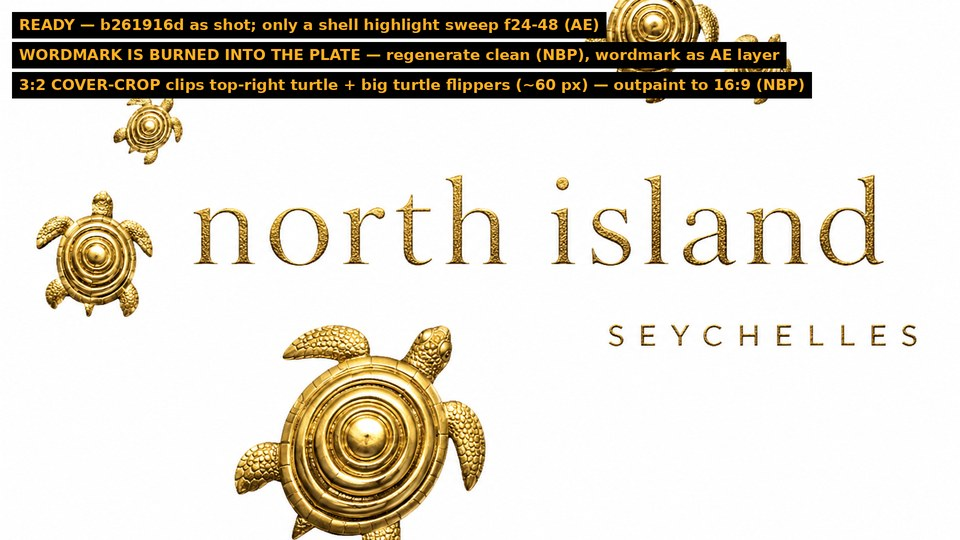
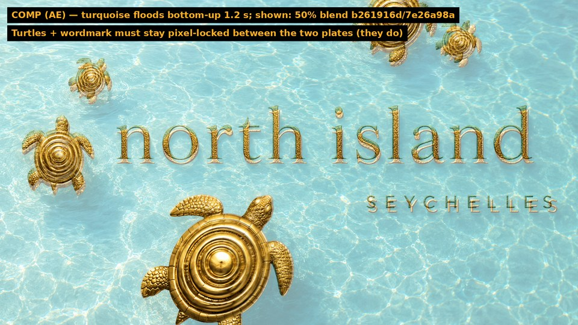
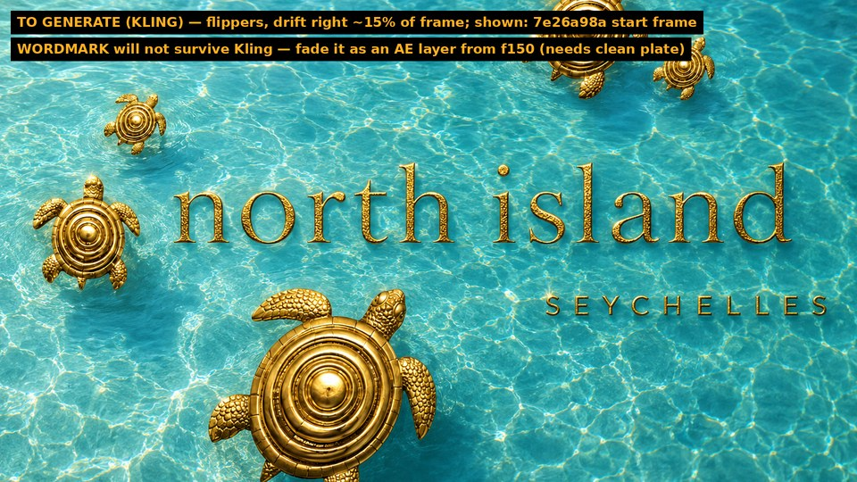
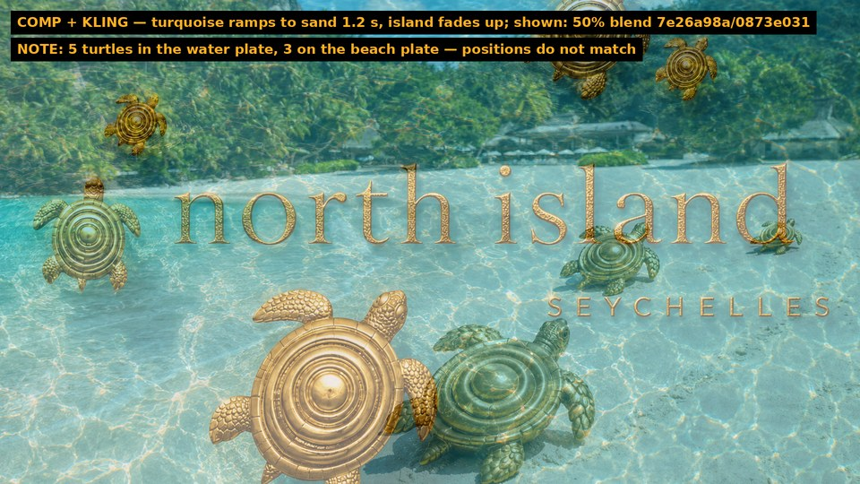
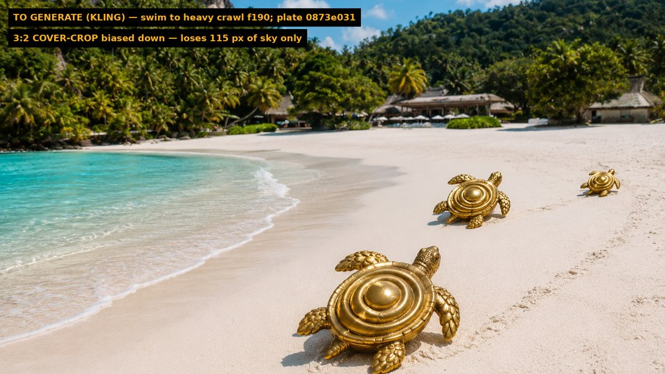
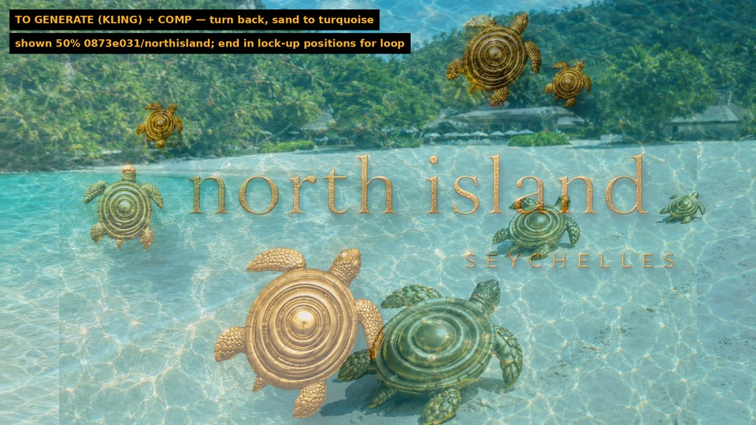
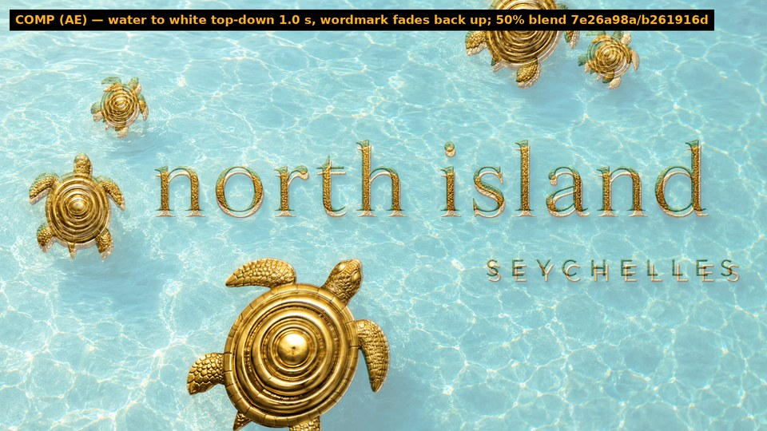
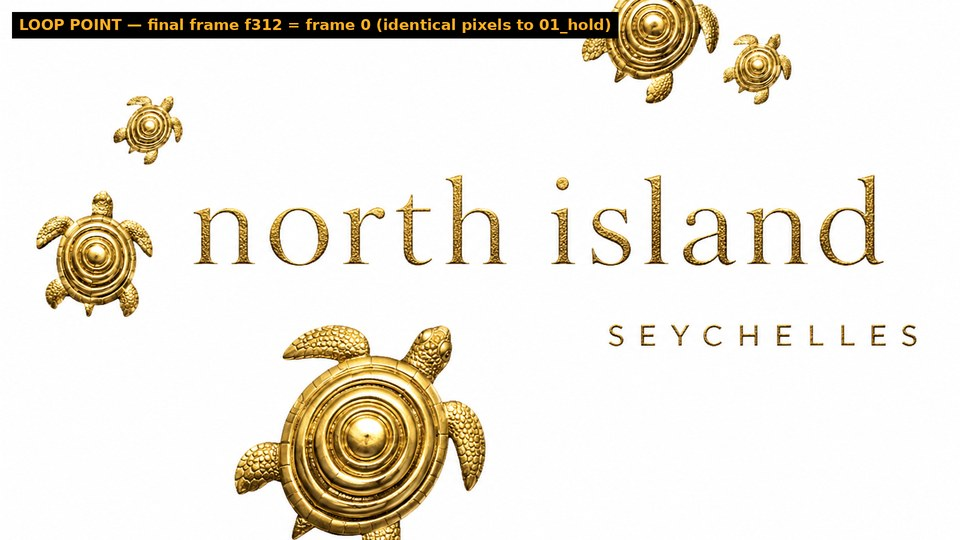

| | |
|---|---|
| Film | 05 North Island (Theria slate, 8 films) |
| TRT | **13.0 s** = 312 frames @ **24 fps** (per `theria_hotel_animations_timing_v1.md` §5) |
| Master | 16:9, 1920×1080 (aspect is still "not decided" in the timing doc's global assumptions — see open question 2) |
| Shots | 6 in the timing doc, boarded as 8 frames (shots 4 and 6 get two frames each) |
| Loop | final frame f312 = frame 0. `build_frames.py` asserts 01 and 08 are pixel-identical below the tag band |
| Frames | `frames/NN_name.png` (1920×1080) + `NN_name_small.jpg` (960×540) + `contact_sheet.jpg`. Rebuild: `python3 north_island/storyboard/build_frames.py PULL_ROOT north_island/storyboard/frames` |
| Beat source | client brief lines (6) → timing doc §5 (source of truth for IN/OUT) → storyboard page "05 NORTH ISLAND" (differences noted below) |

**Assumptions**
- The three 1536×1024 (3:2) plates are scaled ×1.25 to cover 1920×1080 and cropped; 864 of 1024 source rows survive. On the two lock-up plates the turtles span rows 21–1004, so a centred crop clips ~60 px (source) off the top-right turtle and ~60 px off the big turtle's rear flippers. Both are tagged in-frame. The beach plate's crop is biased down (top = row 115) and loses only sky.
- `b261916d` and `7e26a98a` have the **wordmark burned in**. The board uses them as-is; the pipeline doc (§4, and test 3 in §8) recommends **regenerating both clean in Nano Banana Pro (no type)** so the wordmark becomes an After Effects layer. Every "wordmark fades" note below depends on that.
- Blend frames (02, 04, 06, 07) are plain 50 % `Image.blend` of two plates: they show *which two states* the beat moves between, not the wipe itself.
- `b261916d` and `7e26a98a` are two separate generations, not one composition re-lit: the turtles and wordmark sit 5–11 px (source) apart and the gold silhouettes differ ~9 % in area. Shot 2 and shot 6 therefore cannot be a clean dissolve between the two files as delivered — the fix is the same clean-plate regeneration: one turtle/wordmark layer set over a white plate and a water plate.
- `download.jpg` (house mark, 225×121) is **not used in any frame**. It was not enlarged; nothing was AI-enlarged. No client logo was touched.
- Nothing under the pull directory was modified.

### Beats

| # | Brief line | IN–OUT (s) / frames @24 | Frame | On screen | Motion / camera | Transition | Assets used | Status |
|---|---|---|---|---|---|---|---|---|
| 1 | "Start with the gold turtle logo" | 0.0–2.2 / f0–53 (2.2 s) | `01_hold` | Five gold turtles + "north island / SEYCHELLES" on white, dead still | Locked off. One specular sweep across the big turtle's shell f24–48 (AE, on the plate) | — | `b261916d-7215-4f97-8607-d091aabe911a.png` | **READY** as a board frame. Final plate: NBP 4K re-render/outpaint of the same composition **without type** (has wordmark) |
| 2 | "Have the background change to water" | 2.2–4.0 / f53–96 (1.8 s) | `02_flood_COMP` | White ground becomes turquoise shallows; turtles and wordmark do not move | Turquoise floods from the bottom edge upward over 1.2 s (f53–82), caustics resolve as it rises; hold on `7e26a98a` to f96. **The two plates are not pixel-locked** (measured: gold-mask IoU 0.40, turtles and type drift 5–11 px source = 6–14 px at 1080p, big turtle 9 px vertical) — a straight wipe between them will hop. Comp the turtles + wordmark once as layers over a clean water plate | luma wipe bottom→top (AE) | `b261916d-…png` → `7e26a98a-718f-43e1-8719-c7f930b25af3.png` (shown as 50 % blend) | **COMP (AE)** — needs both plates clean (NBP) so the wordmark can sit on its own layer with refraction |
| 3 | "Have the gold turtles start to swim" | 4.0–7.0 / f96–168 (3.0 s) | `03_swim_TOGEN` | Turtles in the shallows begin to swim | Front flippers start f96, staggered 6 frames per turtle; slow drift toward frame right ~15 % of frame width over the shot; caustics move across the shells. Wordmark starts a slow fade at f150 | — | `7e26a98a-…png` as Kling start frame | **TO GENERATE — Kling** (image-to-video from the **clean** NBP plate; a burned-in wordmark will not survive Kling — cf. Giraffe Manor `frame1_to_frame2.mp4`). Wordmark fade = AE layer |
| 4a | "Have them land on a beach" | 7.0–8.2 / f168–197 (1.2 s) | `04_landfall_COMP` | Water shallows out; sand, beach and island fade up behind | Colour ramps turquoise → pale sand over 1.2 s; beach plate fades up | cross-dissolve (AE) | `7e26a98a-…png` → `0873e031-511a-499b-a9d5-8a2b7a701d87.png` (50 % blend) | **COMP (AE)** over the Kling shot-3 tail. Turtle positions do **not** match between plates (5 in water, 3 on sand) — see open question 1 |
| 4b | (same) | 8.2–9.4 / f197–226 (1.2 s) | `05_sand` | Turtles on white sand, bay and lodge behind | Flipper cycle changes from swim to a heavy crawl at f190; slow each ~30 % as it takes the sand | — | `0873e031-…png` (Kling start frame) | **TO GENERATE — Kling**. Plate: Seedream 4K re-render (clean, no type) per pipeline §3; page also asks for a beach plate **without turtles** |
| 5 | "Then back to sea" | 9.4–11.4 / f226–274 (2.0 s) | `06_return_COMP` | Turtles turn back to the water; sand ramps back to turquoise | Three turtles turn, staggered 0.5 s apart, and head out; colour ramp sand → turquoise under them | cross-dissolve (AE) | `0873e031-…png` → `7e26a98a-…png` (50 % blend) | **TO GENERATE — Kling** (turn) **+ COMP (AE)** ramp. Turtles must end in their `7e26a98a` positions |
| 6a | "back to blue, back to white" | 11.4–12.4 / f274–298 (1.0 s) | `07_whiteout_COMP` | Water desaturates to white from the top down; turtles settle into shot-1 positions; wordmark fades back up | Top-down luma wipe over 1.0 s, wordmark opacity 0 → 100 | luma wipe top→bottom (AE) | `7e26a98a-…png` → `b261916d-…png` (50 % blend) | **COMP (AE)** |
| 6b | (loop) | 12.4–13.0 / f298–312 (0.6 s) | `08_loop` | Identical to frame 0 | Hold. **Final frame = frame 0** | loop point | `b261916d-…png` | **READY** (same pixels as `01_hold`) |

### Where the storyboard page (TRT 13.0 s) differs from the timing doc

Boarded to the timing doc. The page text (`inventory/storyboards_rendered_text_2026-09-25.txt`, "05 NORTH ISLAND") differs in:

1. **Beat boundaries** — page: 0–2 / 2–4 / 4–7 / 7–10 / 10–12 / 12–13. Timing doc: 0–2.2 / 2.2–4.0 / 4.0–7.0 / 7.0–9.4 / 9.4–11.4 / 11.4–13.0. Same TRT, landfall is 0.6 s shorter and the sign-off 0.6 s longer in the doc.
2. **Beat 2 mechanics** — page: radial wipe from the four corners, 1.4 s, refraction distortion on the wordmark. Doc: bottom-up flood, 1.2 s, wordmark locked. Beat 6 mirrors this (page: "drains the way it came in"; doc: top-down).
3. **Turtle count** — page says **four**; the two lock-up plates have **five**; the beach plate has **three**; the doc's shot 5 says "the three turtles".
4. **Beat 3** — page: turtles break the logo formation into a loose line, big one leading, logo shape survives to ~0:05.5, wakes behind them. Doc: drift right ~15 %, staggered flippers, no formation change.
5. **Beat 4** — page: "camera surfaces and swings level", drag tracks in the sand. Doc: no camera move, beach fades up behind.
6. **Beat 5** — page: "mirror the plate so the exit reads opposite the entrance", a wave takes the tracks. Doc: turtles turn back on the same plate.
7. **Sound** — page: underwater pressure → surf → silence. Doc: surf/reef ambience rising through the water beats, dropping to near-silence at 12.4.

### Open questions for Allen

1. **How many turtles?** Lock-up plates: 5. Beach plate: 3. Page: 4. Doc shot 5: 3. If 5 is canon, do the two top-right turtles stay in the water on the beach beat, or does the beach plate get regenerated with all five?
2. **16:9 crop vs outpaint.** A cover crop of the 3:2 lock-up clips the top-right turtle and the big turtle's flippers (~60 px source each, tagged on 01/03/08). Outpaint both lock-up plates to 16:9 in NBP (recommended — same pass as removing the type), or shrink the lock-up and pillarbox (works on white, not on water)? And is 9:16 still on the table — it changes this film's layout completely.
3. **Which wordmark is canon?** The plates carry a textured gold serif "north island / SEYCHELLES"; the house mark in `download.jpg` is a thin black serif with concentric-circle turtles. Is the gold-rendered type approved, or must the client's vector wordmark be the AE layer (pipeline §4 says never generate a wordmark)?
4. **Beat 2/6 wipe direction** — bottom-up / top-down (doc) or radial from the corners with refraction (page)? Affects the comp and whether the wordmark needs a displacement pass.
5. **Beat 5 exit** — turn the turtles back on the same plate (doc) or mirror the plate (page)? Mirroring flips the island's geography and the lodge; check the client won't mind.

### Assets still needed

- Vector wordmark and house mark from the client (`download.jpg` is 225×121 — reference only, never to be enlarged).
- `b261916d` and `7e26a98a` regenerated **clean (no type)**, 16:9, ≥3840×2160 — Nano Banana Pro, same composition (pipeline §8 test 3 is exactly this file).
- `0873e031` re-rendered at 4K in Seedream 4.5; plus a **beach plate with no turtles** (page TO SOURCE) for the landfall comp.
- Each gold turtle as its own alpha layer (or the 3D source) — needed for the staggered swim start, the settle-back in shot 6 and any 5→3 turtle reconciliation.
- Kling clips: shot 3 swim/drift, shot 4b crawl, shot 5 turn. No North Island prompts exist in the pipeline doc yet.
- Audio bed (surf/reef) and the loop-safe fade at 12.4.

### What this board does not cover

- No wipe/caustic/refraction previs: 02, 04, 06, 07 are flat 50 % blends of two plates.
- No per-turtle motion, stagger or the 15 % drift; no shot-1 highlight sweep; no wordmark fade (impossible while it is burned in).
- No Kling prompts, seeds or fallbacks. No audio. No 1:1 / 9:16 re-frames (the logo-safe centre-80 % rule is not checked).
- No turtle-count reconciliation between the water and beach plates.
- Frames are built from the 1536×1024 originals scaled ×1.25 — they are review frames, not final plates.

## 06 · Miavana

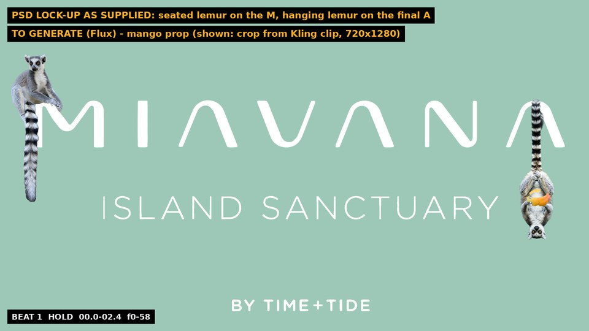
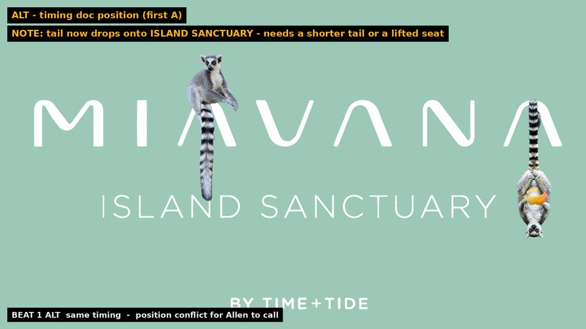
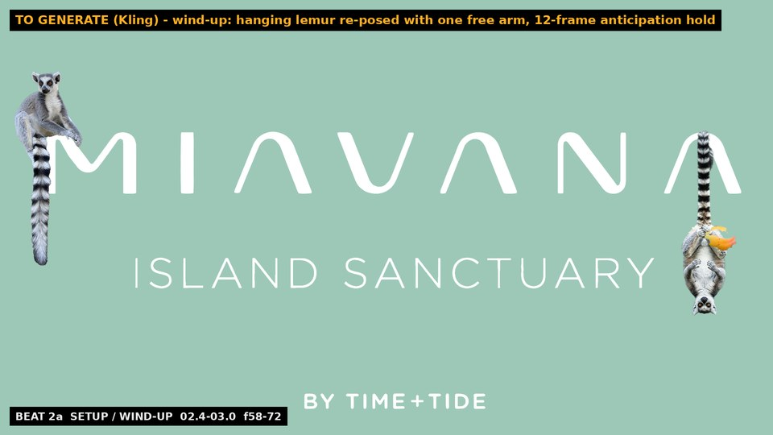
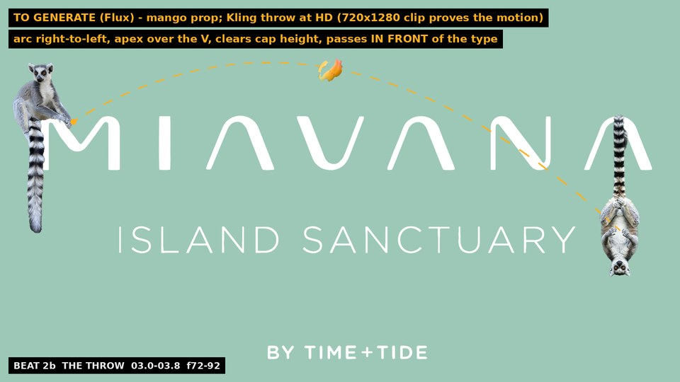
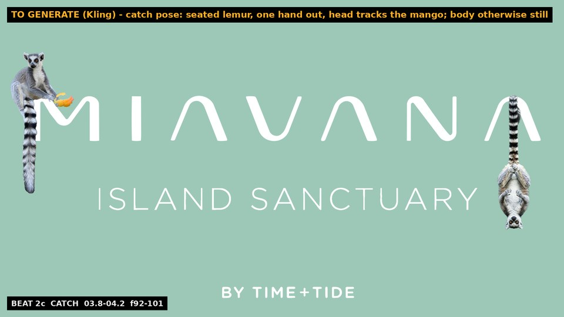
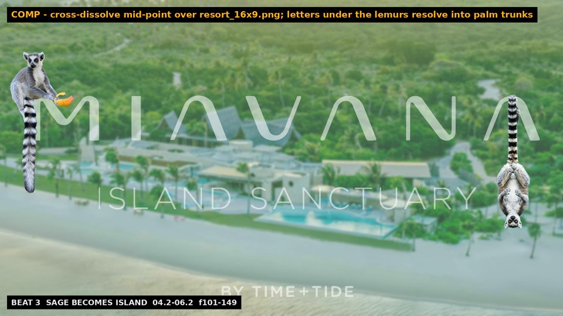
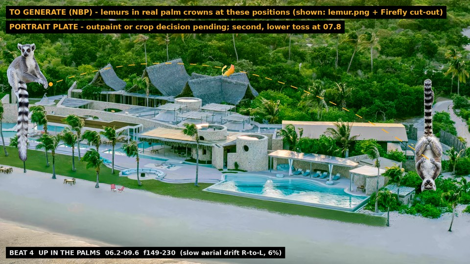
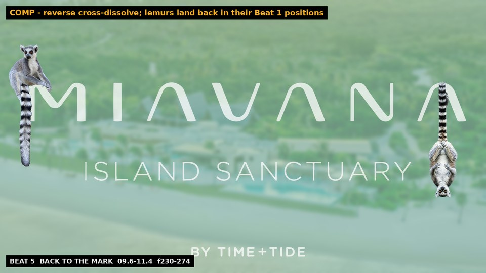
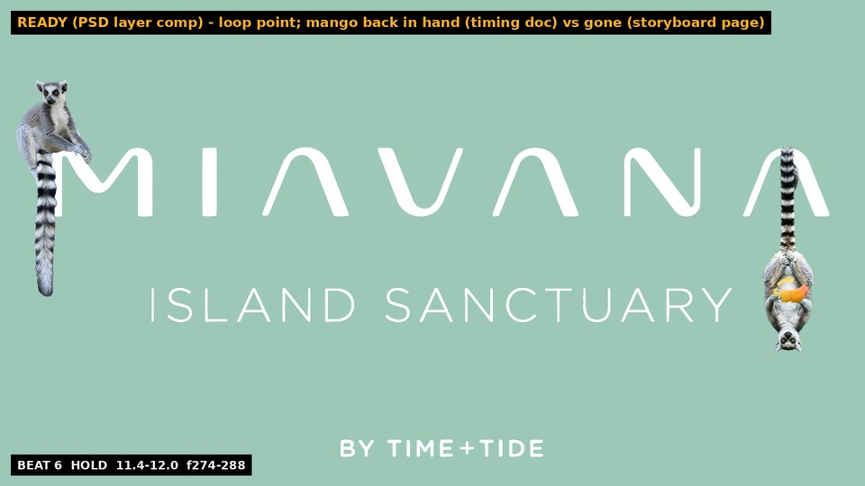

| | |
|---|---|
| Film | 06 Miavana, Nosy Ankao, Madagascar (client: Theria; hotel group Time+Tide) |
| TRT | 12.0 s = 288 frames @ 24 fps (timing doc `theria_hotel_animations_timing_v1.md` §6) |
| Master | 16:9, 1920×1080, sage brand ground RGB 157/200/183 (sampled from the PSD background layer) |
| Frames | `miavana/storyboard/frames/` — one PNG per beat + `*_small.jpg` (960×540) + `contact_sheet.jpg`; rebuilt by `build_frames.py PULL_ROOT OUT_DIR` |
| Brief | "Start with the logo with the lemurs (better positions). Have the last one holding a mango throwing it to the other lemur. The hotel appears in the background and the lemurs are in the palm trees. Hotel disappears back to the logo and lemurs in places." |

**Assumptions**

- The lock-up is rebuilt from the PSD layer exports (`Miavana/upscaled/miavana_*.png`) placed by the bboxes in `inventory/psd_layers_2026-09-25.md`, scaled 2508→1920 (×0.7655). Nothing in the wordmark has been redrawn, re-kerned or AI-enlarged; the PSD is used **as-is** — seated lemur on the **M**, hanging lemur on the **final A**. The timing doc's "seated lemur on the first A" is shown once as an ALT frame, not adopted (see open question 1).
- "The last one" in the brief = the hanging lemur on the final A; it throws **right-to-left** to the seated lemur. Both the timing doc and the earlier storyboard page agree on this direction.
- Mango: no prop exists in the pull. The frames use a colour-keyed crop of one frame (`-ss 2.0`) of the Kling clip `a ring-tailed lemur produces a mango, throws it up and to the right.mp4` (720×1280), down-scaled to ~84 px. It is a placeholder for a Flux-generated prop; the clip proves the throw motion but is below HD.
- Resort plate: `resort.png` (3600×4802, 2× upscale of `Miavana_©_Dylane_Cabano_001-scaled.jpg`) is **portrait**. The board covers 16:9 with a crop centred at 62 % of the plate's height (villas, pools, palm band, beach edge); ~58 % of the plate's height is discarded. Outpaint vs. crop is not decided here.
- The PSD lemurs are ~480 px / ~460 px tall at HD (soft, from the 1254 px source). The palms beat uses the large cut-outs `lemur.png` (seated) and `Firefly_remove background 477817 (1).png` (hanging) scaled **down** to the same screen bboxes; those are stand-ins for NBP output, not finals.
- Screen positions (HD px) carried through every beat: seated lemur bbox (34,176)–(207,660); hanging lemur bbox (1690,322)–(1810,783); release point = hanging lemur's clasped hands (1750,651); catch point = seated lemur's reaching hand (207,344); throw apex (932,197), i.e. over the V and 130 px above cap height (y 327).
- Storyboard page (rendered text, "06 MIAVANA") has slightly different beat splits (throw 04.0–05.5, palms 08–10). This board follows the **timing doc**; the page's notes (12-frame anticipation hold, arc in front of the type, colour-match plate greens toward sage, easter-egg mango on loop 3) are kept as motion notes.

### Beats

| # | Brief line | IN–OUT (s) · frames | Frame | On screen | Motion / camera | Transition | Assets used | Status |
|---|---|---|---|---|---|---|---|---|
| 1 | "Start with the logo with the lemurs (better positions)" | 00.0–02.4 · f0–58 | `01_lockup.png` | Sage lock-up: MIAVANA / ISLAND SANCTUARY / BY TIME+TIDE, seated lemur on the M, hanging lemur by its tail from the final A, mango already visible in its clasped hands | Still. Breathing on both, one tail sway on the hanging lemur, one head-turn. Mango visible from f0 so the audience registers it before it moves | — | `miavana_0002_miavana.png`, `miavana_0003_islandsanctuary.png`, `miavana_0004_bytimeandtide.png`, `miavana_0000_left_lemur.png`, `miavana_0001_right_lemur.png`, sage from `miavana_0005_Layer-0.png`; mango crop from `a ring-tailed lemur produces a mango, throws it up and to the right.mp4` @2.0 s | COMP (lock-up READY as PSD comp) · mango TO GENERATE — **Flux** prop |
| 1 ALT | same | same | `01alt_lockup_firstA_ALT.png` | As beat 1 but the seated lemur moved onto the **first A** (PSD x 798, feet on the apex at x 885) — the timing doc position | same | — | same layers, `left_lemur` layer offset +754 px in PSD space | ALT — for Allen's call. Note: the tail (632 px layer) now drops ~27 PSD px into ISLAND SANCTUARY; needs a lifted seat or trimmed tail if chosen |
| 2a | "the last one holding a mango" | 02.4–03.0 · f58–72 | `02_windup_TOGEN.png` | Hanging lemur produces / weighs the mango, cocks one arm | Wind-up f58–70. 12-frame anticipation hold — the comedy is in the pause. Seated lemur only turns its head | — | as beat 1; mango offset up-right of the hands | TO GENERATE — **Kling** (hanging lemur re-posed with one free arm; the supplied still has both hands clasped). Existing 720×1280 Kling clips prove the motion, below HD |
| 2b | "throwing it to the other lemur" | 03.0–03.8 · f72–92 | `03_throw_TOGEN.png` | Mango mid-arc over the V, in front of the type; dashed arc drawn from release (1750,651) to catch (207,344) | Release f72, 20-frame arc, apex over the V clearing cap height, mango tumbling; receiving lemur's head tracks it | — | as beat 1 | TO GENERATE — **Flux** mango prop; **Kling** throw at HD (or 2D-animate the Flux prop along this arc in After Effects) |
| 2c | (catch) | 03.8–04.2 · f92–101 | `04_catch_TOGEN.png` | Mango in the seated lemur's outstretched hand | One-handed catch, lemur otherwise still; soft "thup" at 04.0 | — | as beat 1 | TO GENERATE — **Kling** (or 2D on the still) |
| 3 | "The hotel appears in the background" | 04.2–06.2 · f101–149 | `05_reveal_COMP.png` | Sage dissolving to the aerial resort plate; wordmark holds ~1.0 s at reduced strength then fades; lemurs hold position | Cross-dissolve; the letters under the lemurs resolve into palm trunks as they go. Colour-match the plate greens toward the sage ground so the change reads as focus, not a cut | cross-dissolve | `resort.png` (16:9 cover crop, anchor 0.62), lock-up layers at 55 %, lemur layers, mango | COMP · plate PORTRAIT — outpaint or crop decision pending |
| 4 | "the lemurs are in the palm trees" | 06.2–09.6 · f149–230 | `06_palms_TOGEN.png` | Resort plate full; both lemurs in real palm crowns at the same screen positions they had on the letterforms; second, lower toss mid-arc | Slow aerial drift right-to-left, 6 % of frame over 3.4 s. Second toss at 07.8 shorter and lower (apex ~90 px below the first); "thup" at 08.0 | — | `resort.png`, `lemur.png` (seated, scaled down to the 484 px bbox), `Firefly_remove background 477817 (1).png` (hanging, scaled to the 462 px bbox), mango crop | TO GENERATE — **NBP** (lemurs sat in real palm crowns at these positions on the plate; type-free); toss motion **Kling** or 2D |
| 5 | "Hotel disappears back to the logo" | 09.6–11.4 · f230–274 | `07_return_COMP.png` | Resort dissolving out, sage returning, letters re-forming under the lemurs | Reverse of beat 3; lemurs land in their beat 1 positions | cross-dissolve | `resort.png` at 30 % (blurred), lock-up layers at 75 %, lemur layers | COMP |
| 6 | "lemurs in places" (hold / loop) | 11.4–12.0 · f274–288 | `08_hold.png` | Full-strength lock-up, lemurs in beat 1 positions, mango back in the hanging lemur's hands | Still; loop point back to f0 | — (loop) | as beat 1 | READY as PSD comp; mango TO GENERATE — **Flux** |

Audio (timing doc): Malagasy forest at dawn, valiha or light marimba; two soft catches at 04.0 and 08.0. Storyboard page: "keep it dry, never cartoonish".

### Open questions for Allen

1. **Seated lemur: M or first A?** The PSD, the flattened `miavana copy.png`, `images-2.jpg` and the earlier storyboard page all put it on the M; the timing doc says first A ("the two arches read as branches"). Board is built on the M; `01alt_lockup_firstA_ALT.png` shows the alternative. If the first A wins, the tail collides with ISLAND SANCTUARY and the lemur needs re-seating (lifted or shorter tail) — that means touching the wordmark layout, so it needs the vector mark.
2. **`resort.png` rights and format.** It is a 2× upscale of `Miavana_©_Dylane_Cabano_001-scaled.jpg` — is the licence confirmed for a broadcast/social animation, and do we (a) outpaint the sides to 16:9 (NBP/Flux, risks inventing resort architecture) or (b) accept the tight cover crop shown (loses sky, sandbar and most of the lagoon)?
3. **Mango at the loop point.** Timing doc: "mango back in hand — loops clean." Storyboard page: "the mango is gone. Nobody mentions it." Board follows the timing doc. Which?
4. **Throw at HD: Kling re-run or 2D?** The two existing Kling clips are 720×1280 portrait with forest backgrounds (no alpha). Either re-run Kling on the sage lock-up at HD with the hanging pose, or animate the Flux mango along the drawn arc in AE with the stills breathing. The 2D route needs no new lemur generation for beats 2a–2c except one free-arm pose.
5. **Vector wordmark.** Still not in the pull — the PSD type layers are raster (2260 px wide). Needed before any re-kerning, the ALT position, or the "letters become palm trunks" morph in beat 3.

### Assets still needed

- Mango prop (Flux), clean alpha, ~120 px at HD, lit to match the lemur stills; a second frame with it tumbled 35° for the arc.
- Hanging lemur with one free arm raised (wind-up pose) at the PSD lemur's scale — NBP or Kling still.
- NBP plate: `resort.png` crop with both lemurs composited into real palm crowns at bboxes (34,176)–(207,660) and (1690,322)–(1810,783).
- Decision-dependent: 16:9 outpaint of `resort.png`; vector `MIAVANA` wordmark.
- Kling motion at HD (throw, catch, breathing/tail sway) if the 2D route is not taken.
- Audio: forest bed, valiha/marimba figure, two catch foleys.

### What this board does not cover

- No motion is proven at HD: every Kling reference is 720×1280. The dashed arcs are annotations, not animation curves.
- The "letters resolve into palm trunks" idea (beat 3) is described only; no morph frame was built, since it needs the vector mark and the NBP plate.
- The palms frame places the big cut-outs at the letterform positions on the plate; they are not in the palm crowns (floating over jungle at left, over a palm at right) — that is exactly the NBP job.
- Colour-matching the plate greens to sage, the 6 % aerial drift, and the easter-egg mango on the third loop are not previewed.
- No audio, no end-card variant with a smaller mark, and no vertical (9:16) safe-area pass.
- `build_frames.py` writes one ffmpeg frame grab and the mango cut-out into `frames/_work/`; nothing under the pull directory is touched.

## 07 · Necker Island

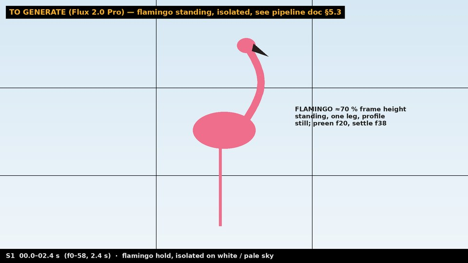
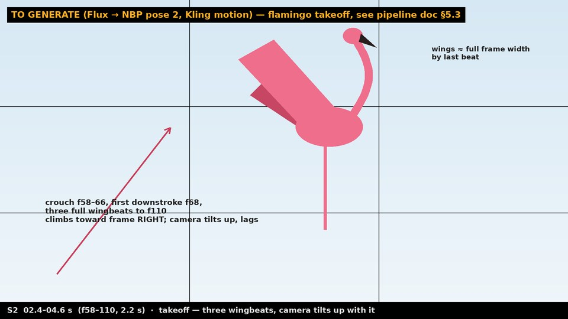
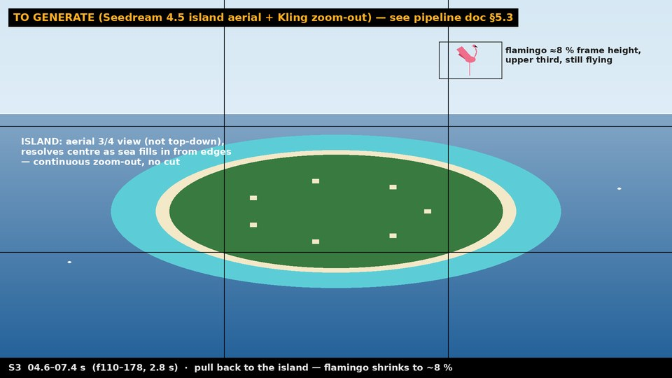
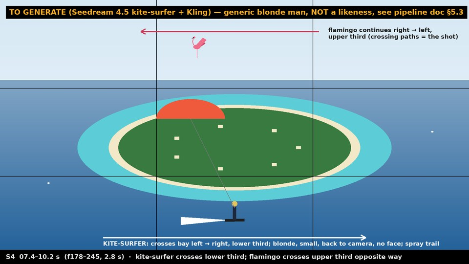
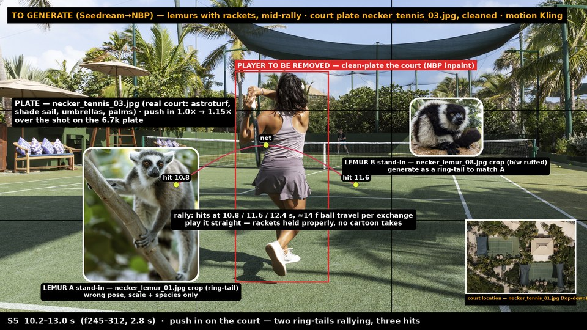
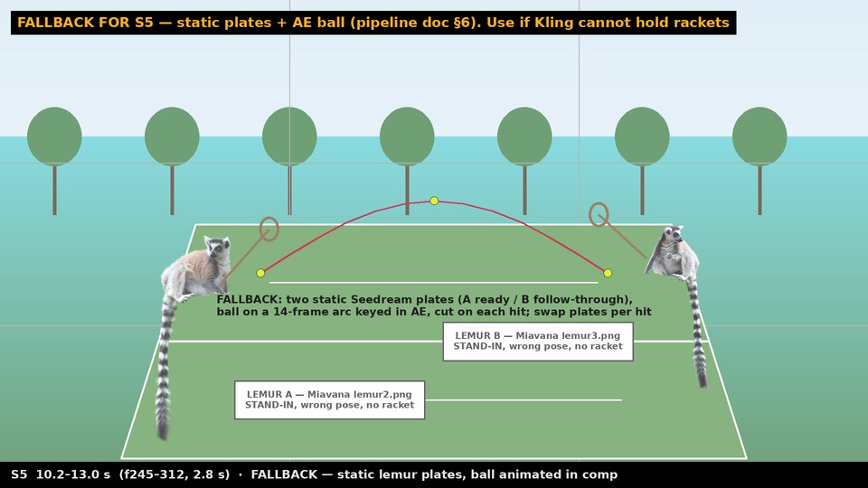
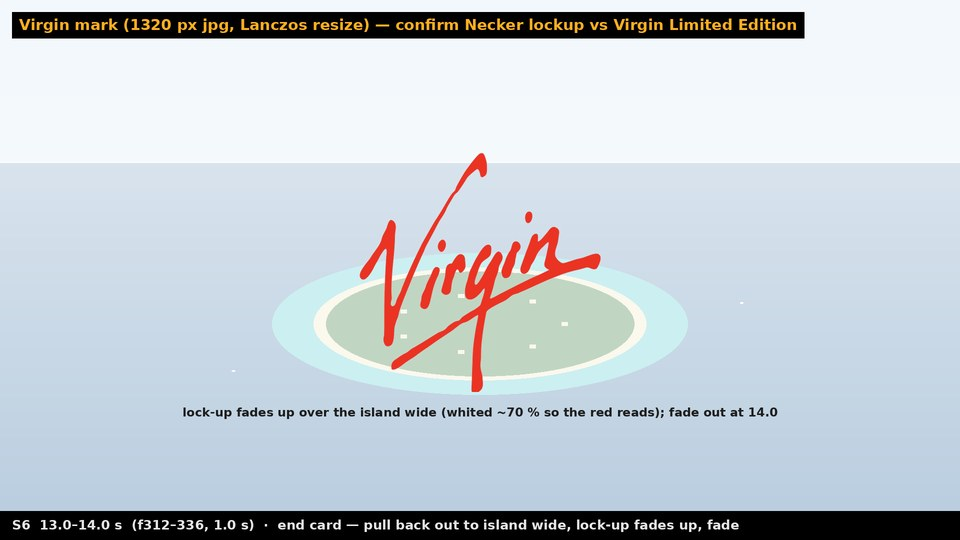

**Film 07 of 8** · client Theria · Allen Grabo / RTFX Design
**TRT 14.0 s (f336) @ 24 fps · 16:9 · 1920×1080 master** · 6 shots + 1 fallback frame
Frames: `necker_island/storyboard/frames/` (PNG 1920×1080, `*_small.jpg` 960×540, `contact_sheet.jpg`).
Build: `python3 necker_island/storyboard/build_frames.py PULL_ROOT OUT_DIR`

**Source of truth for beats:** the client brief (flamingo → takes flight → zoom out to island with kite-surfer → lemurs playing tennis). Cuts are boarded to `theria_hotel_animations_timing_v1.md` §7 (14.0 s). The earlier storyboard page ("07 NECKER ISLAND", TRT 13.0 s) is noted per beat where it differs.

**Assumptions**
- This is the flamingo concept from the brief. `Animation Virgin.docx` in the same folder is a **different film** (hand-drawn Virgin logo, red line through the decades, parachute drop onto Necker) and is **not boarded here** — see open question 1.
- The only usable art in the pull is the Virgin script mark (`07D6D2DD-….jpg`, 1320×1240, red on white, no alpha). Every other frame is a **Pillow-drawn schematic placeholder**: pale sky field, thirds grid, simple silhouettes and labelled boxes giving position and screen fraction. Nothing in these frames is a look reference — they are layout guides for the generation pass.
- Generation prompts for the four missing elements are already written in `theria_higgsfield_asset_pipeline_v1.md` §5.3 and are referenced by name, not rewritten. Kling motion prompts per shot are in the same doc §6 "Necker Island".
- Casting rule (brief + both docs): the kite-surfer is a **generic blonde man, small in frame, back to camera, no facial detail** — never a likeness of a named person. No real person's name goes into any prompt.
- Lemur stand-ins in S5 are the Miavana cut-outs `Miavana/upscaled/lemur2.png` and `lemur3.png` (RGBA, ~1050×2700), Lanczos-resized only. They are the wrong pose and hold nothing; they are there for species/scale and to remind that S5 must match Miavana's lemurs.
- Mark on the end card: plain Lanczos downscale of the 1320 px jpg with alpha lifted from luminance. Not AI-enlarged. Placeholder until the correct lock-up arrives; logo fade is an AE layer over the plate, never baked into a generation (pipeline doc §4).
- Frames show the *end state* of each shot unless noted.

### Beats

| # | Brief line served | IN–OUT (s) / frames @24 | Frame | On screen | Motion / camera | Transition | Assets used | Status |
|---|---|---|---|---|---|---|---|---|
| 1 | "Art is a flamingo" | 00.0–02.4 · f0–58 (2.4 s) | `01_flamingo_hold_TOGEN.png` | Single flamingo standing on one leg, full profile, ≈70 % frame height, just left of centre, isolated on white / pale sky. Same open-on-white grammar as Films 01, 02, 05. | Locked off. Head preens at f20, settles f38. Nothing else moves. | — | none (schematic silhouette) | **TO GENERATE — Flux 2.0 Pro** "Flamingo, isolated" (§5.3). Motion: Kling Necker shot 1. *Page: 0:00–0:02, same beat.* |
| 2 | "The flamingo takes flight" | 02.4–04.6 · f58–110 (2.2 s) | `02_takeoff_TOGEN.png` | Takeoff: wings extended, body angled up and forward, climbing toward frame right; wings ≈ full frame width by the last beat. Still on the pale field — no background yet. | Crouch f58–66, first downstroke f68, three full wingbeats to f110. Camera tilts up with it, lagging slightly. | — | none (schematic silhouette) | **TO GENERATE — Flux pose 1 → Nano Banana Pro pose 2** (same bird, §5.3 "second pass"). Motion: Kling Necker shot 2. *Page: 0:02–0:04.5, "runs three steps"; timing doc has a crouch instead — boarded to the crouch.* |
| 3 | "It zooms out as an island comes into view" | 04.6–07.4 · f110–178 (2.8 s) | `03_pullback_island_TOGEN.png` | Flamingo now ≈8 % frame height, upper third, upper-right, still flying. Sea has filled in from the edges; island resolves centre in aerial three-quarter view (not top-down): white sand ring, palm interior, villa scatter, boats. | One continuous zoom-out, no cut. | — | none (schematic island plate) | **TO GENERATE — Seedream 4.5** "Island aerial" (§5.3). Motion: Kling Necker shot 3. *Page: 0:04.5–0:07, "bird holds screen-left third throughout" — timing doc sends it right in S2 and back left in S4, so boarded upper-right here.* |
| 4 | "…with Richard Branson kite surfing (change in the photo to a blonde man)" | 07.4–10.2 · f178–245 (2.8 s) | `04_kitesurfer_TOGEN.png` | Camera settled on the island wide. Kite-surfer crosses the bay **left → right in the lower third**: blonde, small, back to camera, board throwing spray, kite arcing above and behind. Flamingo crosses the **upper third right → left**. The two crossing paths are the composition. | Locked off; only the two subjects move. | — | none (schematic figure + kite) | **TO GENERATE — Seedream 4.5** "Kite-surfer" (§5.3). Motion: Kling Necker shot 4. Casting rule applies: generic blonde man, no likeness, no face. *Page: 0:07–0:09.5, rider "jumps"; timing doc is a straight crossing — boarded straight.* |
| 5 | "And Lemurs are playing Tennis with each other" | 10.2–13.0 · f245–312 (2.8 s) | `05_lemur_tennis_TOGEN.png` | Push in on the island's grass court. Two ring-tailed lemurs, one each side, rackets in hand, mid-rally. Palms and turquoise sea behind. Play it straight — proper form, no cartoon takes, no clothing. | Push in. Three hits at **10.8 / 11.6 / 12.4 s**, ball travel ≈14 frames per exchange. Rally audio arrives one beat before the court enters frame (page note, kept). | — | `Miavana/upscaled/lemur2.png`, `lemur3.png` as tagged stand-ins (wrong pose) | **TO GENERATE — Seedream 4.5, then Nano Banana Pro with the Miavana lemur references** so the coat matches Film 06 (§5.3). Motion: Kling Necker shot 5 — highest-risk generation in the reel. *Page: 0:09.5–0:11.5, same beat, 2.0 s.* |
| 5b | (fallback for 5) | 10.2–13.0 · f245–312 | `05b_tennis_AE_fallback.png` | Same court; ball on a 14-frame arc; plates swap on each hit (A ready / B follow-through). | Two static Seedream plates, ball keyed in After Effects, cut on each hit. | — | as above | **FALLBACK** per pipeline doc §6 ("board a fallback"). Only used if Kling cannot hold rackets. |
| 6 | (sign-off) | 13.0–14.0 · f312–336 (1.0 s) | `06_endcard.png` | Pull back out to the island wide, field whites out ≈70 %, Necker / Virgin lock-up fades up centre (≈27 % frame width). | Pull-back then hold; lock-up fade is an AE layer. | fade to out at 14.0 | `Necker Island/07D6D2DD-….jpg` Virgin mark, Lanczos resize only | Mark is a **placeholder** — confirm Necker lockup vs Virgin Limited Edition (open question 2). *Page: 0:11.5–0:13 (1.5 s), "flamingo drops out bottom-left, island holds a half-beat, whites out"; timing doc gives 1.0 s and a pull-back — boarded to the timing doc, flamingo exit not shown.* |

**Audio (timing doc):** wing beats close then distant, wind and water, three tennis pocks. No music until the end card.

**Page vs timing doc, summary:** page TRT 13.0 s → timing doc 14.0 s (S2 +0.1, S3 +0.3, S4 +0.3, S5 +0.8, S6 −0.5). Beat order and content are the same; the differences are S2 "runs three steps" vs crouch, S4 rider "jumps" vs straight crossing, S3 bird screen-left vs right, and S6 whiteout-only vs pull-back + fade. Timing doc wins per the handoff.

### Open questions for Allen

1. **Which Necker concept is live?** The brief (flamingo → island → kite-surfer → lemur tennis, boarded here) or `Animation Virgin.docx` (hand-drawn Virgin logo / red line through the decades / parachute onto Necker). They are different films; only the flamingo one is boarded.
2. **Which mark signs off** — a Necker Island lock-up, or Virgin Limited Edition? Only the plain Virgin script (jpg, no alpha) was supplied; the end card uses it as a placeholder.
3. **Are the timing-doc cuts still the source of truth** (14.0 s) over the storyboard page (13.0 s)? Boarded to 14.0; the four content differences are listed above.
4. **S5 tennis: generate it in Kling, or go straight to the comp fallback** (two static plates + AE ball)? The pipeline doc calls it the highest-risk generation in the reel; the fallback costs less than three Kling attempts.
5. **Flamingo path across S2–S4:** timing doc sends it right in S2 then back right-to-left in S4; the page holds it screen-left throughout. Confirm the crossing-paths version (boarded).

### Assets still needed

- Flamingo, standing, isolated on white (Flux 2.0 Pro, §5.3) — plus takeoff pose, same bird (NBP referencing pose 1).
- Necker aerial plate, three-quarter view, ~300 m (Seedream 4.5, §5.3). If a real Necker aerial exists client-side it beats a generated island — the page mentions "Great House on the ridge, reef line, sailboats".
- Kite-surfer plate, generic blonde man, back to camera (Seedream 4.5, §5.3).
- Two lemurs playing tennis (Seedream 4.5 → NBP with Miavana refs, §5.3); for the fallback, two separate static plates (ready / follow-through).
- Kling segments for shots 1–5 (pipeline doc §6, Necker table).
- Correct end-card mark as vector or transparent PNG (Necker lock-up or Virgin Limited Edition).
- Audio: wingbeats, wind/water bed, three tennis pocks, end-card music sting.

### What this board does not cover

- No look, colour or lighting reference — every frame except the mark is a schematic. Do not show these to the client as visuals.
- The flamingo's exit is not boarded (page has it leaving bottom-left before the end card; timing doc does not mention it).
- Not boarded: the second concept in `Animation Virgin.docx`. Not read: the five speech/itinerary/questions docx files and the two PDFs (schedule, 62 MB summit deck) — they look unrelated to the animation, as the inventory already noted.
- No in-between frames for S2's three wingbeats or S5's three hits; only end states plus the hit times.
- No AE comp, no Kling runs, no generated art — nothing here touches the pull directory or any model.

## 08 · 22 Club

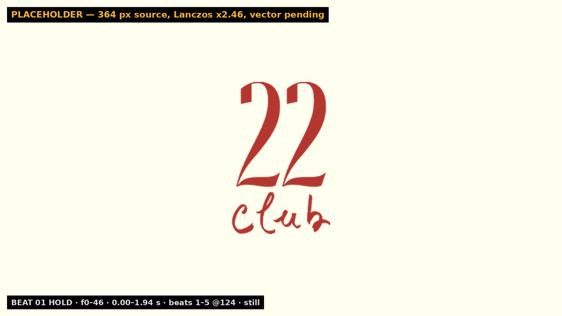
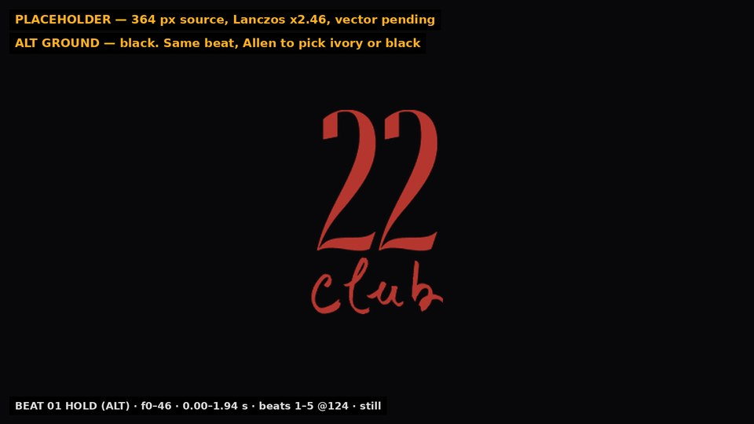
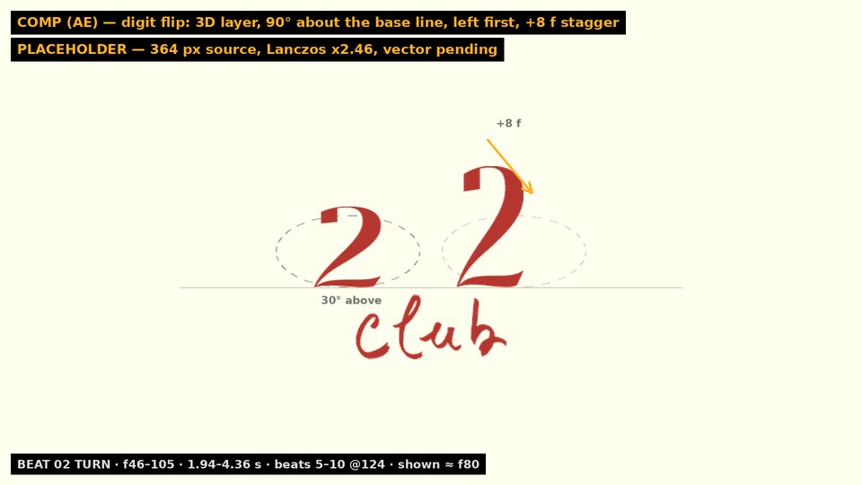
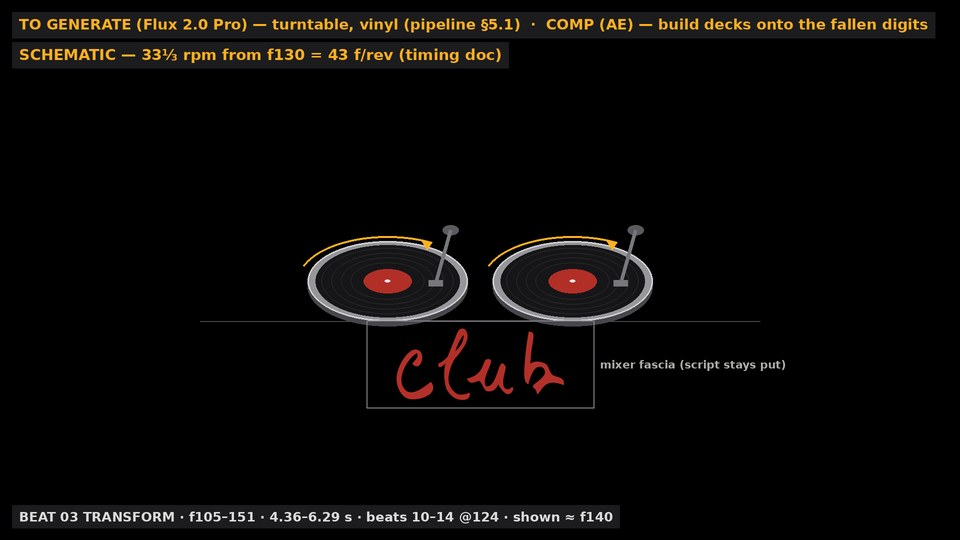
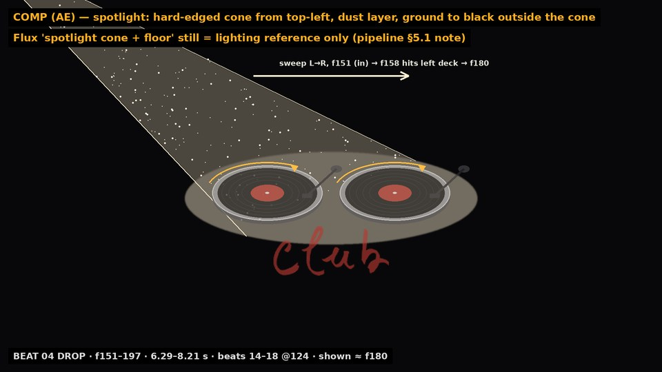
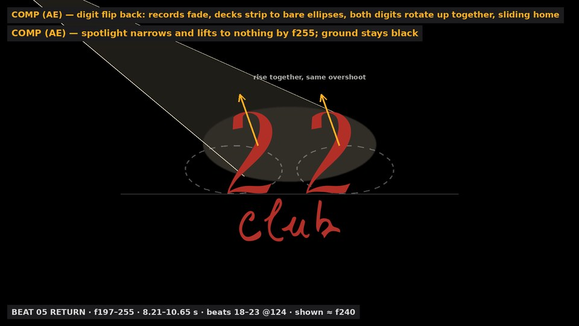
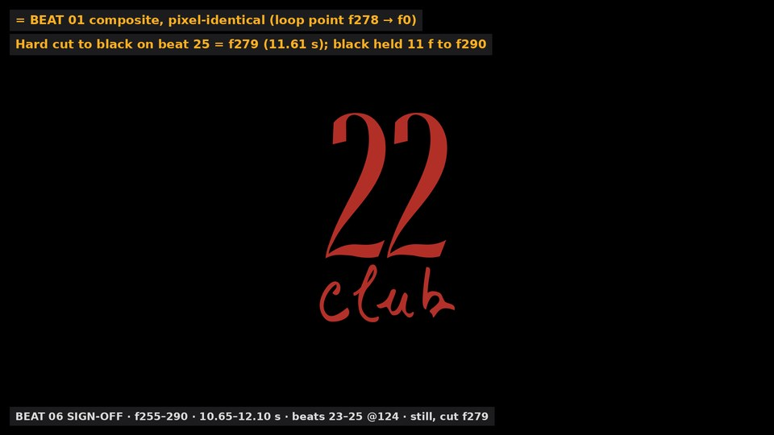

| | |
|---|---|
| Film | 22 Club (Theria slate, film 8 of 8) — "the numerals become the decks" |
| TRT | **12.10 s = 290 frames @ 24 fps**, cut to a 124 BPM grid (11.613 f/beat, 25 beats, 6.25 bars of 4) |
| Format | 16:9, 1920×1080 master. Frames in `frames/` (PNG) + `*_small.jpg` (960×540) + `contact_sheet.jpg` |
| Built by | `build_frames.py PULL_ROOT OUT_DIR` — Pillow only, nothing under the pull is touched |
| Source of truth | Client brief (5 lines) → `theria_hotel_animations_timing_v1.md` §8 (shot list) → this board. The earlier rendered storyboard page ("08 22 CLUB", TRT 12.0 s) is referenced where it differs. |

**Assumptions**
- 24 fps and 16:9 (both still open in the timing doc's own questions). At 30 fps every frame number here ×1.25.
- The timing doc gives shot boundaries in round seconds (2.0 / 4.4 / 6.2 / 8.2 / 10.6 / 12.0) *and* says cut to the 124 BPM grid. I snapped each boundary to its nearest beat onset; the shift is never more than 0.07 s. Both values are in the table.
- Beat numbering is 1-based from the first frame (beat 1 = f0). Beat 5 = bar 2 downbeat, beat 13 = bar 4, beat 17 = bar 5, beat 21 = bar 6, beat 25 = bar 7 downbeat (f279).
- The mark: the only file is `22 club/images.png`, 364×549 palette PNG, white ground, no alpha. Ink bbox 136×211 px. It is used at ×2.46 (Lanczos) so the mark's ink stands 520 px tall on the 1080 canvas. **That is a tagged placeholder, not an approved enlargement** — the vector (or a ≥2000 px raster) replaces it 1:1 in position. The white was colour-keyed to alpha so the same file sits on black; the red is the measured mean ink colour (181, 54, 47).
- Platters are drawn 320 px in diameter, seen from 30° above (ellipse height = 0.5 × width, per the timing doc), near edge on the digits' base line, extending *away* from camera. The two 2s are only 155 px apart at this scale, so the decks drift outward to ±185 px from centre as the digits fall. See review note 2.
- Ground: ivory (255,255,240) for beats 1–3 and 6, black outside the spotlight cone in beat 4, mixing back in beat 5 — per the timing doc. Black-ground alternate for beat 1 supplied.

### Beats

| # | Brief line served | IN–OUT (timing doc) | IN–OUT snapped to 124 BPM · frames @24 · lands on beat | Frame | On screen | Motion / camera | Transition | Assets used | Status |
|---|---|---|---|---|---|---|---|---|---|
| 1 | "Start with the logo with the 22 club" | 0.00–2.00 s | **0.00–1.94 s · f0–46 · beats 1→5** (in on beat 1, out on bar-2 downbeat) | `01_hold_ivory.png` / `01b_hold_black_ALT.png` | The full mark, red, dead centre on ivory (alt: on black). Nothing else. | Locked off. Optional 2 % bass-pulse scale on "club" at tempo (timing doc) — not drawn. | — (out is the flip starting, no cut) | `22 club/images.png` at ×2.46 Lanczos | **PLACEHOLDER** — vector pending. Otherwise READY (AE, nothing to generate) |
| 2 | "The 22 turns on its back" | 2.00–4.40 s | **1.94–4.36 s · f46–105 · beats 5→10** (59 f, 2.46 s) | `02_flip_COMP.png` | Both 2s rotate 90° backwards about their own base line, left first, right 8 f behind; they end as two flat shapes seen from ~30° above, drifting outward onto the platter footprints. "club" does not move. Shown ≈ f80: left down, right at ~45°. | 3D layer rotation in AE, camera 30° elevation. 0.8 s per digit (19 f) with small overshoot and settle. Ease-in from still. | — | mark split into `2 L`, `2 R`, `club` (source px cols 120–180 / 183–243 / rows 321–379) | **COMP (AE)** — digit flip. Needs vector with numerals and script on separate paths. |
| 3 | "…becomes vinyl record player with spinning records" | 4.40–6.20 s | **4.36–6.29 s · f105–151 · beats 10→14** (46 f, 1.92 s) | `03_decks_TOGEN.png` | Spindle, platter rim, tonearm and a black vinyl with plain red label build onto each ellipse over 1.0 s (f105–129). Records start spinning at f130, up to speed in 0.5 s. "club" stays put and becomes the mixer fascia between/under the decks. Shown ≈ f140. | Static camera. Rotation: 33⅓ rpm = 1.8 s/rev = 43 f/rev (timing doc). Flash on the vinyl once per rev. | — | Flux stills: "Turntable platter, isolated" + "Vinyl record, isolated, top-down" (pipeline §5.1) cut out and mapped onto the 30° ellipses in AE | **TO GENERATE (Flux 2.0 Pro)** — turntable, vinyl. Deck build itself is COMP (AE). |
| 4 | "A spot light appears" | 6.20–8.20 s | **6.29–8.21 s · f151–197 · beats 14→18** (46 f, 1.92 s) | `04_spotlight_COMP.png` | Hard-edged cone drops in from top-left at f151, hits the left deck at f158, sweeps right across both by f180. Ground goes to black outside the cone. Dust in the beam. Vinyl catches the light each rotation. "club" half-lit in the spill. Shown ≈ f180. | Beam = AE cone geometry + noise-driven dust layer (pipeline §5.1 note). Track: filter opens / drop lands here. | — | Flux "Spotlight cone + floor" still as lighting reference only; beam built in AE | **COMP (AE)** — spotlight. Reference still TO GENERATE (Flux), optional. |
| 5 | "The numbers turn back around" | 8.20–10.60 s | **8.21–10.65 s · f197–255 · beats 18→23** (58 f, 2.42 s) | `05_flipback_COMP.png` | Records fade, decks strip back to bare ellipses (0.8 s, f197–216), then both digits rotate up 90° **together** (0.8 s, f216–235) with the same overshoot, sliding back to their home x. Spotlight narrows and lifts away as they rise; ground mixes back toward ivory. Shown ≈ f240 (digits at ~45°). | Reverse of beat 2 in AE, un-staggered. | — | same as beats 2–3 | **COMP (AE)** — digit flip back + spotlight lift. |
| 6 | "…and then go back to normal" | 10.60–12.00 s (doc: 12.10 s) | **10.65–12.10 s · f255–290 · beats 23→25(+end)**; hard cut to black on beat 25 = f279 (11.61 s), black held 11 f to f290 | `06_return.png` (= beat 1) | Full mark, dead centre, dead still, flat ivory light. Same pixel position as beat 1 = loop point. | Locked off. | **hard cut to black on the final downbeat (beat 25)** | `22 club/images.png` placeholder | **PLACEHOLDER / READY** as beat 1 |

Where this board differs from the earlier storyboard page ("08 22 CLUB", TRT 12.0 s, 6 beats):
- Page runs 12.0 s with beats at 0/2/4/6/9/11/12; the timing doc (and this board) runs 12.10 s at 124 BPM with the spotlight at 6.29 s and the flip-back at 8.21 s. Page gives the spotlight 3 s, timing doc 2 s — boarded to the doc.
- Page: "club" script *slides down out of the way* in beat 2 and the ground goes to ink as the digits land. Timing doc: "club" stays put and becomes the mixer fascia; ground only goes black under the spotlight. Boarded to the doc.
- Page: spin locked to the track's BPM, one deck half a beat behind; tonearm swings in from the right; red label at centre. Timing doc: 33⅓ rpm from f130. Boarded to the doc's 33⅓; both noted on frame 03's tag. Red label kept (it is also in the Flux prompt).
- Page: spotlight snaps on in one frame, sweeps left-right-left. Timing doc: drops in over 7 f, single sweep L→R. Boarded to the doc.
- Page: beat 5 is "reverse the beat 2 curve exactly, 20 % faster" and the numerals stay "still lit, still moving slightly"; beat 6 has the audio run one bar past picture. Timing doc: same-speed rise, dead still on return, hard cut to black on the final downbeat. Boarded to the doc.

### Open questions for Allen

1. **Ground: ivory or black?** The brief says nothing; the timing doc says "red on black if the film is going in a club, which it should"; the page and the rest of the slate are ivory. Frames `01_hold_ivory` and `01b_hold_black_ALT` show both. Black makes the spotlight beat (4) trivial and the loop cleaner; ivory keeps the slate grammar.
2. **Music track.** The whole edit is quantised to 124 BPM. Which sexy-techno bed, and is it licensed? Any tempo other than 124 moves every IN–OUT in the table (at 122 BPM the film is 12.30 s / 295 f). Timing doc: this is the one film where the track must be locked *before* the edit.
3. **Platter size vs. digit spacing.** Two 320 px decks cannot sit where the two 2s stand (155 px apart) — the digits have to drift ~110 px outward each as they fall (as boarded), or the decks have to be ~140 px across (too small to read). Which? Alternative: keep them tight and let the decks overlap like a DJ's two-deck setup seen in perspective.
4. **Beats 4 and 5 land on the "2" of their bars** (beats 14 and 18) if the doc's 6.2 s / 8.2 s hits are kept. Moving them to the downbeats — beat 13 (5.81 s, f139) and beat 17 (7.74 s, f186) — makes the drop hit harder but shortens the deck beat to 1.45 s. Your call; the table changes by one column.
5. **Vector artwork.** Numerals and script on separate paths, plus the exact red. Until it arrives nothing in beats 2–5 can be built for real. (Also: which "2" glyph face is the brand's — the source has a flat base bar on each 2 that the flip is built around.)

### Assets still needed

| Asset | For | Route | Notes |
|---|---|---|---|
| 22 club mark, vector (AI/EPS/SVG), numerals + script as separate paths | every beat | client | The 364×549 PNG is a placeholder at ×2.46. Do not upscale with a model (pipeline §4). |
| Turntable platter, isolated, low three-quarter | beat 3 | Flux 2.0 Pro, pipeline §5.1 prompt 1 | Needs to read at 30° elevation; two copies. |
| Vinyl record, top-down, plain red label | beats 3–4 | Flux 2.0 Pro, pipeline §5.1 prompt 2 | Mapped to the ellipse in AE; rotation done in AE. |
| Spotlight cone + dusty floor still | beat 4 (reference only) | Flux 2.0 Pro, pipeline §5.1 prompt 3 | Beam itself built in AE. Optional. |
| Techno bed, 124 BPM, ≥13 s, licensed | all | Allen / client | Locks the frame grid. |

### What this board does not cover

- **No motion was tested.** Every frame is a still at one representative frame number; the digit flip is drawn as a vertical squash, not a true 3D projection. The overshoot, the 8 f stagger and the tonearm move only exist as words.
- **No real deck, vinyl, spotlight or dust artwork.** Beats 2–5 are Pillow schematics tagged COMP / TO GENERATE. Nothing was generated; the pipeline §5.1 prompts were not run or rewritten.
- **The mark is a Lanczos resize of a 364 px PNG**, colour-keyed to alpha. It is not the logo at delivery quality and it must not be shown to the client as such.
- **Audio.** No track chosen, no filter/drop automation specified beyond "filter opens under the spotlight, drop on the flip-back" (timing doc). The 124 BPM grid is an assumption until the track is locked.
- **Aspect ratio and frame rate** other than 16:9 @ 24 fps. 9:16 would restack the decks vertically and the whole flip geometry changes.
- **Type, taglines, URLs, end-card legal.** Logo only, as on every film in the slate.
- **Sound-design of the flip** (mechanical clunk, needle drop) — not specified anywhere upstream, not added here.

